# M4: EDA

# Contents

- [1 Introduction](#1-Introduction)

- [2 Dataset Overview](#2-Dataset-Overview)

- [3 Univariate Analysis](#3-Univariate-Analysis)
  - [3.1 Age](#3-1-Age)
  - [3.2 Hours Worked per Week](#3-2-Hours-Worked-per-Week)
  - [3.3 Workclass](#3-3-Workclass)
  - [3.4 Education](#3-4-Education)
  - [3.5 Marital Status](#3-5-Marital-Status)
  - [3.6 Occupation](#3-6-Occupation)
  - [3.7 Relationship](#3-7-Relationship)
  - [3.8 Race](#3-8-Race)
  - [3.9 Sex](#3-9-Sex)
  - [3.10 Native Country](#3-10-Native-Country)
  - [3.11 Key Findings from Univariate Analysis](#3-11-Key-Findings-from-Univariate-Analysis)

- [4 Bivariate Analysis](#4-Bivariate-Analysis)
  - [4.1 Numerical Variables](#4-1-Numerical-Variables)
    - [4.1.1 Age and Income](#4-1-1-Age-and-Income)
    - [4.1.2 Hours Worked per Week and Income](#4-1-2-Hours-Worked-per-Week-and-Income)
  - [4.2 Categorical Variables](#4-2-Categorical-Variables)
    - [4.2.1 Workclass and Income](#4-2-1-Workclass-and-Income)
    - [4.2.2 Education and Income](#4-2-2-Education-and-Income)
    - [4.2.3 Marital Status and Income](#4-2-3-Marital-Status-and-Income)
    - [4.2.4 Occupation and Income](#4-2-4-Occupation-and-Income)
    - [4.2.5 Relationship and Income](#4-2-5-Relationship-and-Income)
    - [4.2.6 Race and Income](#4-2-6-Race-and-Income)
    - [4.2.7 Sex and Income](#4-2-7-Sex-and-Income)
    - [4.2.8 Native Country and Income](#4-2-8-Native-Country-and-Income)
  - [4.3 Correlation and Association with Income](#4-3-Correlation-and-Association-with-Income)
    - [4.3.1 Numerical Variables](#4-3-1-Numerical-Variables)
    - [4.3.2 Binary Variables](#4-3-2-Binary-Variables)
    - [4.3.3 Categorical Variables](#4-3-3-Categorical-Variables)
  - [4.4 Bivariate Analysis Summary](#4-4-Bivariate-Analysis-Summary)

- [5 Multivariate Analysis](#5-Multivariate-Analysis)
  - [5.1 Age, Hours Worked per Week and Income](#5-1-Age,-Hours-Worked-per-Week-and-Income)
  - [5.2 Sex, Education and Income](#5-2-Sex,-Education-and-Income)
  - [5.3 Multivariate Analysis Summary](#5-3-Multivariate-Analysis-Summary)

- [6 Data-Quality Hooks](#6-Data-Quality-Hooks)
  - [6.1 Hook A: Target Class Imbalance](#6-1-Hook-A:-Target-Class-Imbalance)
  - [6.2 Hook B: Rare Categorical Groups](#6-2-Hook-B:-Rare-Categorical-Groups)
  - [6.3 Hook C: Sparse Capital Gain and Capital Loss Indicators](#6-3-Hook-C:-Sparse-Capital-Gain-and-Capital-Loss-Indicators)

- [7 Conclusion](#7-Conclusion)

# 1-Introduction

This report presents an exploratory data analysis of the Adult Income dataset. The dataset was originally extracted by Barry Becker from the Census database. The dataset focuses on individuals who are part of the working population and have valid income and employment-related records.

The main prediction task associated with this dataset is to determine whether a person’s annual income is greater than 50,000 dollars. The target variable is therefore binary, with two possible income classes: `>50K` and `<=50K` in the original dataset.

The dataset contains a mixture of demographic, education-related, employment-related, and financial variables. Examples include `age`, `workclass`, `education`, `marital_status`, `occupation`, `relationship`, `race`, `sex`, `hours_per_week`, `native_country`, and income-related capital variables. These variables provide a useful basis for exploring which personal and employment characteristics may be associated with higher income.

The purpose of this EDA is to understand the structure and quality of the cleaned dataset, examine the distribution of key variables, and identify early patterns that may be useful for later modelling. In particular, this report investigates whether variables such as education, occupation, working hours, demographic characteristics, and capital gain/loss indicators may help explain differences between individuals earning `<=50k` and those earning `>50k`.

This stage is important because EDA helps reveal data imbalance, dominant categories, missing-data issues, unusual values, and potential relationships between variables before formal modelling begins. The findings from this EDA will later support the selection of features and the formulation of a clear binary classification modelling question.

# 2-Dataset Overview

Before conducting EDA, the original dataset was cleaned and transformed to create a more consistent analysis-ready version. The cleaned dataset is stored as `adult_cleaned.xlsx`.

After cleaning, the dataset used in this EDA contains **32,534 rows and 13 columns**. The cleaned variables are:

```text
age
workclass
education
marital_status
occupation
relationship
race
sex
hours_per_week
native_country
capital_gain_flag
capital_loss_flag
income
```

The first few rows of the cleaned dataset confirm that the variables are consistently formatted. For example, the cleaned dataset includes records such as a 39-year-old male working in `state-gov` with a `bachelors` education and income `<=50k`, and a 28-year-old female working in `private` employment with a `bachelors` education and income `<=50k`.

The dataset inspection shows that all 13 columns have complete values. The `df_eda.info()` output confirms that every column contains **32,534 non-null values**, meaning there are no missing values remaining after preprocessing. The missing-value summary also shows `0` missing values for every variable. Therefore, no additional imputation or row deletion is required before EDA.

The cleaned dataset contains **four numeric variables**. Among them, `capital_gain_flag` and `capital_loss_flag` are binary variables:

```text
age
hours_per_week
capital_gain_flag
capital_loss_flag
```

It also contains **nine categorical variables**:

```text
workclass
education
marital_status
occupation
relationship
race
sex
native_country
income
```

The numeric summary shows that `age` ranges from **17 to 74**, with a mean of approximately **38.53**. The variable `hours_per_week` ranges from **8 to 80**, with a mean of approximately **40.39**, suggesting that many individuals work around standard full-time hours. The means of `capital_gain_flag` and `capital_loss_flag` are low, around **0.08** and **0.05**, which indicates that most individuals do not report capital gains or capital losses.

The categorical summary shows several dominant categories. The most common `workclass` is `private`, with **24,506** records. The most common education level is `hs-grad`, with **10,493** records. The most common marital status is `married-civ-spouse`, and the most common occupation is `prof-specialty`. The dataset is also dominated by individuals from `united-states`, with **29,732** records. These dominant categories suggest that some variables are unevenly distributed, which should be considered when interpreting later visualisations.

Overall, the cleaned dataset is suitable for exploratory analysis. It has a clear binary target variable, no remaining missing values, consistent formatting, and a mixture of numeric and categorical predictors. However, the dataset also contains important structural characteristics, especially class imbalance in `income` and uneven category sizes in variables such as `workclass`, `education`, `occupation`, and `native_country`. These characteristics will guide the univariate and bivariate analysis in the following sections.

# 3-Univariate Analysis

Univariate analysis examines one variable at a time. In this section, numerical variables are analysed using summary statistics, histograms, and boxplots, while categorical variables are analysed using frequency tables and bar charts. The purpose is to understand the distribution of each variable before examining relationships with income in later sections.

## 3-1 Age

The variable `age` ranges from **17 to 74**, with a mean of **38.53** and a median of **37**. The standard deviation is **13.48**, showing that the dataset contains individuals across a broad adult age range.

The histogram shows that age is not normally distributed. Most individuals are concentrated between approximately **20 and 50 years old**, which is expected because the dataset mainly represents the working population. The distribution also appears slightly right-skewed, with fewer individuals in older age groups.
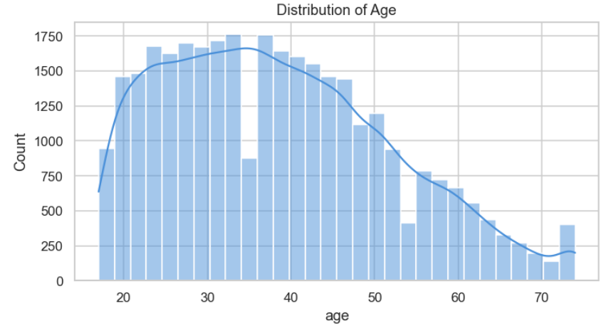

The boxplot confirms that the middle 50% of individuals are between **28 and 48 years old**. Using the 1.5 × IQR rule, no age outliers were detected. This suggests that the age values are within a reasonable range and do not contain unusual extreme cases.
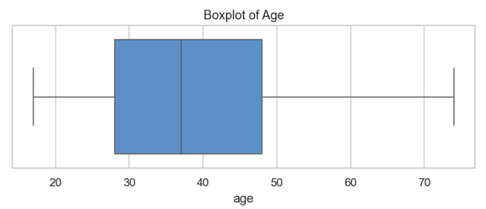

Overall, age is likely to be useful in later analysis because income may vary across career stages. However, age alone is unlikely to fully explain income differences.

## 3-2 Hours Worked per Week

The variable `hours_per_week` ranges from **8 to 80**, with a mean of **40.39** and a median of **40**. This shows that the typical individual in the dataset works around a standard full-time schedule.

The histogram shows a very strong peak around **40 hours per week**, indicating that full-time work is the dominant pattern. There are also smaller peaks around approximately **20, 50, and 60 hours**, suggesting the presence of different work patterns such as part-time work, standard full-time work, and overtime work.
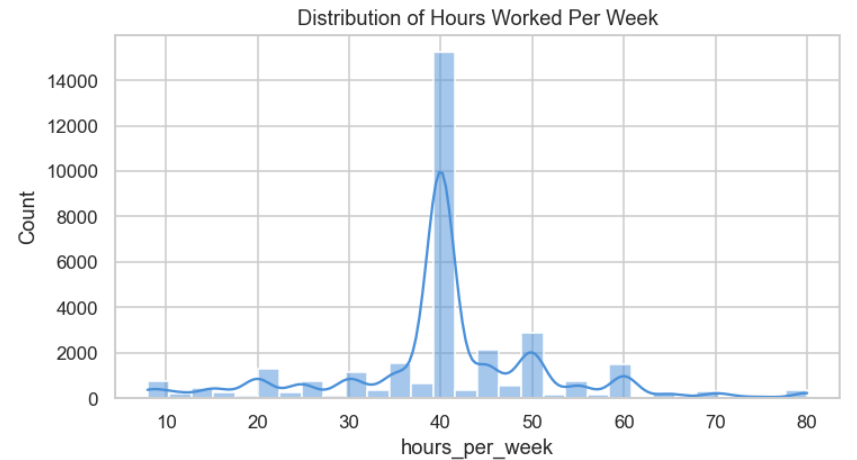

The boxplot and IQR calculation show that the middle 50% of observations fall between **40 and 45 hours**. The IQR is only **5**, so the 1.5 × IQR rule flags many values below 32.5 or above 52.5 hours as outliers. In total, **9,001 observations**, or **27.67%**, are flagged as outliers.
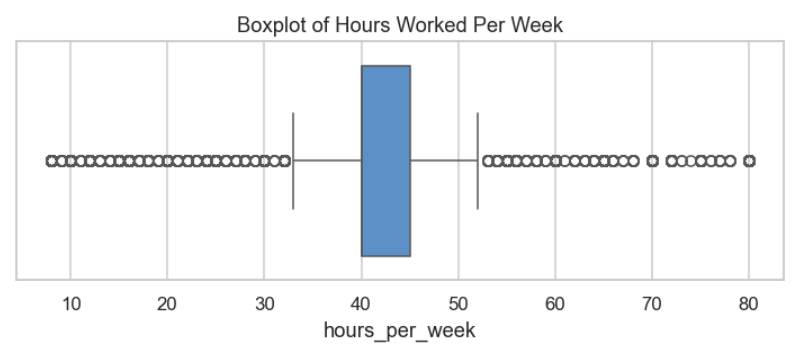

However, these should not necessarily be treated as data errors. In this context, values outside the IQR range likely represent real work patterns, such as part-time or long-hour employment. Therefore, `hours_per_week` should be kept for later analysis, especially when comparing income between standard-hours and non-standard-hours workers.

## 3-3 Workclass

The `workclass` variable is highly imbalanced. The largest category is `private`, with **24,506 observations**, accounting for **75.32%** of the dataset. This means that most individuals work in the private sector.

Other categories are much smaller. `self-emp-not-inc` accounts for **7.81%**, `local-gov` for **6.43%**, `state-gov` for **3.99%**, `self-emp-inc` for **3.43%**, and `federal-gov` for **2.95%**. The categories `without-pay` and `never-worked` are extremely rare, together representing less than 0.1% of the dataset.

The bar chart clearly shows that the dataset is dominated by private-sector workers. This imbalance means that later income comparisons across workclass should use percentages rather than raw counts.
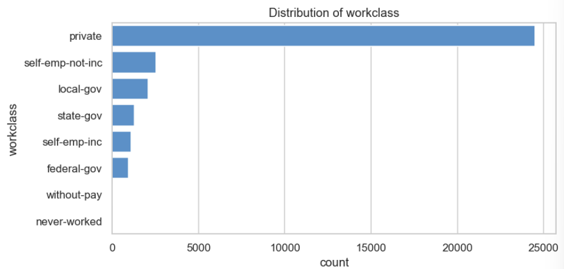

## 3-4 Education

The `education` variable shows clear differences in group size. The largest group is `hs-grad`, with **10,493 observations**, accounting for **32.25%** of the dataset. This is followed by `some-college` at **22.38%** and `bachelors` at **16.45%**.

Together, these three education levels make up more than 70% of the dataset. Higher education categories such as `masters`, `prof-school`, and `doctorate` are much smaller, while lower education levels such as `1st-4th`, `5th-6th`, and `preschool` are rare.

The bar chart shows that the dataset is concentrated around high school, some college, and bachelor’s education. Since education level is likely related to income, this variable should be examined carefully in bivariate analysis.
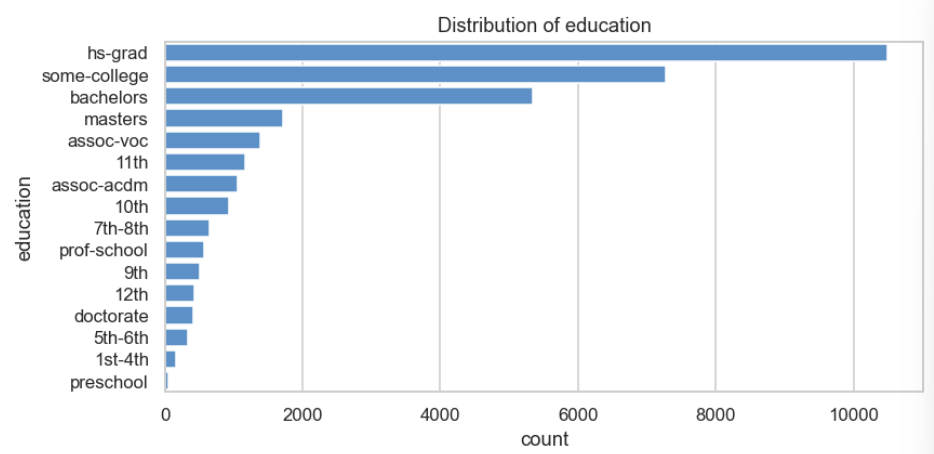

## 3-5 Marital Status

The `marital_status` variable is also concentrated in a few categories. The largest group is `married-civ-spouse`, accounting for **46.01%** of the dataset. The second-largest group is `never-married`, with **32.78%**, followed by `divorced` at **13.65%**.

Together, these three categories represent more than 90% of all observations. Other categories, such as `separated`, `widowed`, `married-spouse-absent`, and `married-af-spouse`, are much smaller.
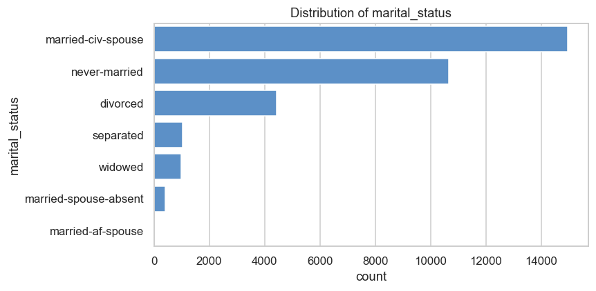

This distribution suggests that marital status may reflect important life-stage and household differences. It should be explored further in relation to income, but smaller categories should be interpreted cautiously because they contain fewer observations.

## 3-6 Occupation

The `occupation` variable contains 14 categories and shows meaningful variation across job types. The largest category is `prof-specialty`, accounting for **18.37%** of observations. This is followed by `craft-repair` at **12.58%**, `exec-managerial` at **12.49%**, `adm-clerical` at **11.58%**, `sales` at **11.22%**, and `other-service` at **10.12%**.

The bar chart shows that several occupations have substantial representation, but some categories are very rare. For example, `priv-house-serv` accounts for only **0.45%**, and `armed-forces` accounts for only **0.03%**.
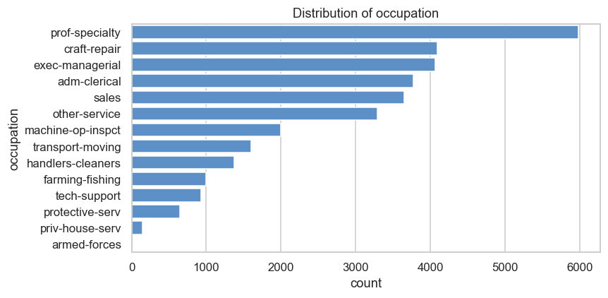

Occupation is likely to be an important variable for later income analysis because job type is closely connected to earning potential. However, rare occupations should be handled carefully because small sample sizes may make their patterns less stable.

## 3-7 Relationship

The `relationship` variable describes a person’s role within their household. The largest category is `husband`, accounting for **40.53%** of the dataset. This is followed by `not-in-family` at **25.49%** and `own-child` at **15.56%**.

Together, these three categories make up more than 80% of the dataset. Other categories, including `unmarried`, `wife`, and `other-relative`, occur less frequently.
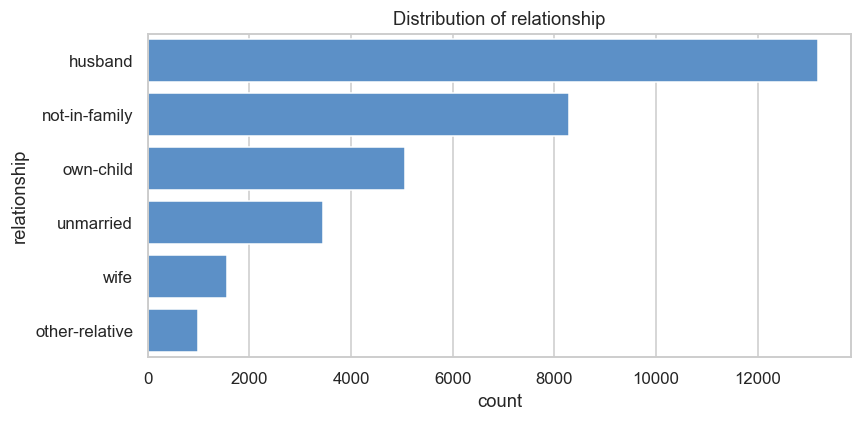

The distribution suggests that household role may be related to age, marital status, and possibly income. Since `relationship` overlaps conceptually with `marital_status`, it may be useful in later analysis but should be interpreted alongside other demographic variables.

## 3-8 Race

The `race` variable is highly imbalanced. The `white` category dominates the dataset, with **27,792 observations**, accounting for **85.42%**. The second-largest group is `black`, accounting for **9.60%**, followed by `asian-pac-islander` at **3.19%**.

The remaining categories, `amer-indian-eskimo` and `other`, each account for less than 1% of the dataset. This means that minority groups are underrepresented compared with the `white` category.
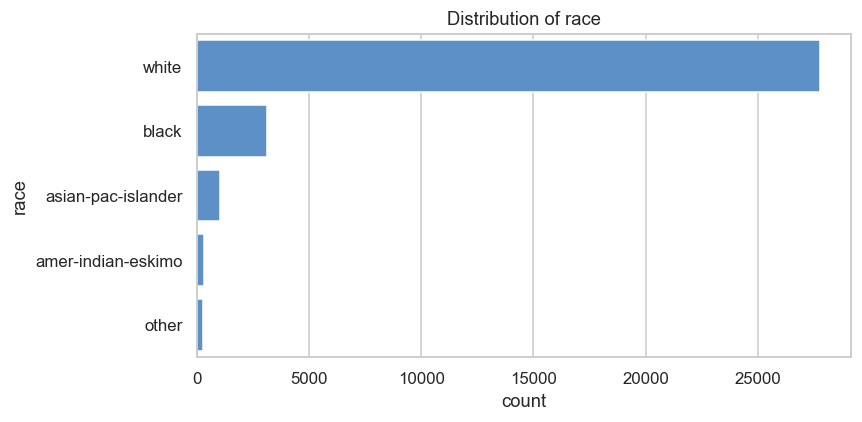

This imbalance is important for later interpretation. Patterns for smaller racial groups may be less reliable because they are based on fewer observations. Any income comparisons by race should therefore be interpreted with caution.

## 3-9 Sex

The `sex` variable contains two categories: `male` and `female`. Males account for **66.92%** of the dataset, while females account for **33.08%**.

The bar chart shows a moderate imbalance, with approximately two-thirds of observations belonging to the male group. Both groups are large enough for analysis, but the overall dataset patterns may be more influenced by male observations because they are more common.
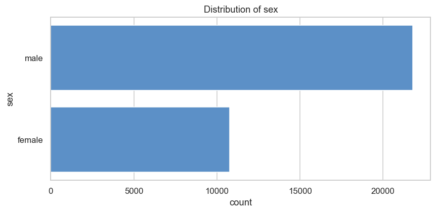

This variable should be examined in relation to income in later analysis, especially because sex may interact with occupation, working hours, marital status, and relationship.

## 3-10 Native Country

The `native_country` variable is extremely imbalanced. The largest category is `united-states`, with **29,732 observations**, accounting for **91.39%** of the dataset.

Among non-U.S. categories, `mexico` is the second-largest group, but it only accounts for **1.96%** of observations. Other countries, such as `philippines`, `germany`, `canada`, `puerto-rico`, and `india`, each make up less than 1% of the dataset.

The bar chart of the top 15 native countries clearly shows that the dataset mainly represents individuals from the United States. As a result, country-level comparisons should be interpreted carefully because most non-U.S. groups have small sample sizes.
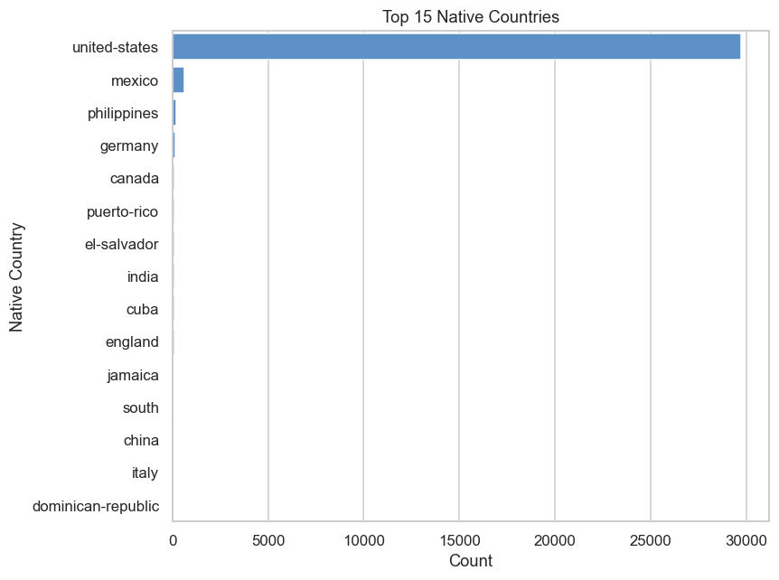

## 3-11 Key Findings from Univariate Analysis

The univariate analysis reveals several important characteristics of the cleaned Adult Income dataset.

First, the numerical variables are not normally distributed. Age is concentrated among working-age adults and is slightly right-skewed, while hours_per_week is strongly centred around 40 hours. Many IQR-based outliers are identified for hours_per_week, but these likely reflect genuine employment patterns rather than data errors.

Second, several categorical variables are highly imbalanced. The dataset is dominated by private-sector workers, high-school graduates, married-civ-spouse individuals, males, whites, and individuals from the United States. These dominant groups may influence overall patterns observed in the data.

Overall, these findings suggest that subsequent analysis should focus on key variables such as education, occupation, marital_status, sex, age, hours_per_week, and capital gain/loss indicators. Given the imbalance in several variables, proportions and rates should be used alongside raw counts when making comparisons.

# 4-Bivariate Analysis

Bivariate analysis examines the relationship between two variables. In this section, the main focus is how different features are associated with the target variable `income`. Since `income` is a binary variable, the analysis uses **high-income rate, boxplots, cross-tabulations, stacked bar charts, heatmap, and correlation analysis** to explore possible income-related patterns.

And following the methodology used in the course examples, numerical variables were analysed using distribution comparisons and Pearson correlation coefficients, while categorical variables were examined through income-rate visualisations and Cramer's V association measures.

The analysis also evaluates the following hypotheses from our proposal:

* **Hypothesis 1:** Significant income distribution differences exist across demographic and socioeconomic groups.
* **Hypothesis 2:** Education level, occupation, and working hours are among the most influential factors affecting annual income.

Before conducting the analysis, a binary target variable (`income_binary`) was created, where individuals earning more than $50K were assigned a value of 1 and all others were assigned a value of 0. The dataset contains 24,696 individuals in the <=50K group and 7,838 individuals in the >50K group, resulting in an overall high-income rate of **24.09%**.

## 4-1 Numerical Variables

### 4-1-1 Age and Income

A boxplot was used to compare age distributions across income groups. Individuals earning more than `$50K` are noticeably older than those earning `$50K` or less. The mean age of the high-income group is 44.2 years compared with 36.7 years for the low-income group. Similarly, the median age increases from 34 years to 44 years.
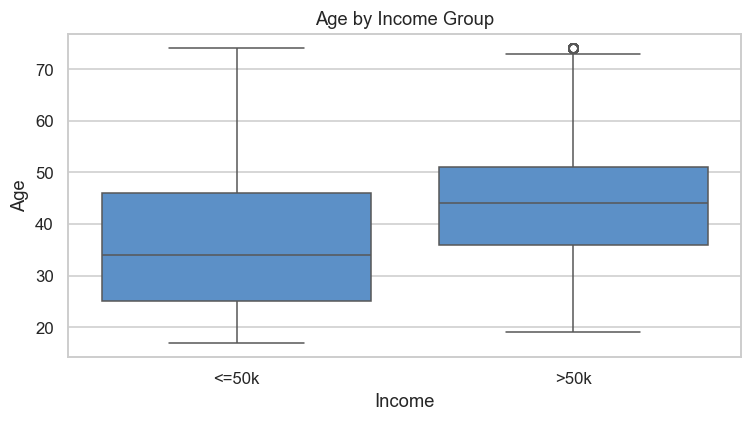

These results suggest that age is positively associated with income, likely reflecting accumulated work experience, career advancement, and professional development over time. However, substantial overlap remains between the two distributions, indicating that age alone cannot fully distinguish high-income individuals from low-income individuals.

### 4-1-2 Hours Worked per Week and Income

A violin plot was used to compare weekly working hours across income groups. Individuals earning more than `$50K` work an average of 45.4 hours per week, compared with 38.8 hours among those earning `$50K` or less.
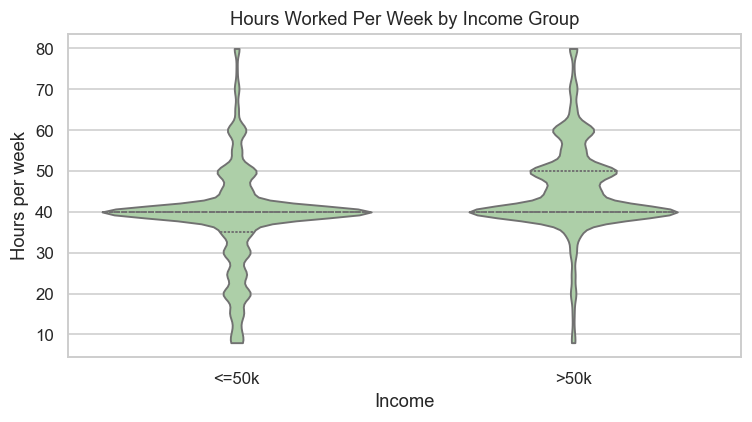

The upper quartile also increases from 40 hours to 50 hours, suggesting that high-income earners are more likely to work beyond a standard full-time schedule. Nevertheless, both groups remain strongly concentrated around 40 hours per week, indicating that working hours provide useful predictive information but are not sufficient on their own to explain income differences.

Overall, both numerical variables show positive relationships with income, although the separation between income groups remains moderate.

## 4-2 Categorical Variables

### 4-2-1 Workclass and Income

Income distribution varies considerably across employment types. The heatmap visually indicates the magnitude of proportions through color, and the accompanying data labels clearly show that self-employed incorporated workers exhibit the highest proportion of high-income earners, with 55.7% earning more than $50K. Federal government employees also show relatively high rates of high-income individuals (38.7%).

In contrast, only 21.0% of private-sector workers belong to the high-income group. Other government employment categories and self-employed non-incorporated workers fall between these extremes.
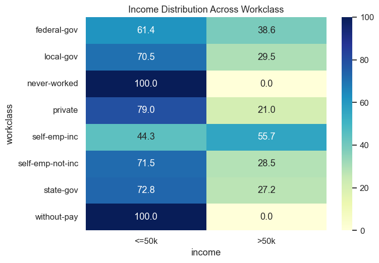

These findings suggest that employment type is meaningfully associated with income outcomes and may capture differences in compensation structures, business ownership, and occupational opportunities.

### 4-2-2 Education and Income

Observing bar chart of high-income rates, advanced educational qualifications correspond to substantially higher rates of earning more than $50K. Individuals with Doctorate degrees (74.1%), Professional School qualifications (73.4%), and Master's degrees (55.7%) exhibit the highest high-income rates.

Conversely, individuals with educational attainment below high school generally show high-income rates below 10%. The clear upward trend across education levels indicates that educational attainment is a highly informative predictor of income and strongly supports the human capital theory that higher education increases earning potential.


### 4-2-3 Marital Status and Income

A heatmap was used to visualise the income distribution within each marital status category. Marital status is strongly associated with income. Approximately 44.7% of individuals in the Married-civ-spouse category earn more than $50K, compared with only 4.6% among individuals who have never married.
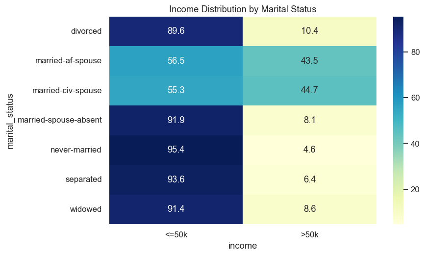

Divorced, separated, widowed, and spouse-absent categories also exhibit relatively low proportions of high-income earners. These differences may reflect variations in age, career stage, household structure, and financial circumstances. While marital status appears highly informative, part of its predictive power may overlap with other demographic and socioeconomic characteristics.

### 4-2-4 Occupation and Income

A bar chart was used to compare high-income rates across occupational categories. Because occupation contains many categories, ranking them by high-income rate helps identify which occupations are most strongly associated with higher earnings. Occupation exhibits substantial variation in income outcomes. Executive-managerial occupations show the highest high-income rate (48.4%), followed by professional-specialty occupations (34.3%), protective services (32.5%), and technical support roles (30.5%).

In contrast, service-oriented occupations such as other-service (4.2%) and private-house-service (0.7%) display very low proportions of high-income earners.
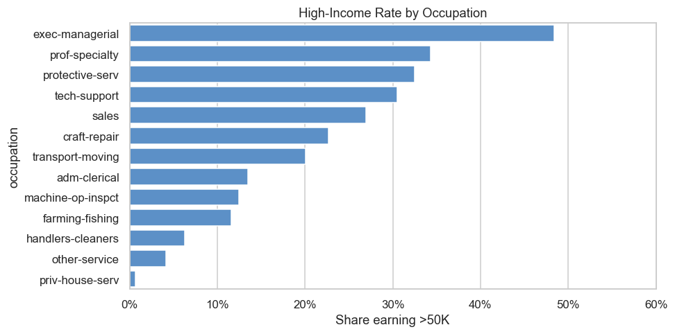

These findings suggest that occupation captures important differences in skill requirements, responsibility levels, and compensation structures, making it one of the strongest predictors of income.

### 4-2-5 Relationship and Income

A bar chart was used to compare the proportion of high-income earners across relationship categories. Relationship status exhibits one of the strongest associations with income. Individuals classified as husband (44.9%) and wife (47.5%) have substantially higher rates of earning more than $50K than individuals classified as own-child (1.3%), unmarried (6.3%), or other-relative (3.8%).
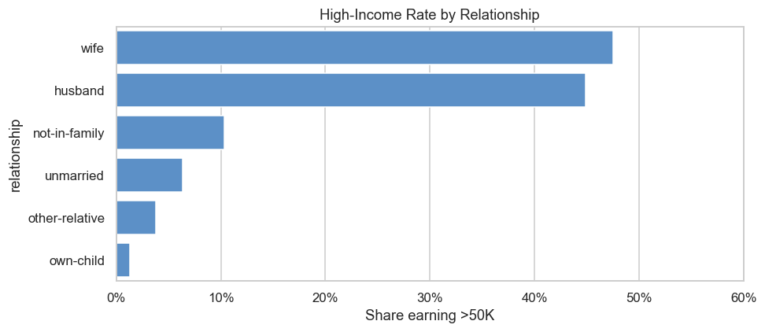

Because relationship status is closely related to household composition and marital status, some of its explanatory power may reflect similar underlying demographic factors.

### 4-2-6 Race and Income 

Differences in income distribution are also observed across racial groups. Asian-Pac-Islander (26.6%) and White (25.6%) individuals exhibit higher proportions of high-income earners than Black (12.4%), Amer-Indian-Eskimo (11.6%), and Other (9.2%) groups.

A 100% stacked bar chart was used to visualise the income composition within each racial group. This chart type standardises each group to the same height, making it easier to compare proportions rather than absolute counts.
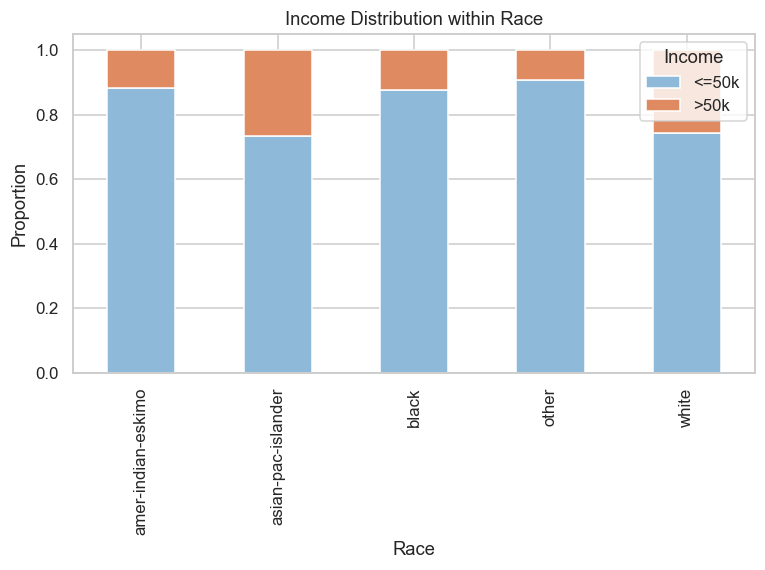

### 4-2-7 Sex and Income

Sex demonstrates a substantial relationship with income. Approximately 30.6% of males earn more than $50K compared with only 11.0% of females.

The stacked bar chart clearly illustrates this difference, with the proportion of high-income earners being considerably larger among males. This represents one of the largest income disparities observed among the categorical variables.
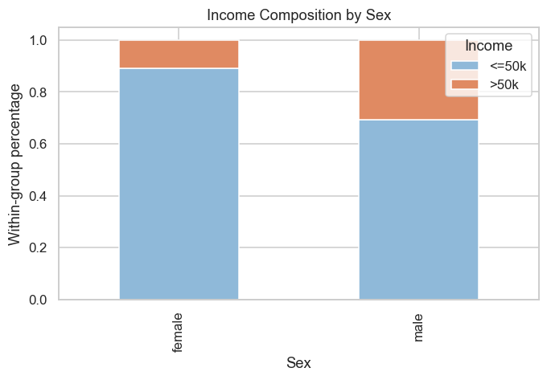

### 4-2-8 Native Country and Income

Native country shows some variation in high-income rates. Among countries with at least 50 observations, India (40.0%), Taiwan (39.2%), and Japan (38.7%) exhibit the highest proportions of high-income earners. A bar chart displaying the high-income rate for countries with at least 50 observations was used.
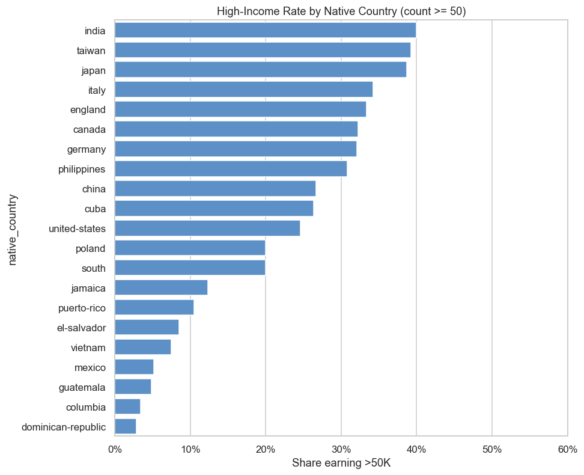

However, many countries are represented by relatively small sample sizes, making their estimated rates less stable. Since the United States accounts for the vast majority of observations, conclusions regarding smaller countries should be interpreted cautiously. For predictive modelling, grouping infrequent countries may help reduce noise and improve model stability.

## 4-3 Correlation and Association with Income

To quantify the strength of relationships identified through visual analysis, Pearson correlation coefficients were calculated for numerical variables and Cramer's V statistics were calculated for binary and categorical variables.

### 4-3-1 Numerical Variables

The Pearson correlation analysis shows that both age (r = 0.237) and hours worked per week (r = 0.236) have positive associations with income. Older individuals and those who work longer hours are more likely to belong to the high-income group. However, both correlations remain relatively weak, suggesting that neither variable alone can strongly explain income variation.

Then heatmap were used to visualise the relationships among numerical variables. Heatmaps provide an intuitive overview of correlation strength and direction while also helping identify potential multicollinearity issues.
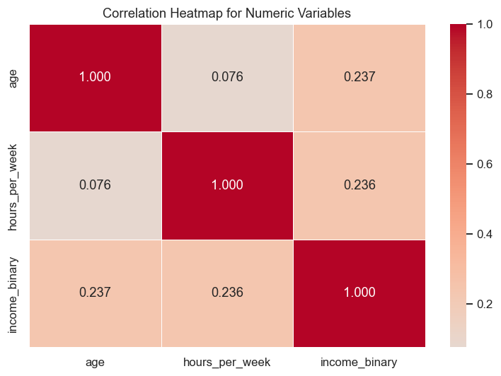

### 4-3-2 Binary Variables

Among the binary indicators, capital_gain_flag exhibits a stronger association with income (Cramer's V = 0.266) than capital_loss_flag (Cramer's V = 0.139). This finding suggests that individuals reporting capital gains are substantially more likely to belong to the high-income group.

### 4-3-3 Categorical Variables

Cramer's V analysis reveals clear differences in the strength of association across categorical variables:

| Variable       | Cramer's V |
| -------------- | ---------- |
| Relationship   | 0.454      |
| Marital Status | 0.447      |
| Education      | 0.369      |
| Occupation     | 0.314      |
| Sex            | 0.216      |
| Workclass      | 0.168      |
| Race           | 0.101      |
| Native Country | 0.098      |

The strongest associations are observed for relationship status and marital status, followed by education and occupation. These variables display substantial differences in income distributions and are likely to contribute significantly to predictive modelling.

Moderate associations are observed for sex and workclass, while race and native country demonstrate comparatively weaker relationships with income.

## 4-4 Bivariate Analysis Summary

Overall, the results largely support the study hypotheses. Significant differences in income distribution are observed across demographic, occupational, educational, and family-related groups, providing strong support for Hypothesis 1.

The analysis identifies relationship status, marital status, education level, and occupation as the variables most strongly associated with income. Among numerical variables, age and hours worked per week exhibit similar levels of association with income. Additionally, capital gain indicators demonstrate meaningful predictive potential.

The findings partially support Hypothesis 2. Education level and occupation are indeed among the most influential factors affecting income, consistent with expectations. However, family-related variables, particularly relationship status and marital status, display even stronger associations than initially anticipated. These results suggest that income is influenced not only by human capital factors such as education and occupation, but also by household structure and family circumstances.

# 5-Multivariate Analysis

Multivariate analysis investigates how relationships change when additional variables are considered simultaneously. Following the approach demonstrated in the course examples, this section explores interactions among variables and evaluates whether introducing a third variable changes the interpretation of an observed relationship. Particular attention is given to identifying potential examples of Simpson's paradox and understanding how demographic and socioeconomic factors interact in explaining income outcomes.

To address these analytical objectives, two new hypotheses will be proposed and examined.

## 5-1 Age, Hours Worked per Week and Income

**Hypothesis:**

A negative correlation exists between age and weekly working hours, and this relationship changes when income is introduced as an additional variable.

**Analysis:**

A scatter plot with a regression line was used to examine the relationship between age and hours worked per week. An additional scatter plot coloured by income group was used to investigate whether this relationship changes after introducing income as a third variable.
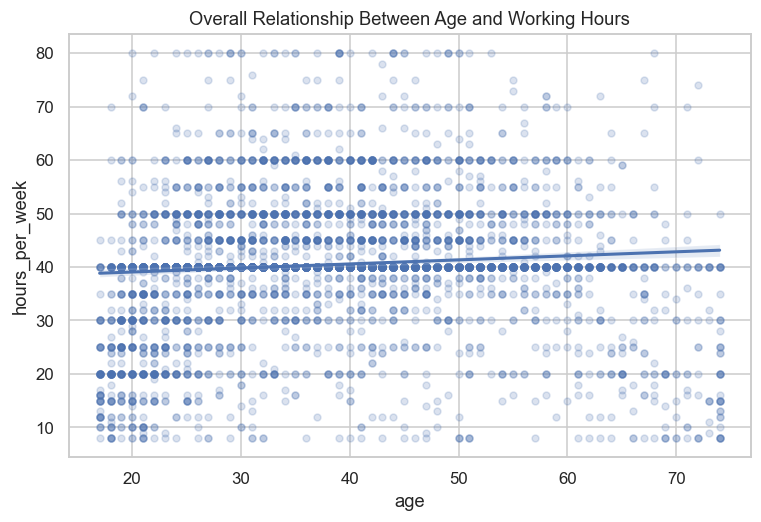
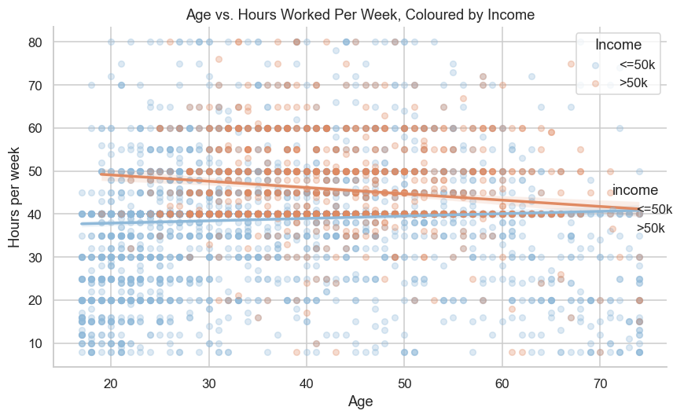

The overall correlation between age and weekly working hours is very weak (r = 0.076), indicating little linear relationship. However, after stratifying by income, different patterns emerge. For individuals earning ≤50K, the correlation is weakly positive (r = 0.053), whereas for those earning >50K, it becomes weakly negative (r = -0.128).

This reversal in correlation direction suggests a potential example of Simpson's paradox, where the relationship observed in the overall data differs from the relationships within subgroups. The scatter plot also shows that high-income individuals are mainly concentrated among middle-aged adults working around 40–60 hours per week, while low-income individuals are more widely distributed across ages and working hours.

## 5-2 Sex, Education and Income

**Hypothesis:**

Education level influences the relationship between sex and income, demonstrating how a third variable can alter the interpretation of a two-variable relationship.

**Analysis:**

A grouped bar chart was used to compare the proportion of individuals earning more than $50K across sex categories within each education level. Grouped bar charts are effective for comparing multiple categories simultaneously and allow interaction effects between sex and education to be observed more clearly than overall summary statistics.


At the overall level, males exhibit a substantially higher high-income rate (30.58%) than females (10.96%). This result is consistent with the patterns observed in the bivariate analysis.

After introducing education level, the income advantage for males remains present across all education categories. For example, among individuals holding a bachelor's degree, 50.37% of males earn more than $50K compared with 20.95% of females. Similar patterns are observed across master's, doctorate, and professional degree categories.

Unlike the previous example, no Simpson's paradox is observed because the direction of the relationship remains unchanged after stratification. Males consistently show higher high-income rates regardless of education level.

Nevertheless, education clearly moderates the strength of the relationship. The difference in income rates between males and females becomes larger among highly educated groups and smaller among lower education groups. This suggests that education influences the magnitude of the gender-income gap, even though it does not reverse the overall pattern.

## 5-3 Multivariate Analysis Summary

The multivariate analysis demonstrates that relationships observed in bivariate analysis can change when additional variables are considered. In the relationship between age and weekly working hours, income acts as a lurking variable and produces a pattern consistent with Simpson's paradox, where the correlation observed within income groups differs from the overall correlation.

The analysis of sex, education, and income illustrates a different type of interaction. Education does not reverse the relationship between sex and income, but it affects the strength of that relationship, indicating a moderating effect.

Overall, these findings highlight the importance of considering multiple variables simultaneously when analysing income outcomes. Relationships observed in aggregated data may mask important subgroup differences, and multivariate analysis provides a more comprehensive understanding of the factors associated with income.

# 6-Data-Quality Hooks

In addition to exploring relationships between variables, EDA can also reveal data-quality issues that may affect interpretation and model performance. This section highlights several project-specific characteristics of the Adult Income dataset.

## 6-1 Hook A: Target Class Imbalance

The target variable is noticeably imbalanced. Individuals earning $50K or less account for 24,696 observations (75.91%), while only 7,838 observations (24.09%) belong to the >50K class.


This imbalance may affect model evaluation because a classifier can achieve relatively high accuracy by simply predicting the majority class. Therefore, future classification models should be assessed using additional metrics such as precision, recall, and F1-score rather than relying solely on accuracy.

## 6-2 Hook B: Rare Categorical Groups

Category frequency counts were examined across all categorical variables to identify groups with very small sample sizes.

Several categorical variables contain categories with very few observations. For example, *holand-netherlands* appears only once, *armed-forces* appears 9 times, and *married-af-spouse* appears 23 times.

Because estimates derived from very small groups are highly sensitive to random variation, unusually high or low income rates may not reflect meaningful patterns. As a result, subgroup analyses should always be interpreted together with the corresponding sample sizes, and infrequent categories may need to be grouped or encoded carefully during modelling.

## 6-3 Hook C: Sparse Capital Gain and Capital Loss Indicators

A bar chart was used to compare the proportion of records containing capital-gain and capital-loss flags. Bar charts are effective for illustrating differences in prevalence between binary indicators.
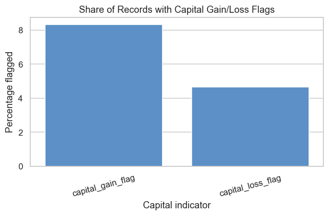

Both capital-related variables are highly sparse. Only 8.34% of individuals have a capital-gain flag, while just 4.67% have a capital-loss flag. The majority of observations therefore contain no reported capital gains or losses.

Although previous analysis showed that these variables are associated with income, the flagged groups represent only a small portion of the dataset. Consequently, patterns involving capital gains and losses should be interpreted cautiously, as results may be influenced by the limited number of positive cases.

# 7-Conclusion

The EDA confirms that the cleaned Adult Income dataset is suitable for predictive modelling. The dataset contains no missing values, consistent variable formats, and a mix of numerical and categorical features that provide useful information for income classification.

Univariate analysis shows that many variables are unevenly distributed. Most individuals work in the private sector, have a high-school level education, are married-civil-spouse, male, white, and from the United States. Age is concentrated among working-age adults, while hours worked per week is strongly centred around 40 hours.

Bivariate and multivariate analyses reveal that income is associated with several demographic, educational, employment, and financial factors. Education, occupation, marital status, relationship, and capital-gain indicators show some of the strongest relationships with income. Age and weekly working hours are also positively associated with higher income, while multivariate analysis highlights that some relationships can change when additional variables are considered.

The EDA also identifies several data-quality considerations. The target variable is imbalanced, some categorical groups contain very few observations, and the capital gain/loss indicators are highly sparse. These characteristics should be considered during feature engineering, model evaluation, and interpretation of results.

Overall, the findings support proceeding with a binary income classification task. The most promising predictors include education, occupation, marital status, relationship, age, and hours worked per week indicators. Future modelling should pay particular attention to class imbalance and subgroup performance when evaluating model effectiveness.
