# M5: Data Modelling & Visualisation

# Contents

- [1 Load Data](#1-Load-Data)
- [2 Target and Feature Definition](#2-Target-and-Feature-Definition)
- [3 Train-Test Split](#3-Train-Test-Split)
- [4 Preprocessing Pipeline](#4-Preprocessing-Pipeline)
- [5 Cross-Validation Strategy](#5-Cross-Validation-Strategy)
- [6 Logistic Regression](#6-Logistic-Regression)
  - [6.1 Model Introduction](#6-1-Model-Introduction)
  - [6.2 Cross-Validation and Hyperparameter Tuning](#6-2-Cross-Validation-and-Hyperparameter-Tuning)
  - [6.3 Test Results and Analysis](#6-3-Test-Results-and-Analysis)

- [7 Decision Tree](#7-Decision-Tree)
  - [7.1 Model Introduction](#7-1-Model-Introduction)
  - [7.2 Cross-Validation and Hyperparameter Tuning](#7-2-Cross-Validation-and-Hyperparameter-Tuning)
  - [7.3 Test Results and Analysis](#7-3-Test-Results-and-Analysis)
  
- [8 Random Forest](#8-Random-Forest)
  - [8.1 Model Introduction](#8-1-Model-Introduction)
  - [8.2 Cross-Validation and Hyperparameter Tuning](#8-2-Cross-Validation-and-Hyperparameter-Tuning)
  - [8.3 Test Results and Analysis](#8-3-Test-Results-and-Analysis)

- [9 XGBoost](#9-XGBoost)
  - [9.1 Model Introduction](#9-1-Model-Introduction)
  - [9.2 Cross-Validation and Hyperparameter Tuning](#9-2-Cross-Validation-and-Hyperparameter-Tuning)
  - [9.3 Test Results and Analysis](#9-3-Test-Results-and-Analysis)

- [10 Model Performance Comparison](#10-Model-Performance-Comparison)
  - [10.1 Comparison Table](#10-1-Comparison-Table)
  - [10.2 Metric Comparison](#10-2-Metric-Comparison)
  - [10.3 ROC and Precision-Recall Curve Analysis](#10-3-ROC-and-Precision-Recall-Curve-Analysis)

- [11 Best Model Selection](#11-Best-Model-Selection)

- [12 Feature Importance](#12-Feature-Importance)
  - [12.1 Final Model for Interpretation](#12-1-Final-Model-for-Interpretation)
  - [12.2 Model-Based Feature Importance](#12-2-Model-Based-Feature-Importance)
  - [12.3 Permutation Importance](#12-3-Permutation-Importance)
  - [12.4 Feature Importance Summary](#12-4-Feature-Importance-Summary)

- [13 SHAP Explanations](#13-SHAP-Explanations)
  - [13.1 SHAP Setup and Additivity Check](#13-1-SHAP-Setup-and-Additivity-Check)
  - [13.2 Global SHAP Importance](#13-2-Global-SHAP-Importance)
  - [13.3 SHAP Summary Plot](#13-3-SHAP-Summary-Plot)
  - [13.4 SHAP Dependence Plot](#13-4-SHAP-Dependence-Plot)
  - [13.5 Local SHAP Explanation](#13-5-Local-SHAP-Explanation)
  - [13.6 SHAP Summary](#13-6-SHAP-Summary)

- [14 PDP and ICE Check](#14-PDP-and-ICE-Check)
  - [14.1 Method Introduction](#14-1-Method-Introduction)
  - [14.2 Visualisation and Results Analysis](#14-2-Visualisation-and-Results-Analysis)

- [15 Stakeholder Visualisations](#15-Stakeholder-Visualisations)
  - [15.1 Classification Results](#15-1-Classification-Results)
  - [15.2 Probability Distribution](#15-2-Probability-Distribution)
  - [15.3 Threshold Trade-Offs](#15-3-Threshold-Trade-Offs)
  - [15.4 Stakeholder Feature Drivers](#15-4-Stakeholder-Feature-Drivers)
  - [15.5 Stakeholder Summary](#15-5-Stakeholder-Summary)
  
- [16 Failure Modes & Limitations](#16-Failure-Modes-&-Limitations)
  - [16.1 Confusion Matrix and Error Types](#16-1-Confusion-Matrix-and-Error-Types)
  - [16.2 Error Slice Analysis](#16-2-Error-Slice-Analysis)
  - [16.3 Bias and Fairness Discussion](#16-3-Bias-and-Fairness-Discussion)
  - [16.4 Class Imbalance Limitation](#16-4-Class-Imbalance-Limitation)
  - [16.5 Generalizability Limitation](#16-5-Generalizability-Limitation)
  - [16.6 Overfitting Check](#16-6-Overfitting-Check)

# 1-Load Data

The cleaned Adult Income dataset produced during previous milestones was used as the starting point for model development. The dataset was inspected to verify its dimensions, variable structure, and missing values before modelling.

The cleaned dataset contains 32,534 observations and 13 variables with no missing values. The target variable is income, and an additional binary target variable, income_binary, is created for classification modelling.

# 2-Target and Feature Definition

The prediction target is whether an individual's annual income exceeds $50K.

The binary variable income_binary is defined as:

- 0: income ≤ `$50K`
- 1: income > `$50K`

The feature matrix X is created by removing both income and income_binary from the dataset, while the target vector y consists only of income_binary.

Removing these variables prevents target leakage, ensuring that the model learns only from information that would be available before prediction.

# 3-Train-Test Split

Before model training, the distribution of the target classes was examined.

Approximately 75.9% of observations belong to the ≤50K class, while only 24.1% belong to the >50K class. This indicates a moderately imbalanced classification problem.

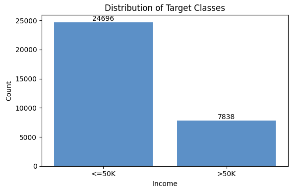

Because of this imbalance, a stratified train-test split was adopted. Stratified sampling preserves the original class proportions in both training and testing datasets.

The dataset was divided into:

- Training set: 26,027 observations
- Test set: 6,507 observations

Verification of the class proportions shows that both subsets maintain nearly identical distributions, reducing sampling bias and improving the reliability of model evaluation.

Since the target classes are imbalanced, model performance will be evaluated using multiple metrics, including Precision, Recall, F1-score, and ROC-AUC rather than relying solely on Accuracy.

# 4-Preprocessing Pipeline

The Adult Income dataset contains both numerical and categorical variables, requiring different preprocessing strategies.

Numerical variables are imputed using the median and standardized using StandardScaler.

Categorical variables are imputed using the most frequent category and transformed using One-Hot Encoding.

These preprocessing operations are integrated within a ColumnTransformer and a unified Pipeline.

This design ensures that identical preprocessing procedures are automatically applied during cross-validation, hyperparameter tuning, and final evaluation, thereby preventing information leakage.

# 5-Cross-Validation Strategy

To obtain reliable estimates of model performance, Stratified K-Fold Cross-Validation is adopted throughout the modelling process.

Five folds are used, with each fold preserving the original class distribution of the target variable.

During each iteration:

- Four folds are used for training.
- One fold is used for validation.

This process is repeated five times so that every observation serves as validation data exactly once.

The same validation strategy is also applied during hyperparameter tuning to ensure that all machine learning models are evaluated under identical conditions.

The modelling workflow follows four consistent steps:

1. Apply the preprocessing pipeline.
2. Perform Stratified K-Fold cross-validation.
3. Conduct hyperparameter tuning using GridSearchCV.
4. Evaluate the best model on the independent test set.

Section 6-9 develops and evaluates four classification models for predicting whether an individual’s annual income exceeds $50K: Logistic Regression, Decision Tree, Random Forest, and XGBoost. All models use the same preprocessing pipeline and stratified cross-validation strategy created in the previous section. The preprocessing pipeline includes numerical imputation and scaling, categorical imputation, and one-hot encoding. Keeping preprocessing inside the pipeline helps prevent data leakage during cross-validation and hyperparameter tuning.

The target variable is moderately imbalanced, with approximately 24% of individuals earning more than $50K. Therefore, model performance is evaluated using multiple metrics: Accuracy, Precision, Recall, F1-score, ROC-AUC, and PR-AUC. Accuracy is reported, but it is not used as the only evaluation criterion because a model could achieve high accuracy by mainly predicting the majority class, <=50K. F1-score, Recall, ROC-AUC, and PR-AUC are especially important for this project because the goal is not only to predict income accurately, but also to identify the high-income group reliably.

# 6-Logistic Regression

## 6-1 Model Introduction

Logistic Regression was used as the first model because it provides a clear and interpretable baseline for binary classification. In this project, the model predicts whether an individual belongs to the >50K income group based on demographic and employment-related features such as age, education, occupation, marital status, working hours, and capital gain/loss indicators.

This model is useful for the project because it gives a simple benchmark before applying more complex models. If more advanced models cannot substantially improve over Logistic Regression, then a simpler and more interpretable model may be preferable. Logistic Regression is also suitable for explaining broad relationships between predictors and income level, which is important for workforce analytics and income inequality analysis.

The Logistic Regression model was built inside the preprocessing pipeline. Numerical variables were scaled because Logistic Regression is sensitive to feature scale, while categorical variables were one-hot encoded. The model was first evaluated using 5-fold Stratified Cross-Validation to obtain a stable estimate of performance while preserving the class distribution in each fold.

## 6-2 Cross-Validation and Hyperparameter Tuning

The initial cross-validation results were:

| Metric | Mean | Std |
|---|---:|---:|
| Accuracy | 0.8412 | 0.0031 |
| Precision | 0.7092 | 0.0075 |
| Recall | 0.5775 | 0.0110 |
| F1-score | 0.6366 | 0.0084 |
| ROC-AUC | 0.8963 | 0.0068 |
| PR-AUC | 0.7282 | 0.0117 |

These results show that Logistic Regression is a strong baseline. Its ROC-AUC is high, meaning the model has good ability to rank high-income individuals above low-income individuals. However, the Recall is only moderate before tuning, meaning that some individuals who actually earn more than $50K are missed.

Hyperparameter tuning was then performed using `GridSearchCV`. The tuned parameters included `C`, `penalty`, `solver`, and `class_weight`. The parameter `C` controls regularization strength, while `penalty` determines whether L1 or L2 regularization is used. The `class_weight` option was included because the dataset is imbalanced and the minority `>50K` class needs more attention during training.

F1-score was used as the main tuning metric. This is appropriate because the target variable is imbalanced: only about one quarter of the observations belong to the high-income class. If Accuracy were used as the tuning metric, the model might favor the majority `<=50K` class and still appear to perform well. F1-score balances Precision and Recall, making it more suitable for selecting a model that can identify high-income individuals without ignoring prediction quality.

The best Logistic Regression model used:

```text
C = 1
penalty = l2
solver = liblinear
class_weight = balanced
```

The best cross-validation F1-score was: 0.6696

## 6-3 Test Results and Analysis

After tuning, the model was evaluated on the independent test set:

| Metric | Score |
|---|---:|
| Accuracy | 0.8031 |
| Precision | 0.5603 |
| Recall | 0.8501 |
| F1-score | 0.6754 |
| ROC-AUC | 0.9008 |
| PR-AUC | 0.7453 |

The tuned Logistic Regression model performs well for the project objective. Its Recall of 0.8501 means that it identifies most individuals in the `>50K` income group. This is useful for workforce analytics because the model is effective at detecting individuals with a higher probability of high income. However, the Precision of 0.5603 indicates that some individuals predicted as `>50K` are actually in the `<=50K` group. This reflects a trade-off caused by using `class_weight='balanced'`: the model becomes better at finding high-income individuals, but it also produces more false positives.

The confusion matrix visualisation supports this interpretation. It shows how many individuals were correctly classified as `<=50K` or `>50K`, and how many were misclassified. For the project, false negatives are especially important because they represent individuals who actually earn more than $50K but are predicted as `<=50K`. The tuned Logistic Regression model reduces this problem by achieving high Recall.
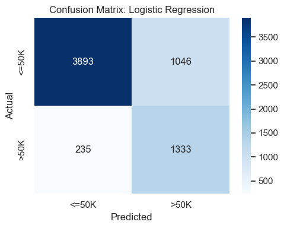

Overall, Logistic Regression provides a useful and interpretable baseline. It shows that demographic and employment-related features contain strong predictive information about income level. The high ROC-AUC and PR-AUC also suggest that the model can distinguish high-income and low-income individuals reasonably well.

# 7-Decision Tree

## 7-1 Model Introduction

Decision Tree was used as the second model because it provides an interpretable non-linear approach to income prediction. Unlike Logistic Regression, which models a linear relationship between predictors and the log-odds of high income, a Decision Tree can capture threshold-based rules and interactions between features. For example, income may depend not only on education level alone, but also on combinations of education, occupation, marital status, and weekly working hours.

This model is relevant to the project because it can provide rule-based explanations that are easier for non-technical stakeholders to understand. In workforce analytics, a tree model can help illustrate how different groups are separated into higher or lower predicted income categories.

The Decision Tree was also placed inside the same preprocessing pipeline to ensure fair comparison with Logistic Regression. It was first evaluated using 5-fold Stratified Cross-Validation.

## 7-2 Cross-Validation and Hyperparameter Tuning


The initial cross-validation results were:

| Metric | Mean | Std |
|---|---:|---:|
| Accuracy | 0.7893 | 0.0031 |
| Precision | 0.5643 | 0.0066 |
| Recall | 0.5491 | 0.0160 |
| F1-score | 0.5565 | 0.0097 |
| ROC-AUC | 0.7232 | 0.0044 |
| PR-AUC | 0.4355 | 0.0050 |

These results indicate that the default Decision Tree performs worse than Logistic Regression, especially in ROC-AUC and PR-AUC. This suggests that the default tree has weaker ranking ability and is less effective at distinguishing the minority high-income class. One possible reason is that a single Decision Tree can easily overfit local patterns in the training data, especially when many categorical variables are one-hot encoded.

To improve the model, hyperparameter tuning was performed using `GridSearchCV`. The tuned parameters included `criterion`, `max_depth`, `min_samples_split`, `min_samples_leaf`, and `class_weight`. These parameters control how the tree splits the data and how complex the final tree can become. Tuning is important because an unconstrained tree can become too complex and generalize poorly.

The best Decision Tree model used:

```text
criterion = entropy
max_depth = None
min_samples_leaf = 20
min_samples_split = 2
class_weight = balanced
```

The best cross-validation F1-score was: 0.6463

## 7-3 Test Results and Analysis

The use of `min_samples_leaf=20` helps reduce overfitting by preventing the model from creating leaves based on very small groups of observations. The use of `class_weight='balanced'` again helps the model pay more attention to the minority `>50K` class.

On the independent test set, the tuned Decision Tree achieved:

| Metric | Score |
|---|---:|
| Accuracy | 0.7830 |
| Precision | 0.5318 |
| Recall | 0.8310 |
| F1-score | 0.6486 |
| ROC-AUC | 0.8797 |
| PR-AUC | 0.7050 |

The tuned Decision Tree performs much better than the default tree in terms of high-income detection. Its Recall of 0.8310 means that it identifies a large share of true `>50K` individuals. However, its Precision is 0.5318, which means that some predicted high-income cases are false positives. Compared with Logistic Regression, the Decision Tree has slightly lower Accuracy, F1-score, ROC-AUC, and PR-AUC.

The confusion matrix visualisation shows the same pattern: the tuned Decision Tree captures many high-income individuals, but it also misclassifies some low-income individuals as high-income. This is acceptable as part of model exploration, but it suggests that a single Decision Tree may not be the best final predictive model.
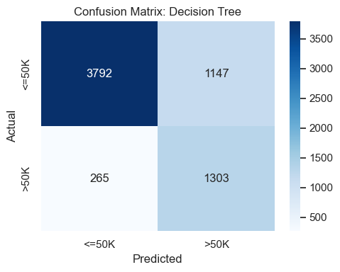

A simplified Decision Tree visualisation was also created using a shallow tree with `max_depth=3`. This visualisation is not the final tuned model, but it is useful for stakeholder communication. It provides a simple view of how a tree-based model makes decisions by splitting individuals into groups based on selected features. In the context of this project, this can help explain how factors such as education, occupation, capital gain indicators, and working hours may contribute to income prediction.
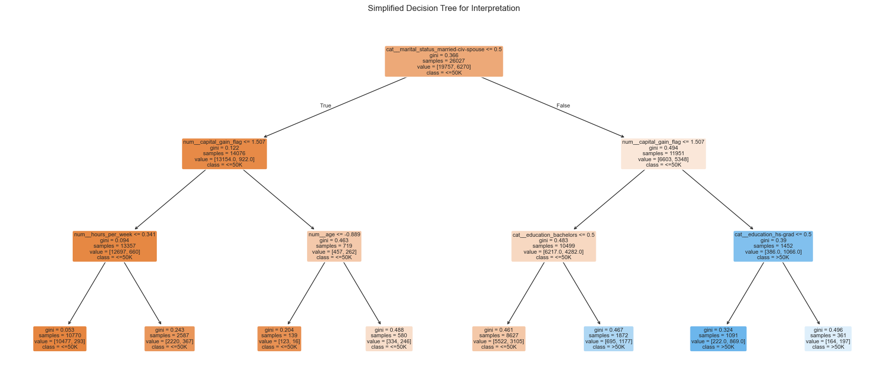

Overall, Decision Tree is useful because it provides an interpretable non-linear model and helps communicate decision logic. However, its lower performance compared with Logistic Regression suggests that a single tree may be too unstable for final deployment. This motivates the use of ensemble tree models, such as Random Forest and XGBoost, in later sections.

# 8-Random Forest

Random Forest was used as an ensemble tree-based model for the Adult Income binary classification task. The model combines many decision trees trained on bootstrap samples of the training data. By averaging the predictions from multiple trees, Random Forest usually reduces the variance and instability that can occur in a single Decision Tree.

This model is appropriate for the project because the relationship between demographic, education, work, and income variables may be non-linear. Random Forest can capture feature interactions without requiring a strictly linear relationship between predictors and the target outcome.

## 8-1 Model Introduction

The Random Forest pipeline used the same preprocessing workflow as the earlier models. Numerical variables were imputed and standardised, while categorical variables were imputed and one-hot encoded. Keeping preprocessing inside the pipeline ensures that the same transformations are applied during cross-validation, hyperparameter tuning, and test-set evaluation.

The baseline Random Forest used 200 trees and was evaluated using five-fold stratified cross-validation. Stratification was important because the target variable is moderately imbalanced, with the `>50K` class representing the minority class.

## 8-2 Cross-Validation and Hyperparameter Tuning

Before tuning, the baseline Random Forest achieved the following mean cross-validation results:

```text
Accuracy:  0.8233
Precision: 0.6527
Recall:    0.5700
F1-score:  0.6084
ROC-AUC:   0.8721
PR-AUC:    0.6701
```

These baseline results show that the model had reasonable accuracy and probability ranking ability, but its recall and F1-score were lower than desired. This means the default model missed a substantial number of actual high-income individuals.

Hyperparameter tuning was conducted using randomized search with F1-score as the optimization metric. The tuning process searched over the number of trees, maximum tree depth, minimum samples required for splitting and leaves, maximum features considered at each split, and class weighting.

The best Random Forest configuration was:

```text
n_estimators:       300
max_depth:          None
min_samples_split:  10
min_samples_leaf:   1
max_features:       sqrt
class_weight:       balanced
```

The best cross-validated F1-score after tuning was **0.6748**, which is a clear improvement over the baseline cross-validation F1-score of **0.6084**. The use of `class_weight='balanced'` helped the model pay more attention to the minority `>50K` class.

## 8-3 Test Results and Analysis

The tuned Random Forest was evaluated on the independent test set. Its final test-set results were:

```text
Accuracy:  0.8362
Precision: 0.6329
Recall:    0.7621
F1-score:  0.6916
ROC-AUC:   0.8982
PR-AUC:    0.7359
```

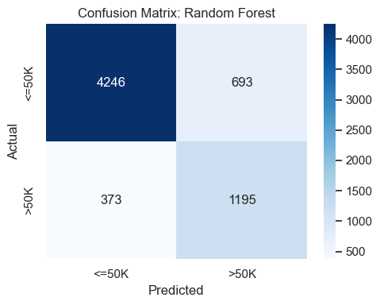

The Random Forest achieved the highest F1-score among all evaluated models. Its recall of **0.7621** indicates that it correctly identified a large proportion of individuals earning more than $50K. Its precision of **0.6329** means that some false positives remain, but the model provides the best overall balance between precision and recall.

Compared with the baseline Random Forest, tuning substantially improved recall and F1-score. This suggests that the tuned class weighting and tree structure made the model more suitable for the imbalanced classification setting. Overall, Random Forest is a strong candidate because it provides balanced minority-class performance while maintaining good accuracy and AUC values.

# 9-XGBoost

XGBoost was used as a gradient-boosted tree model. Unlike Random Forest, which builds many trees independently, XGBoost builds trees sequentially. Each new tree focuses on correcting the errors made by the previous ensemble, allowing the model to learn complex patterns gradually.

XGBoost is often effective on structured tabular datasets because it combines non-linear tree models with regularization and boosting. However, it is also more sensitive to hyperparameter choices than Random Forest, so tuning is important.

## 9-1 Model Introduction

The XGBoost model was trained using the same feature set and train-test split as the other models. The pipeline included the preprocessing transformer followed by the XGBoost classifier. The model output predicted probabilities for the positive class, which allowed the calculation of threshold-based metrics such as precision, recall, and F1-score, as well as ranking metrics such as ROC-AUC and PR-AUC.

Since the project focuses on predicting whether income exceeds $50K, XGBoost was treated as a binary classification model.

## 9-2 Cross-Validation and Hyperparameter Tuning

The baseline XGBoost model achieved the following mean cross-validation results:

```text
Accuracy:  0.8453
Precision: 0.7057
Recall:    0.6140
F1-score:  0.6566
ROC-AUC:   0.8991
PR-AUC:    0.7359
```

These results were already strong before tuning. XGBoost had higher precision and AUC values than the baseline Random Forest, suggesting that it was effective at ranking individuals by their likelihood of earning more than $50K. However, its recall was lower than Random Forest after tuning, meaning that it was more conservative in predicting the positive class.

Hyperparameter tuning was performed using randomized search with F1-score as the primary optimization metric. The search included learning rate, number of estimators, maximum tree depth, subsampling rate, column sampling rate, minimum child weight, and L2 regularization.

The best XGBoost configuration was:

```text
n_estimators:       250
learning_rate:      0.2
max_depth:          5
subsample:          1.0
colsample_bytree:   1.0
min_child_weight:   1
reg_lambda:         5
```

The best cross-validated F1-score after tuning was **0.6660**. This is slightly higher than the baseline XGBoost F1-score, but lower than the tuned Random Forest cross-validated F1-score.

## 9-3 Test Results and Analysis

The tuned XGBoost model achieved the following test-set results:

```text
Accuracy:  0.8512
Precision: 0.7168
Recall:    0.6327
F1-score:  0.6721
ROC-AUC:   0.9063
PR-AUC:    0.7592
```

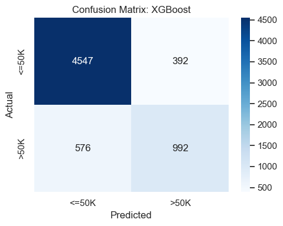

XGBoost achieved the highest accuracy, precision, ROC-AUC, and PR-AUC among the evaluated models. This indicates strong overall predictive performance and strong probability ranking ability. In other words, XGBoost was very good at assigning higher predicted probabilities to individuals who truly earned more than $50K.

However, its recall was only **0.6327**, which means it missed more actual high-income individuals than Random Forest and Logistic Regression. Therefore, XGBoost is a strong model when the goal is high precision or strong ranking performance, but it is not the best choice under F1-score because its lower recall reduces the balance between precision and recall.

# 10-Model Performance Comparison

All tuned models were compared on the same independent test set. Accuracy, precision, recall, and F1-score were used as the four core classification metrics. ROC-AUC and PR-AUC were also reported because they evaluate probability ranking performance across thresholds.

## 10-1 Comparison Table

The final model comparison is shown below:

| Model | Accuracy | Precision | Recall | F1-score | ROC-AUC | PR-AUC |
|---|---:|---:|---:|---:|---:|---:|
| Random Forest | 0.8362 | 0.6329 | 0.7621 | 0.6916 | 0.8982 | 0.7359 |
| Logistic Regression | 0.8031 | 0.5603 | 0.8501 | 0.6754 | 0.9008 | 0.7453 |
| XGBoost | 0.8512 | 0.7168 | 0.6327 | 0.6721 | 0.9063 | 0.7592 |
| Decision Tree | 0.7830 | 0.5318 | 0.8310 | 0.6486 | 0.8797 | 0.7050 |

The comparison shows that no single model dominates across every metric. XGBoost performs best on accuracy, precision, ROC-AUC, and PR-AUC, while Logistic Regression has the highest recall. Random Forest achieves the highest F1-score, which is the primary metric for this project.

## 10-2 Metric Comparison

Accuracy alone is not sufficient for this project because the target variable is imbalanced. A model can achieve high accuracy by performing well on the majority `<=50K` class while still missing many `>50K` observations. Therefore, precision, recall, and F1-score provide more useful information about positive-class performance.

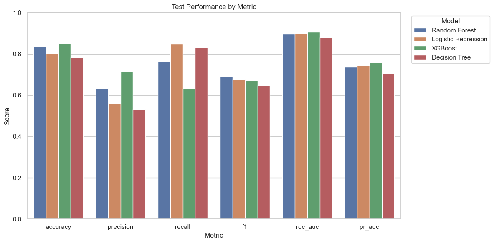

Logistic Regression has the highest recall (**0.8501**), meaning it captures the largest share of actual high-income individuals. However, its precision is the lowest among the stronger models, indicating more false positives.

XGBoost has the highest precision (**0.7168**) and accuracy (**0.8512**), meaning its positive predictions are more reliable. However, its lower recall shows that it is more conservative and misses more positive cases.

Random Forest provides the best compromise. Its precision is lower than XGBoost, but its recall is much higher. This balance leads to the highest F1-score (**0.6916**), making it the strongest model under the selected primary evaluation criterion.


## 10-3 ROC and Precision-Recall Curve Analysis

The ROC curves compare how well each model separates the two income classes across different thresholds. XGBoost has the highest ROC-AUC (**0.9063**), followed closely by Logistic Regression (**0.9008**) and Random Forest (**0.8982**). These high ROC-AUC values indicate that the top models rank positive and negative cases well.

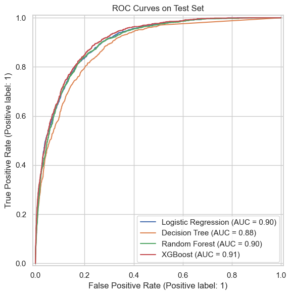

The precision-recall curves are especially important because the positive `>50K` class is the minority class. XGBoost also has the highest PR-AUC (**0.7592**), followed by Logistic Regression (**0.7453**) and Random Forest (**0.7359**). This suggests that XGBoost has the strongest probability ranking performance for the positive class.

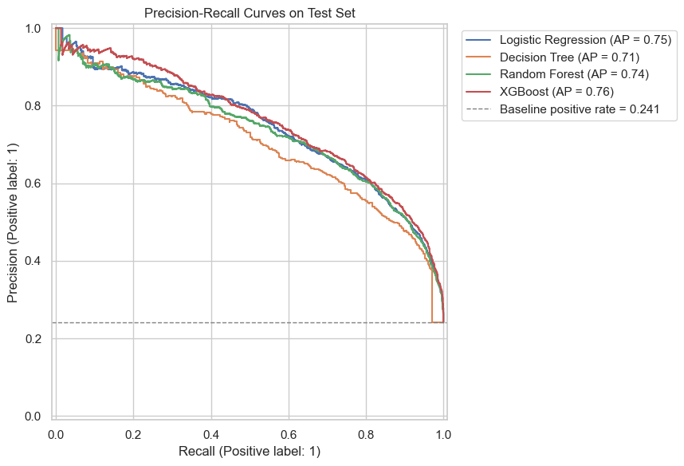

However, curve-based metrics evaluate ranking across thresholds, while the final F1-score is based on the selected classification threshold. Since the project selects the final model based on F1-score, Random Forest remains the preferred final model even though XGBoost has stronger ROC-AUC and PR-AUC.


# 11-Best Model Selection

The final model selection is based primarily on F1-score because the Adult Income dataset is moderately imbalanced and the project needs to balance precision and recall for the minority `>50K` class. Under this criterion, the tuned **Random Forest** is selected as the best final model.

The selected Random Forest achieved:

```text
Accuracy:  0.8362
Precision: 0.6329
Recall:    0.7621
F1-score:  0.6916
ROC-AUC:   0.8982
PR-AUC:    0.7359
```

This model provides the strongest balance between identifying high-income individuals and avoiding excessive false positives. Although XGBoost achieved the highest accuracy, ROC-AUC, and PR-AUC, its lower recall reduced its F1-score. Logistic Regression achieved the highest recall, but its lower precision also reduced its overall balance. Decision Tree was more interpretable but had weaker overall performance than the ensemble models.

Therefore, Random Forest is selected as the final model for the next interpretation stage. This choice is consistent with the later feature importance and SHAP analysis, which use the tuned Random Forest pipeline to explain the main drivers of income prediction.

# 12-Feature Importance

Feature importance analysis was conducted after the final model had been selected in the modelling stage. The purpose of this section is to identify which variables contribute most to the prediction of whether an individual earns more than $50K per year.

The selected final model is a **Random Forest classifier**. This model was chosen because it achieved the strongest balance between precision and recall on the independent test set, with a test F1-score of **0.6916**. Since the Adult Income dataset is moderately imbalanced, F1-score is more informative than accuracy alone because it considers both false positives and false negatives for the minority `>50K` class.

Two types of feature importance were used in this report. First, model-based feature importance was extracted from the Random Forest model. Second, permutation importance was calculated on the test set using F1-score as the evaluation metric. This second method is especially important because it measures how much model performance decreases when one original feature is randomly shuffled.


## 12-1 Final Model for Interpretation

The model selected for interpretation is the tuned **Random Forest** pipeline. The pipeline contains the same preprocessing steps used during model training, including imputation, scaling for numerical variables, and one-hot encoding for categorical variables. This is important because interpretation must be based on the exact model and preprocessing workflow used for prediction.

The final Random Forest was trained using the following original features:

```text
age
hours_per_week
capital_gain_flag
capital_loss_flag
workclass
education
marital_status
occupation
relationship
race
sex
native_country
```

The model's test-set performance provides the context for interpretation. It achieved an accuracy of **0.8362**, precision of **0.6329**, recall of **0.7621**, F1-score of **0.6916**, ROC-AUC of **0.8982**, and PR-AUC of **0.7359**. These results indicate that the model has strong ranking ability and captures a substantial proportion of high-income individuals, although false positives and false negatives remain.


## 12-2 Model-Based Feature Importance

Model-based feature importance was first extracted from the Random Forest model. For tree-based models, this measure reflects how much each feature contributes to reducing impurity across the trees in the forest. Because the model uses one-hot encoded categorical variables, the transformed feature importances were grouped back to their original feature names.

The model-based importance results show that `marital_status`, `age`, `relationship`, `education`, and `occupation` are the strongest predictors. These variables are closely related to life stage, household structure, education level, and employment type, which are all expected to influence income outcomes.

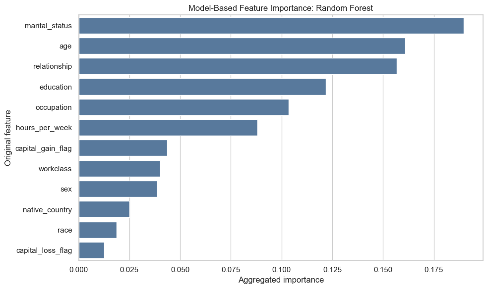

Although model-based importance is useful as a quick diagnostic, it should not be treated as the only explanation. Tree-based impurity importance can overvalue features with many possible splits or many encoded categories. Therefore, the analysis also uses permutation importance as a more reliable held-out evaluation method.


## 12-3 Permutation Importance

Permutation importance was calculated on the independent test set. Each original feature was shuffled one at a time, breaking its relationship with the target variable, and the decrease in F1-score was recorded. A larger drop in F1-score indicates that the feature is more important for the model's predictive performance.

The permutation importance results identify `education`, `age`, `marital_status`, `relationship`, and `occupation` as the top five features. This ranking is broadly consistent with the model-based importance results, which increases confidence that these variables are genuinely important rather than artifacts of one specific interpretation method.

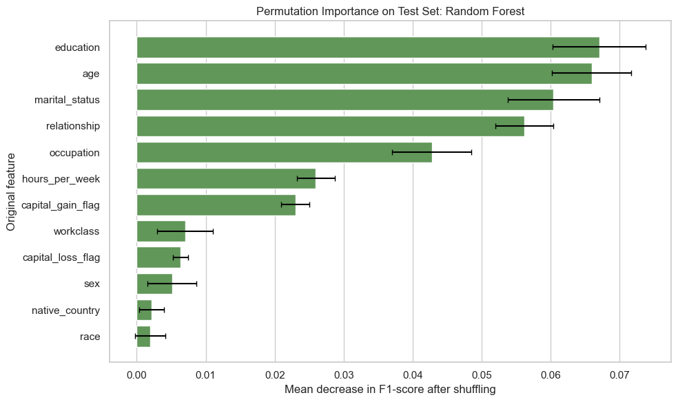

The strongest feature by permutation importance is `education`, with a mean F1-score decrease of approximately **0.0670** when shuffled. This suggests that education level provides substantial predictive information about income. `age` follows closely with an importance value of approximately **0.0660**, reflecting the role of career stage and accumulated work experience. `marital_status`, `relationship`, and `occupation` also show large effects, indicating that household structure and job type are important predictors of earning more than $50K.

In contrast, `race` and `native_country` have relatively small permutation importance values. This suggests that, within the fitted model and after accounting for other variables, these features contribute less to predictive performance than education, age, marital status, relationship, and occupation.


## 12-4 Feature Importance Summary

The feature importance analysis shows that the selected Random Forest model relies most strongly on education, age, marital status, relationship, and occupation. These findings are consistent with the earlier exploratory data analysis, where education level, employment characteristics, household structure, and age were all associated with higher income rates.

Permutation importance is used as the primary interpretation method in this report because it is model-agnostic, evaluated on held-out data, and aligned with the project's primary metric, F1-score. Model-based importance is still useful, but it should be interpreted cautiously because Random Forest impurity-based importance can be biased toward variables with more split opportunities.

Overall, the results suggest that the model's predictions are driven mainly by socioeconomic and employment-related variables rather than by weaker predictors such as race or native country.


# 13-SHAP Explanations

SHAP explanations were used to examine how individual features push model predictions toward either `>50K` or `<=50K`. While feature importance identifies which variables matter overall, SHAP values provide more detailed information about the direction and magnitude of each feature's contribution.

For computational efficiency, SHAP values were calculated on a sample of **200 test-set observations**. The SHAP analysis was applied to the transformed feature space created by the preprocessing pipeline. This means that categorical variables appear in the SHAP summary plot as one-hot encoded feature levels, while the aggregated SHAP importance chart maps them back to original feature names.


## 13-1 SHAP Setup and Additivity Check

The SHAP calculation produced a matrix with shape **(200, 103)**. This means that SHAP values were calculated for 200 sampled observations and 103 transformed features after one-hot encoding. The SHAP base value was approximately **0.5000**, representing the model's baseline output before adding the contribution of individual features.

An additivity check was used to verify that the SHAP values correctly reconstruct an individual model prediction. For one sampled observation, the model predicted a probability of **0.864174** for the `>50K` class. The SHAP base value plus the sum of all SHAP contributions also equalled **0.864174**, with a difference of only **0.00000009**.

This confirms the local accuracy property of SHAP: for an individual prediction, the explanation components add up to the model output. This makes SHAP particularly useful for explaining not only which features matter globally, but also why a specific case received a particular prediction.


## 13-2 Global SHAP Importance

Global SHAP importance was calculated by taking the mean absolute SHAP value for each transformed feature and then aggregating these values back to the original feature names. This provides a global ranking of features based on their average contribution magnitude across individual predictions.

The global SHAP importance results show that `marital_status`, `education`, `relationship`, `occupation`, and `age` are the most influential original variables. This is highly consistent with the feature importance results from Section 12.

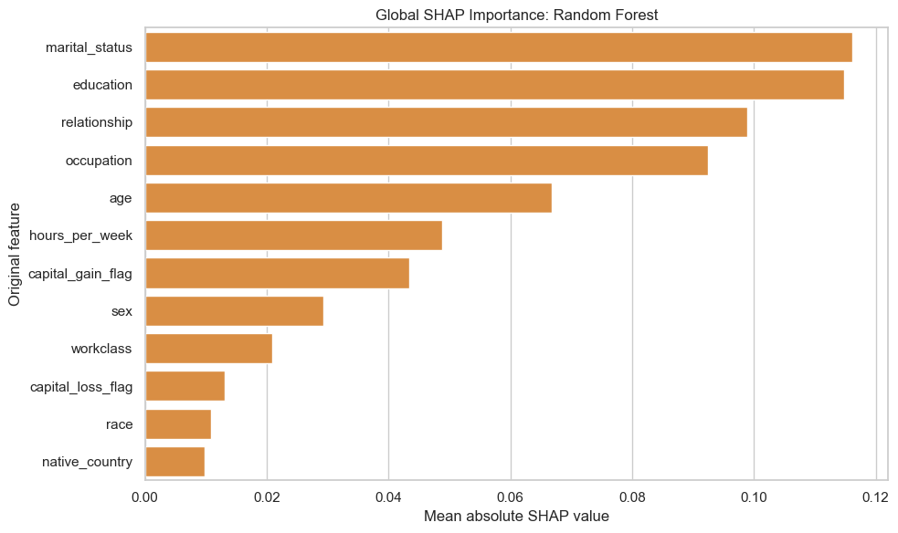

The highest mean absolute SHAP value belongs to `marital_status`, followed closely by `education`. This suggests that the model often adjusts predicted income probabilities based on marital and educational information. `relationship` and `occupation` also have large average SHAP contributions, confirming the role of household structure and job type in income prediction.


## 13-3 SHAP Summary Plot

The SHAP summary plot provides a more detailed view than a simple importance ranking. Each point represents one observation and one transformed feature. The x-axis shows the SHAP value, indicating whether that feature pushes the prediction toward `>50K` or toward `<=50K`. Features with wider horizontal spread have stronger effects on model predictions.

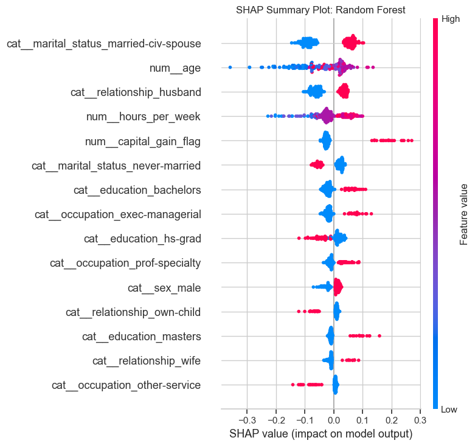

The summary plot shows that several specific education, marital status, relationship, occupation, and capital-gain indicators have strong directional effects. Some feature values push predictions upward toward the `>50K` class, while others push predictions downward toward the `<=50K` class. This supports the interpretation that the model is not relying on a single variable, but rather combines multiple demographic, education, employment, and financial signals.

Because the plot is based on one-hot encoded features, it is most useful for technical interpretation. For stakeholders, the aggregated SHAP importance chart and permutation importance chart are easier to communicate.


## 13-4 SHAP Dependence Plot

A SHAP dependence plot was created for `age`. This plot shows how the SHAP value of age changes as the transformed age value changes. Since age was scaled during preprocessing, the x-axis represents scaled age rather than raw age.

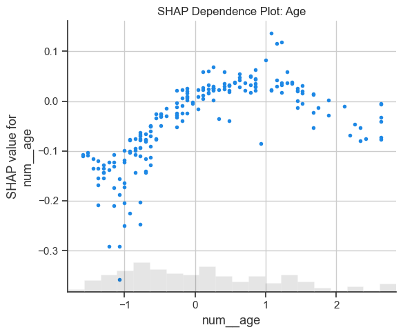

The dependence plot suggests that age has a non-linear relationship with the model's income predictions. In general, older working-age individuals tend to receive higher SHAP contributions for the `>50K` class than younger individuals, which is consistent with the earlier EDA finding that high-income individuals are older on average. However, the relationship is not perfectly linear, suggesting that age interacts with other variables such as education, occupation, marital status, and hours worked.


## 13-5 Local SHAP Explanation

A local SHAP waterfall plot was generated for the sampled observation with the highest predicted probability of earning more than $50K. This individual had a predicted probability of **0.9915** for the `>50K` class, and the actual class was also `>50K`.

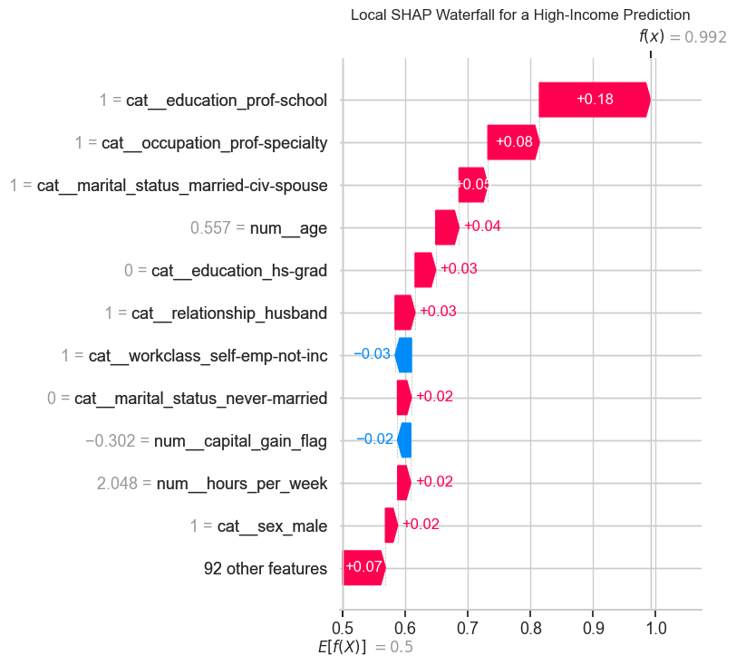

The waterfall plot starts from the model's baseline value and shows how individual feature contributions move the prediction upward or downward. Positive SHAP values push the prediction toward the high-income class, while negative SHAP values push it toward the low-income class.

This local explanation demonstrates how SHAP can be used to explain a single prediction in a transparent way. Instead of only stating that the model predicts high income, the waterfall plot identifies the specific feature values that contributed most to that prediction.


## 13-6 SHAP Summary

The SHAP analysis confirms the main findings from the feature importance section. Across global SHAP importance, the SHAP summary plot, and the local waterfall explanation, the model relies heavily on variables related to education, marital status, relationship, occupation, and age.

The SHAP additivity check also confirms that the explanation is faithful to the model output for individual predictions. This is important because it means the explanation is not only a general approximation but a decomposition of the actual model prediction.

Overall, SHAP adds interpretability by showing both the magnitude and direction of feature effects. This makes it a valuable complement to permutation importance, especially when explaining individual predictions or communicating how different features push predicted probabilities up or down.


# 14-PDP and ICE Check

This section uses Partial Dependence Plot (PDP) and Individual Conditional Expectation (ICE) analysis to explain how the selected best model, Random Forest, responds to two key numerical workforce variables: `age` and `hours_per_week`. This supports the project goal of understanding which demographic and employment-related factors are associated with the model's prediction of whether annual income exceeds $50K.

## 14-1 Method Introduction

PDP and ICE are used as model interpretation tools after model selection. While SHAP explains how features contribute to predictions, PDP and ICE focus on how the predicted probability changes when one feature varies.

The orange PDP line shows the average model response across the sample. The blue ICE lines show individual-level responses, so they reveal whether the effect is consistent for everyone or varies across different people. In this project, `age` and `hours_per_week` are selected because they are continuous variables, easy to interpret, and directly related to the project's workforce analytics questions.

## 14-2 Visualisation and Results Analysis

The code uses a sample of the test set to keep the calculation efficient. The analysis is applied to `best_final_model`, which is the final selected Random Forest model. Therefore, the plots explain the behaviour of the chosen model rather than comparing all four models.
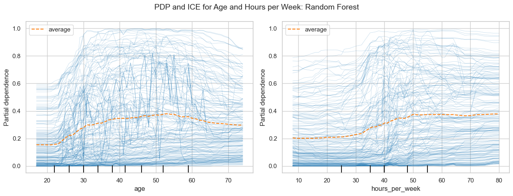

The PDP/ICE plots indicate that both `age` and `hours_per_week` influence the Random Forest model's predicted probability of earning more than $50K.

For `age`, the average predicted probability generally increases from young adulthood to middle age, reaches a higher level around middle age, and then slightly decreases after older working ages. This suggests that the model associates middle-age workers with a higher probability of being in the `>50K` income group, which is consistent with the idea that work experience and career progression may be related to higher income.

For `hours_per_week`, the average predicted probability increases from part-time working hours toward full-time and longer working hours, then becomes relatively stable after around 50 hours per week. This suggests that the model treats working hours as an important employment-related signal, but very long hours do not necessarily continue to increase the predicted probability strongly.

The wide spread of the blue ICE curves shows that the effect is not identical for every individual. For example, two people with the same age or working hours may still receive different predicted probabilities because of other variables such as education, occupation, marital status, and workclass. This supports the project's conclusion that income prediction depends on interactions among multiple demographic and employment-related factors, not only one variable.

# 15-Stakeholder Visualisations

Stakeholder visualisations were created to translate technical model results into practical insights. While model evaluation metrics and SHAP plots are useful for technical audiences, stakeholders often need clearer summaries of model performance, prediction confidence, threshold trade-offs, and the main drivers of predictions.

The following visualisations focus on the final Random Forest model and its predictions on the independent test set.


## 15-1 Classification Results

The confusion matrix summarises how the model's predictions compare with the true income classes. The count matrix shows the number of correct and incorrect predictions, while the percentage matrix shows the same information within each actual class.

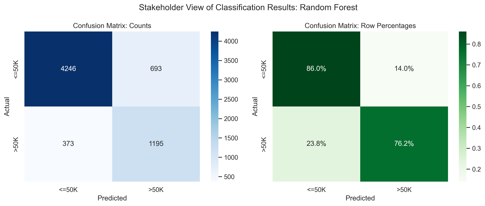

The final model achieves a test accuracy of **0.8362**, meaning that approximately 83.6% of test-set observations are classified correctly. However, because the target is imbalanced, accuracy alone is not sufficient. The model's recall for the `>50K` class is **0.7621**, indicating that it correctly identifies about three-quarters of high-income individuals. Its precision is **0.6329**, meaning that some predicted high-income cases are false positives.

This trade-off is acceptable for the selected F1-focused modelling objective, but it also shows that the model should not be interpreted as error-free. Some borderline individuals remain difficult to classify, especially when their feature profiles resemble both income groups.


## 15-2 Probability Distribution

The predicted probability distribution shows how confidently the model separates the two income classes. Each observation receives a predicted probability of belonging to the `>50K` class.

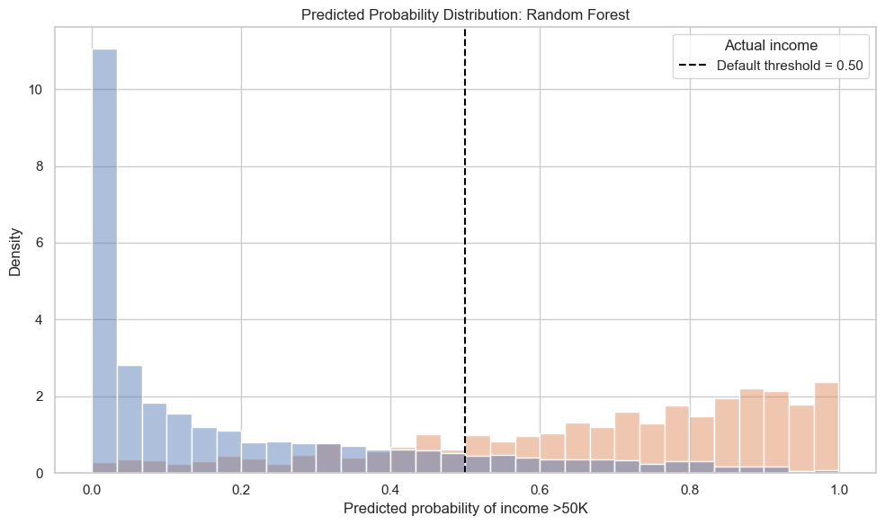

The distribution shows that many `<=50K` observations receive low predicted probabilities, while many `>50K` observations receive higher predicted probabilities. This indicates that the model has meaningful discriminatory power. The ROC-AUC of **0.8982** supports this conclusion, showing that the model ranks high-income individuals above low-income individuals with strong consistency.

However, there is still overlap around the default threshold of 0.50. These overlapping cases represent individuals whose characteristics are less clearly separated by the model. This overlap explains why false positives and false negatives remain even though the overall model performance is strong.


## 15-3 Threshold Trade-Offs

The threshold trade-off chart shows how precision, recall, F1-score, and the predicted positive rate change as the decision threshold varies from 0.10 to 0.90.

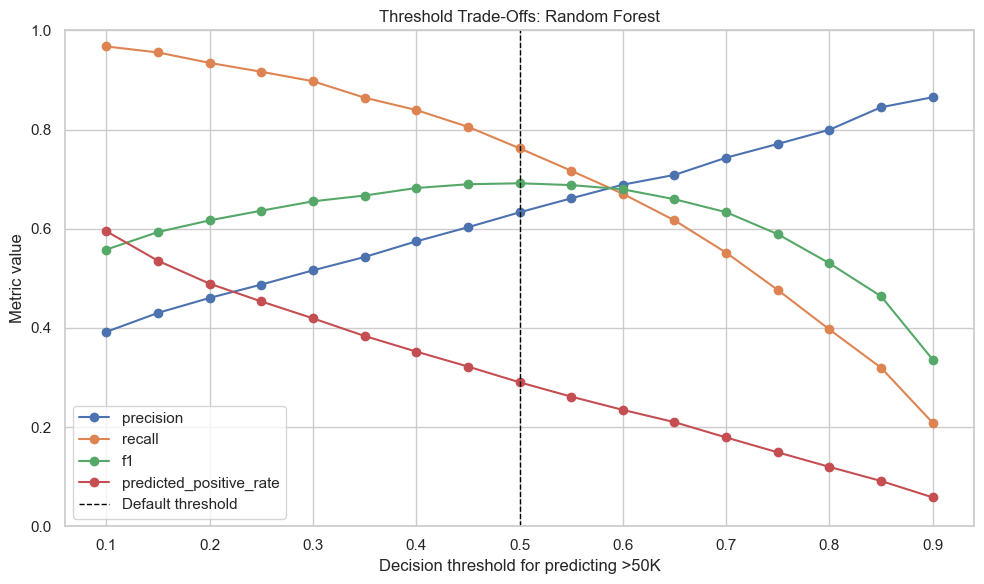

At lower thresholds, the model predicts more individuals as `>50K`. This increases recall but reduces precision. For example, at a threshold of **0.30**, recall rises to approximately **0.8973**, but precision falls to approximately **0.5160**. This means the model captures more high-income individuals but also produces more false positives.

At higher thresholds, the model becomes more conservative. For example, at a threshold of **0.70**, precision increases to approximately **0.7431**, but recall falls to approximately **0.5517**. This means the model's high-income predictions are more reliable, but it misses more true high-income individuals.

The default threshold of **0.50** achieves the highest F1-score among the evaluated thresholds, with an F1-score of **0.6916**. Therefore, the default threshold is retained as the recommended operating point for this project because it provides the best balance between precision and recall.


## 15-4 Stakeholder Feature Drivers

The stakeholder top-drivers chart presents the most important original features using permutation importance. This version is easier for non-technical audiences because it avoids one-hot encoded feature names and focuses on the original variables.

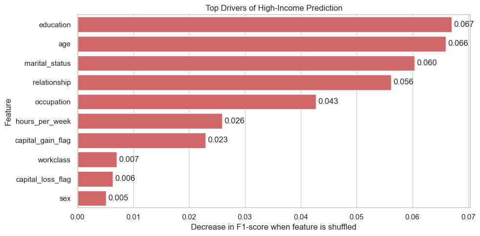

The chart shows that `education`, `age`, `marital_status`, `relationship`, and `occupation` are the most important drivers of high-income prediction. These variables are intuitive and align with broader socioeconomic expectations. Education captures human capital, age reflects career stage and experience, occupation captures job type, and marital or relationship status may reflect household structure and life-stage differences.

The lower-ranked features, such as `race` and `native_country`, contribute relatively little to the model's F1-score when shuffled. This suggests that the strongest predictive information comes from education, work, age, and household-related variables rather than country or race categories.


## 15-5 Stakeholder Summary

The final Random Forest model provides a strong but not perfect classification tool for identifying individuals likely to earn more than $50K. Its main performance results are:

```text
Accuracy:  0.8362
Precision: 0.6329
Recall:    0.7621
F1-score:  0.6916
ROC-AUC:   0.8982
PR-AUC:    0.7359
```

The positive class rate in the test set is approximately **24.1%**, while the model predicts the positive class for approximately **29.0%** of test observations at the 0.50 threshold. This indicates that the model is somewhat more likely to predict `>50K` than the base rate, which helps improve recall for the minority class.

From a stakeholder perspective, the model is most useful as a probability-ranking and decision-support tool rather than as an absolute decision-maker. Its predictions should be interpreted together with the selected threshold, the cost of false positives and false negatives, and the practical purpose of the classification task.


# 16-Failure Modes & Limitations

Although the Random Forest model achieved strong overall predictive performance, aggregate evaluation metrics may hide important weaknesses. This section examines where and how the final model fails by analysing classification errors, subgroup performance, fairness considerations, class imbalance, generalizability, and potential overfitting.


## 16-1 Confusion Matrix and Error Types

The stakeholder confusion matrix presented in Section 15 is reused to analyse the major error types of the final Random Forest model. The same model and default probability threshold of 0.50 are applied.

Stakeholder confusion matrix


In this income classification task, the four confusion matrix outcomes have the following interpretations:

True Positive (TP): actual income is greater than `$50K` and the model predicts greater than `$50K`.
True Negative (TN): actual income is less than or equal to `$50K` and the model predicts less than or equal to `$50K`.
False Positive (FP): actual income is less than or equal to `$50K` but the model predicts greater than `$50K`.
False Negative (FN): actual income is greater than `$50K` but the model predicts less than or equal to `$50K`.

False negatives are particularly important because they represent individuals whose true income exceeds `$50K` but who are classified as lower-income. In a workforce analytics context, this means that potentially high-income individuals may be overlooked.

False positives represent individuals whose income level is overestimated by the model. This may lead to overly optimistic assessments of some lower-income individuals.

Although the model achieves strong overall performance, these classification errors demonstrate that prediction uncertainty still exists, especially for observations near the decision boundary.

## 16-2 Error Slice Analysis

Overall performance metrics may conceal substantial differences across demographic and employment groups. To investigate this issue, the final model was evaluated separately across several important slices, including sex, education, race, and occupation.

The analysis calculates Accuracy, Recall, and F1-score for each subgroup.

Recall and F1-score by sex
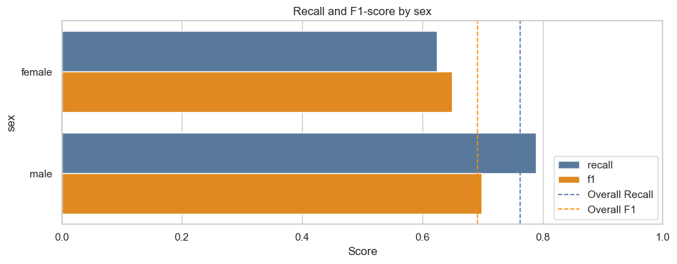

Recall and F1-score by education
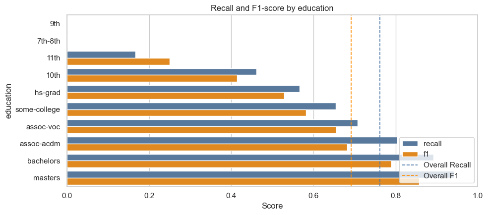

Recall and F1-score by occupation
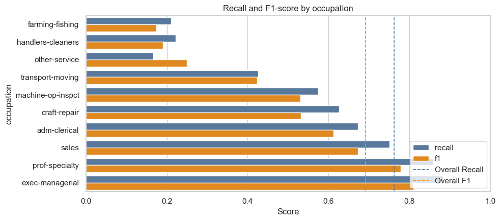

The results indicate that model performance is not uniform across all groups.

For education, the model performs strongly for highly educated groups such as Bachelors, Masters, and Doctorate, where Recall and F1-scores are relatively high. In contrast, lower education groups such as 7th-8th, 9th, and 11th show substantially lower Recall values, indicating that the model frequently misses high-income individuals in these categories.

For occupation, stronger performance is observed for groups such as Exec-managerial, Prof-specialty, Tech-support, and Sales. Lower performance appears for occupations including Farming-fishing, Handlers-cleaners, and Other-service. These groups also contain relatively few high-income individuals, making positive predictions more difficult.

For sex, the model achieves a higher F1-score for males than females. Male individuals have a higher proportion of observations earning more than $50K, which may contribute to the stronger predictive performance observed for this group.

Performance differences also exist across racial groups. However, some racial categories, including Other and Amer-Indian-Eskimo, contain relatively small sample sizes. Consequently, their evaluation metrics may be unstable and should be interpreted with caution.

Overall, the slice analysis demonstrates that strong aggregate performance can still hide weaker performance for specific demographic or occupational groups. These subgroup differences suggest that model evaluation should not rely solely on overall metrics such as accuracy or F1-score.


## 16-3 Bias and Fairness Discussion

The subgroup differences observed in the previous section raise potential fairness concerns.

Variables such as sex and race may contain historical social and economic inequalities that are reflected in the training data. Because machine learning models learn statistical relationships from historical observations, they may reproduce existing patterns of inequality.

Importantly, the model does not identify causal relationships. A higher or lower predicted income probability for a particular demographic group should not be interpreted as evidence that the demographic characteristic itself causes income differences.

The lower Recall and F1-scores observed for some groups suggest that the model may provide less reliable predictions for certain populations. This introduces potential fairness risks if such predictions were used in real-world applications such as workforce analytics, recruitment, or financial decision-making.

Therefore, model performance should always be monitored across demographic subgroups rather than relying solely on aggregate evaluation metrics.

## 16-4 Class Imbalance Limitation

The Adult Income dataset exhibits class imbalance because individuals earning more than `$50K` represent the minority class.

As a result, a model may achieve relatively high overall accuracy simply by predicting the majority class. Therefore, accuracy alone does not provide sufficient information about model quality.

The Recall metric is particularly important because it measures the model's ability to identify high-income individuals. Lower Recall indicates that some truly high-income observations are missed by the model.

Similarly, the F1-score provides a balance between Precision and Recall and is therefore more informative than accuracy alone in imbalanced classification problems.

For this reason, model evaluation in this project emphasises Recall, F1-score, and ROC-AUC rather than relying exclusively on overall accuracy.

## 16-5 Generalizability Limitation

The Adult Income dataset was derived from the 1994 United States Census database. Consequently, the dataset reflects historical labour market conditions, demographic patterns, and socioeconomic relationships that existed during that period.

Modern employment structures, educational systems, wage distributions, and workforce participation patterns may differ substantially from those represented in the dataset.

Furthermore, the dataset reflects the economic and social context of the United States and may not generalize to other countries or regions.

Therefore, the model developed in this project should be viewed primarily as a demonstration of predictive modelling techniques rather than a system that can be directly applied to contemporary income prediction tasks.

## 16-6 Overfitting Check

Potential overfitting was examined by comparing training, cross-validation, and independent test F1-scores.

Overfitting check: Train, CV, and Test F1-score
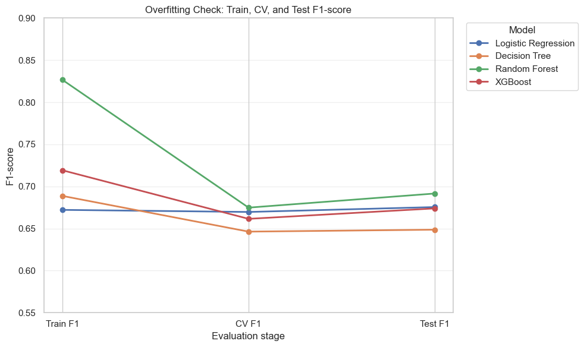

The comparison shows that Random Forest achieves a training F1-score substantially higher than its cross-validation F1-score, indicating that the model has relatively high capacity and may fit the training data strongly.

However, the test F1-score remains close to, and slightly higher than, the cross-validation F1-score. This suggests that the model generalizes reasonably well to unseen data despite the observed train-validation gap.

Decision Tree exhibits a smaller degree of overfitting, while Logistic Regression shows very similar training, validation, and test performance. Overall, the results suggest that the selected Random Forest model maintains acceptable generalization performance and does not exhibit severe overfitting on the independent test set.
