# Adult Income Classification: Final Report

# Contents

- [Adult Income Classification: Final Report](#adult-income-classification-final-report)
- [1. Introduction](#1-introduction)
- [2. Motivation](#2-motivation)
- [3. Dataset Description](#3-dataset-description)
  - [3.1 Source and prediction target](#31-source-and-prediction-target)
  - [3.2 Original variables](#32-original-variables)
  - [3.3 Final analytical dataset](#33-final-analytical-dataset)
- [4. Data Cleaning and Preprocessing](#4-data-cleaning-and-preprocessing)
  - [4.1 Missing-value identification and treatment](#41-missing-value-identification-and-treatment)
  - [4.2 Outlier assessment and winsorization](#42-outlier-assessment-and-winsorization)
  - [4.3 Duplicate handling](#43-duplicate-handling)
  - [4.4 Formatting and representation](#44-formatting-and-representation)
  - [4.5 Encoding, scaling, and leakage prevention](#45-encoding-scaling-and-leakage-prevention)
  - [4.6 Cleaning outcome](#46-cleaning-outcome)
- [5. Exploratory Data Analysis](#5-exploratory-data-analysis)
  - [5.1 Target Distribution and Dataset Structure](#51-target-distribution-and-dataset-structure)
  - [5.2 Univariate Analysis](#52-univariate-analysis)
  - [5.3 Bivariate Analysis with Income](#53-bivariate-analysis-with-income)
  - [5.4 Association Strength](#54-association-strength)
  - [5.5 Multivariate Findings](#55-multivariate-findings)
  - [5.6 EDA Summary](#56-eda-summary)
- [6. Feature Engineering](#6-feature-engineering)
  - [6.1 Target Definition](#61-target-definition)
  - [6.2 Feature Selection](#62-feature-selection)
  - [6.3 Capital Gain and Capital Loss Flags](#63-capital-gain-and-capital-loss-flags)
  - [6.4 Categorical Encoding](#64-categorical-encoding)
  - [6.5 Numerical Scaling](#65-numerical-scaling)
  - [6.6 Preprocessing Pipeline](#66-preprocessing-pipeline)
  - [6.7 Leakage Prevention and Reproducibility](#67-leakage-prevention-and-reproducibility)
  - [6.8 Feature Engineering Summary](#68-feature-engineering-summary)
- [7. Model Development](#7-model-development)
- [8. Model Evaluation and Selection](#8-model-evaluation-and-selection)
- [9. Model Interpretation](#9-model-interpretation)
  - [9.1 Feature Importance](#91-feature-importance)
  - [9.2 SHAP Explanation](#92-shap-explanation)
  - [9.3 PDP / ICE Analysis](#93-pdp-ice-analysis)
  - [9.4 Stakeholder Visualisations](#94-stakeholder-visualisations)
- [10. Deployment: Streamlit Web App](#10-deployment-streamlit-web-app)
  - [10.1 Home Page and Dataset Summary](#101-home-page-and-dataset-summary)
  - [10.2 Dataset Explorer](#102-dataset-explorer)
  - [10.3 Prediction Center Input](#103-prediction-center-input)
  - [10.4 Prediction Output and Explanation](#104-prediction-output-and-explanation)
  - [10.5 What-if Analysis Input](#105-what-if-analysis-input)
  - [10.6 What-if Analysis Output](#106-what-if-analysis-output)
  - [10.7 Model Performance Dashboard](#107-model-performance-dashboard)
  - [10.8 Model Diagnostics](#108-model-diagnostics)
  - [10.9 Deployment Summary](#109-deployment-summary)
- [11. Ethical Considerations and Limitations](#11-ethical-considerations-and-limitations)
  - [11.1 Sensitive Attributes and Fairness](#111-sensitive-attributes-and-fairness)
  - [11.2 Class Imbalance](#112-class-imbalance)
  - [11.3 Prediction Is Not Causation](#113-prediction-is-not-causation)
  - [11.4 Generalizability](#114-generalizability)
  - [11.5 Technical Limitations](#115-technical-limitations)
- [12. Conclusion](#12-conclusion)


# 1. Introduction

Income is shaped by a combination of educational, occupational, demographic, and labor-related factors. Understanding these relationships is useful not only for predicting income groups, but also for examining how access to education, type of employment, occupation, and working patterns are associated with economic outcomes. In this project, we develop a binary classification workflow to predict whether an individual's annual income exceeds USD 50,000.

The analysis uses the Adult (also known as Census Income) dataset from the UCI Machine Learning Repository. The dataset was extracted from the 1994 U.S. Census database and contains individual-level demographic and employment attributes. The prediction target has two classes: `<=50K` and `>50K`. Because the target is categorical, the project is formulated as a supervised binary classification problem rather than a regression or literal revenue-forecasting task.

The project has two connected objectives. The predictive objective is to build and evaluate a model that can distinguish between the two income groups. The explanatory objective is to identify which observed attributes are most strongly associated with the model's predictions and to examine whether these relationships are consistent with the patterns found during exploratory analysis. Particular attention is given to education, occupation, age, weekly working hours, and demographic attributes such as sex.

The main research questions are:

1. To what extent is educational attainment associated with the probability of earning more than USD 50,000 per year?
2. How do predicted income outcomes differ by sex, and what limitations must be considered when interpreting such differences?
3. Among the available demographic and employment attributes, which variables contribute most strongly to income classification?
4. Can these factors be combined into an accurate, interpretable, and deployable classification system?

To answer these questions, the project follows an end-to-end data science workflow: data cleaning and preprocessing, exploratory data analysis, feature engineering, model development and evaluation, model interpretation, and deployment in a Streamlit web application. This report presents both predictive results and their practical limitations. Importantly, observed associations are not interpreted as causal effects, and the model is not intended to justify individual compensation or hiring decisions.

# 2. Motivation

Organizations increasingly use data to support workforce planning, compensation analysis, employee development, and market segmentation. A model that estimates the likelihood of belonging to a higher-income group can reveal broad patterns in how education, occupation, experience-related variables, and working hours interact. When interpreted carefully, these patterns may help organizations identify training needs, review career pathways, and investigate potential inequalities in access to higher-paying work.

Education is a central motivation for this study. Educational attainment is frequently used as a job qualification and is closely connected to occupation and career progression. Measuring its association with income can provide evidence relevant to employee training and professional-development programs. However, education should not be considered in isolation: its apparent relationship with income may also reflect occupation, age, work intensity, or historical differences in access to educational opportunities. The modeling and interpretation stages therefore evaluate education alongside the other available predictors.

The project is also motivated by questions of fairness. Differences in income outcomes across sex or race categories may indicate structural inequality, occupational segregation, unequal opportunities, or other social processes that are not fully represented in the dataset. Examining these patterns can prompt useful organizational review, but a predictive model cannot determine whether discrimination caused an observed disparity. Sensitive attributes are therefore analyzed with caution, and model interpretation is treated as a descriptive audit rather than proof of a causal mechanism.

From a technical perspective, the dataset provides a useful applied machine-learning problem. It combines numeric, ordinal, nominal, and binary variables; contains explicit missing-value markers; includes strongly skewed monetary variables; and has an imbalanced target. A successful workflow must therefore do more than report accuracy. It must preserve information during cleaning, prevent data leakage, use appropriate metrics for the minority `>50K` class, and explain how predictions are produced. These requirements motivate the later comparison of multiple classification algorithms and the use of feature importance, SHAP, and partial-dependence or ICE analyses.

Finally, deployment adds a practical dimension. Packaging the selected pipeline in a Streamlit application demonstrates whether the same preprocessing and prediction logic can be applied consistently to new user inputs. The application is intended as an educational and analytical prototype, not an automated decision system for employment, credit, or compensation.

# 3. Dataset Description

## 3.1 Source and prediction target

The Adult dataset was created by Barry Becker and Ronny Kohavi and donated to the UCI Machine Learning Repository in 1996. Its records were extracted from the 1994 U.S. Census database under basic validity conditions, including age greater than 16 and positive reported working hours. UCI provides 48,842 instances across its training and test files; this project uses the `adult.data` portion, containing 32,561 rows. The repository describes 14 predictors and one income target and notes that the data contain missing values ([UCI Adult dataset](https://archive.ics.uci.edu/dataset/2/adult)).

The target variable, `income`, indicates whether reported annual income is `<=50K` or `>50K`. Before modeling, it can be represented numerically as 0 and 1, respectively. In the cleaned project dataset, 24,696 observations (75.91%) belong to the `<=50K` class and 7,838 (24.09%) belong to the `>50K` class. This approximately 3.15:1 class ratio makes accuracy alone insufficient for model assessment and motivates the later use of precision, recall, F1-score, ROC-AUC, and confusion matrices.

## 3.2 Original variables

The raw project data contain 32,561 observations and 15 columns: 14 predictors plus the target.

| Variable         | Type                | Description                                                  |
| ---------------- | ------------------- | ------------------------------------------------------------ |
| `age`            | Numeric             | Age in years                                                 |
| `workclass`      | Categorical         | Employment sector or class, such as private, government, or self-employed |
| `fnlwgt`         | Numeric             | Census final sampling weight for the record                  |
| `education`      | Ordinal categorical | Highest reported education level                             |
| `education_num`  | Numeric/ordinal     | Numeric coding of educational attainment                     |
| `marital_status` | Categorical         | Reported marital-status category                             |
| `occupation`     | Categorical         | Broad occupation group                                       |
| `relationship`   | Categorical         | Relationship role within the household                       |
| `race`           | Categorical         | Race category supplied in the source data                    |
| `sex`            | Binary categorical  | Sex category supplied in the source data                     |
| `capital_gain`   | Numeric             | Reported capital gain                                        |
| `capital_loss`   | Numeric             | Reported capital loss                                        |
| `hours_per_week` | Numeric             | Usual number of working hours per week                       |
| `native_country` | Categorical         | Country of origin                                            |
| `income`         | Binary target       | Annual income `<=50K` or `>50K`                              |

The predictors cover several distinct dimensions. `age`, `education`, and `education_num` describe personal background and human capital; `workclass`, `occupation`, and `hours_per_week` describe employment; `capital_gain` and `capital_loss` capture non-wage financial activity; and `marital_status`, `relationship`, `race`, `sex`, and `native_country` provide demographic or household context. `fnlwgt` is different from an ordinary personal characteristic: it is a census sampling weight indicating how many people in the population a record is intended to represent.

The raw numeric variables have markedly different scales. For example, age ranges from 17 to 90, weekly working hours from 1 to 99, capital gain from 0 to 99,999, and capital loss from 0 to 4,356. Both capital variables are zero for most observations and highly right-skewed. These differences informed the outlier treatment and scaling decisions described below.

## 3.3 Final analytical dataset

After cleaning, the delivered dataset contains 32,534 rows and 13 columns. The retained fields are `age`, `workclass`, `education`, `marital_status`, `occupation`, `relationship`, `race`, `sex`, `hours_per_week`, `native_country`, `capital_gain_flag`, `capital_loss_flag`, and `income`. The redundant numeric education code and the census sampling weight are not included in this final feature table, while the two sparse monetary variables are represented by binary indicators showing whether a nonzero gain or loss was reported.

All retained fields have complete values. The cleaned categorical variables contain 8 work classes, 16 education levels, 7 marital-status categories, 14 occupations, 6 household-relationship categories, 5 race categories, 2 sex categories, and 41 native-country categories. After winsorization, the retained numeric ranges are 17–74 years for age and 8–80 hours for weekly working time.

# 4. Data Cleaning and Preprocessing

## 4.1 Missing-value identification and treatment

The source file uses `?` as a missing-value marker rather than a native null value. It was therefore read with `?` explicitly defined as missing and categorical whitespace handled during parsing. Missingness was confined to three categorical variables:

| Variable         | Missing rows | Missing rate |
| ---------------- | -----------: | -----------: |
| `occupation`     |        1,843 |        5.66% |
| `workclass`      |        1,836 |        5.64% |
| `native_country` |          583 |        1.79% |


Deleting every incomplete row would retain only 30,162 of 32,561 observations (92.6%) and could change the sample composition. In particular, records with missing occupation had a different income distribution from records with observed occupation: 10.36% versus 24.90% were in the `>50K` class. This suggests that missingness is related to observed characteristics rather than being completely random.

Because no numeric variable required imputation and the missing fields were categorical, mode imputation was selected as a transparent, stable solution. The modes used were `private` for `workclass`, `prof-specialty` for `occupation`, and `united-states` for `native_country`. More complex K-nearest-neighbor and MICE approaches were considered but not adopted because they add substantial complexity without a clear advantage for this low-dimensional categorical missingness pattern. After imputation, no missing values remained.

## 4.2 Outlier assessment and winsorization

Numeric variables were examined using descriptive statistics, boxplots, z-score and modified z-score diagnostics, and a multivariate Isolation Forest experiment. Rule-based validity checks found no impossible values under the source constraints: ages were between 17 and 90, weekly hours between 1 and 99, and capital gain and loss were nonnegative. Extreme observations were therefore treated as plausible but influential values rather than automatic data-entry errors.

To reduce the influence of long tails while preserving every observation, numeric variables were winsorized at the 1st and 99th percentiles. Values beyond these cutoffs were capped rather than removed. The upper bounds changed from 90 to 74 for age, 1,484,705 to 510,072 for `fnlwgt`, 99,999 to 15,024 for capital gain, 4,356 to 1,980 for capital loss, and 99 to 80 for weekly hours. `education_num` retained its original maximum of 16.


This treatment reduces sensitivity to a small number of extreme observations, particularly for linear and distance-based models. It also avoids interpreting valid but rare census records as errors. For tree-based models, winsorization is generally less important, but applying a consistent cleaned dataset makes the model comparison more controlled.

## 4.3 Duplicate handling

Exact duplicates were checked after imputation and winsorization using all 15 raw fields. Twenty-seven duplicate rows (0.08%) were found and removed while retaining the first occurrence, reducing the dataset from 32,561 to 32,534 rows.

The final 13-column analytical table contains repeated feature profiles after `fnlwgt`, `education_num`, and the exact capital values are omitted. These rows are not treated as unresolved raw duplicates: different census records can become identical after projection into a smaller feature space and after converting capital amounts to binary flags. Removing them would discard valid observations and alter the empirical frequency of common profiles.

## 4.4 Formatting and representation

Leading and trailing whitespace was removed from every categorical field. Labels were converted to lowercase and repeated internal whitespace was standardized, preventing values such as `" Private"` and `"Private"` from becoming separate encoded categories. The income target was standardized to `<=50k` and `>50k`, with the positive class represented as 1 during modeling.

Data types were also corrected. `fnlwgt`, which temporarily became a floating-point value during winsorization, was converted back to an integer before the final feature selection. Categorical fields were stored using categorical types where appropriate, and numeric columns were downcast to the smallest lossless integer types. In the preprocessing experiment, numeric memory usage fell from 2.603 MB to 0.716 MB, a reduction of approximately 72.5%, without changing values.

`education` and `education_num` encode the same underlying construct. The final analytical table retains the interpretable education label and excludes the redundant numeric copy. Similarly, `fnlwgt` is excluded from the individual prediction interface because it is a survey sampling weight rather than a characteristic a user would normally supply. The highly sparse `capital_gain` and `capital_loss` amounts are converted to `capital_gain_flag` and `capital_loss_flag`, indicating whether the reported value is greater than zero. This representation reduces the leverage of rare monetary amounts and is easier to explain in the deployed application.

## 4.5 Encoding, scaling, and leakage prevention

Categorical predictors require numerical encoding before model training. Nominal variables are one-hot encoded so that their category labels do not imply an artificial order. Education may be represented by its ordered attainment level when an ordinal encoding is useful. Alternative target and frequency encodings were explored, but target encoding requires especially careful fold-specific fitting because computing category means on the full dataset would expose outcome information to validation observations.

Scaling is model-dependent. Standard, min-max, robust, and max-absolute scaling approaches were compared during preprocessing. Linear and distance-based algorithms benefit from scaled numeric inputs, whereas decision trees and tree ensembles are largely unaffected by monotonic scaling. Consequently, scaling is applied as part of the relevant model pipeline rather than permanently overwriting the cleaned data.

To prevent leakage, the data are split into training and test sets before any learned preprocessing step is fitted. Imputation statistics, encoding mappings, scaling parameters, and any data-dependent transformation are learned from the training data only and then applied unchanged to validation, test, or new application inputs. These operations are combined through a `ColumnTransformer` and scikit-learn `Pipeline`, ensuring that cross-validation evaluates the entire workflow rather than a model trained on information that has already leaked from held-out observations.

## 4.6 Cleaning outcome

The completed cleaning process produced a modeling table with 32,534 observations, 12 predictors, one binary target, no missing values, standardized category labels, and no unresolved exact duplicates in the full cleaned record definition. Compared with listwise deletion, the selected workflow preserves 2,372 additional records. It also reduces the influence of extreme numeric values, removes redundant or deployment-inappropriate fields, and provides a reproducible preprocessing path for the later modeling and Streamlit deployment stages.

# 5. Exploratory Data Analysis

Exploratory Data Analysis (EDA) was conducted on the cleaned Adult Income dataset to understand the structure of the data, identify important income-related patterns, and guide later feature engineering and model development. After preprocessing, the dataset contained **32,534 observations and 13 variables**, with no remaining missing values. The target variable was `income`, which indicates whether an individual's annual income is `<=50K` or `>50K`.

The cleaned dataset included a mixture of numerical, binary, and categorical variables. The main numerical variables were `age` and `hours_per_week`, while `capital_gain_flag` and `capital_loss_flag` were treated as binary indicators. The categorical variables included `workclass`, `education`, `marital_status`, `occupation`, `relationship`, `race`, `sex`, and `native_country`. This combination of demographic, education-related, employment-related, and financial variables provided a strong basis for exploring patterns associated with income.

## 5.1 Target Distribution and Dataset Structure

The first important finding was that the target variable was imbalanced. In the cleaned dataset, **24,696 individuals (75.91%)** belonged to the `<=50K` class, while **7,838 individuals (24.09%)** belonged to the `>50K` class. This means that the high-income group was the minority class.

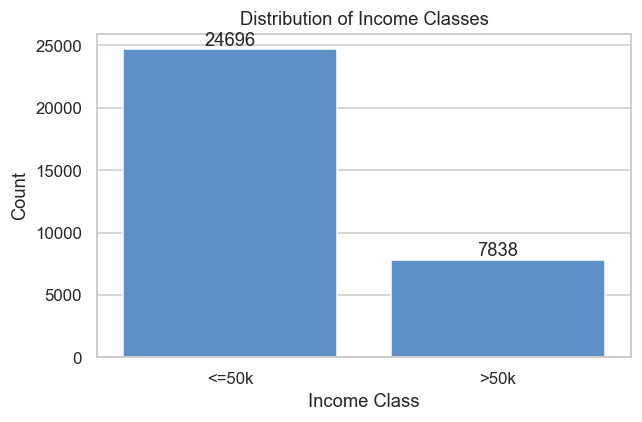

This imbalance has important implications for modeling. If a model predicts the majority class too often, it can achieve relatively high accuracy while still performing poorly at identifying high-income individuals. Therefore, the EDA suggested that model evaluation should not rely only on accuracy. Metrics such as precision, recall, F1-score, ROC-AUC, and PR-AUC would be more appropriate for evaluating classification performance.

The dataset also showed uneven category distributions. For example, most individuals worked in the `private` sector, had `hs-grad` or `some-college` education, were from the `united-states`, and belonged to the `white` race category. These dominant categories are important because they can strongly influence overall patterns in the data, while smaller groups may produce less stable estimates.

## 5.2 Univariate Analysis

Univariate analysis was used to examine each variable individually before studying relationships with income. For numerical variables, histograms and boxplots were used. For categorical variables, frequency tables and bar charts were used.

The variable `age` ranged from **17 to 74**, with a mean of approximately **38.53** and a median of **37**. Most observations were concentrated between young adulthood and middle age, which is consistent with the dataset's focus on the working population. The distribution was slightly right-skewed, with fewer older individuals.

The variable `hours_per_week` ranged from **8 to 80**, with a mean of approximately **40.39** and a median of **40**. The distribution had a strong peak around 40 hours, suggesting that standard full-time employment was the dominant work pattern. Some individuals worked much fewer or many more hours, but these values were treated as meaningful employment patterns rather than data errors.

For categorical variables, several strong imbalances were observed. The `private` workclass accounted for the majority of observations. The most common education levels were `hs-grad`, `some-college`, and `bachelors`. The dataset was also dominated by individuals from the `united-states`. In variables such as `occupation`, `race`, and `native_country`, some categories had very small sample sizes, which means their income rates should be interpreted cautiously.

## 5.3 Bivariate Analysis with Income

Bivariate analysis focused on how each feature was associated with the target variable `income`. For numerical variables, income-group comparisons and correlations were used. For categorical variables, high-income rates and association measures such as Cramer's V were used.

Age showed a positive association with income. Individuals earning more than 50K were older on average than those earning 50K or less. The mean age of the high-income group was approximately **44.2**, compared with **36.7** for the lower-income group. This suggests that income may increase with work experience, career progression, and accumulated skills. However, there was still substantial overlap between the two groups, so age alone cannot fully distinguish income classes.

Weekly working hours also differed between income groups. Individuals earning more than 50K worked an average of about **45.4 hours per week**, compared with **38.8 hours** for those earning 50K or less. This indicates that longer working hours are associated with a higher probability of earning more than 50K, although many individuals in both income groups still worked around 40 hours per week.

Education showed one of the clearest relationships with income. Higher education levels were associated with substantially higher high-income rates. For example, individuals with doctorate, professional school, and master's degrees had much higher proportions of `>50K` income than individuals with lower education levels. This supports the idea that education is an important predictor of income.

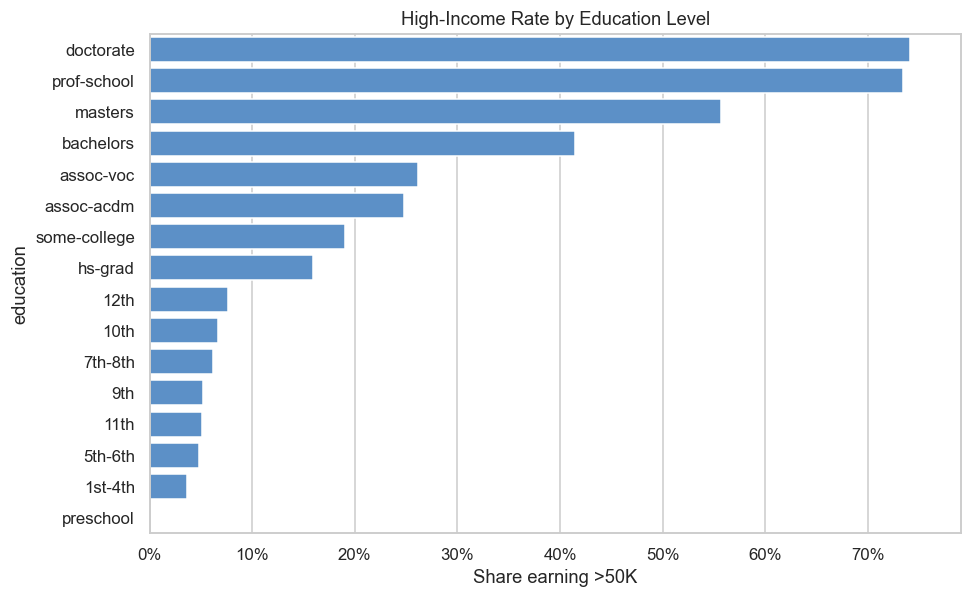

Occupation also showed strong income differences. Executive-managerial and professional-specialty occupations had relatively high high-income rates, while service-oriented occupations had much lower rates. This suggests that job type captures important differences in skill requirements, responsibility, and earning potential.


Marital status and relationship status were also strongly associated with income. Individuals in `married-civ-spouse`, `husband`, and `wife` categories had much higher high-income rates than groups such as `never-married`, `own-child`, or `unmarried`. These variables may reflect household structure, life stage, and economic stability, although they should not be interpreted as causal factors.

Sex showed a notable income gap. Approximately **30.6%** of males earned more than 50K, compared with about **11.0%** of females. This difference may reflect historical labor market patterns, occupation distributions, working hours, and social inequalities embedded in the dataset. Because sex is a sensitive demographic variable, this finding should be interpreted carefully in later modeling and ethical analysis.

Capital-related indicators were sparse but informative. Only **8.34%** of individuals had a capital-gain flag, and only **4.67%** had a capital-loss flag. However, `capital_gain_flag` had a meaningful association with income, suggesting that people reporting capital gains were more likely to belong to the high-income class.

## 5.4 Association Strength

To compare the relative strength of categorical relationships with income, Cramer's V was calculated. The strongest associations were found for:

| Variable       | Cramer's V |
| -------------- | ---------: |
| Relationship   |      0.454 |
| Marital Status |      0.447 |
| Education      |      0.369 |
| Occupation     |      0.314 |
| Sex            |      0.216 |
| Workclass      |      0.168 |
| Race           |      0.101 |
| Native Country |      0.098 |

These results indicate that relationship status, marital status, education, and occupation were the strongest categorical predictors of income in the EDA stage. Race and native country had weaker measured associations, but they remain important from an ethical perspective because they are sensitive demographic variables.

For numerical variables, both `age` and `hours_per_week` had positive correlations with income, each around **0.236-0.237**. These correlations were meaningful but not strong, suggesting that they provide useful information but should be combined with categorical features for prediction.

## 5.5 Multivariate Findings

Multivariate analysis was used to examine whether relationships changed when additional variables were considered. One analysis explored the relationship between `age`, `hours_per_week`, and `income`. The overall correlation between age and weekly working hours was weakly positive. However, after separating the data by income group, the relationship changed direction: it remained weakly positive for the `<=50K` group but became weakly negative for the `>50K` group. This suggests that aggregated relationships may hide subgroup patterns.

Another analysis examined sex, education, and income together. Males had higher high-income rates than females across all education levels, so no Simpson's paradox was observed. However, education affected the size of the gap. The difference between male and female high-income rates was larger among more highly educated groups, showing that education moderates the relationship between sex and income.

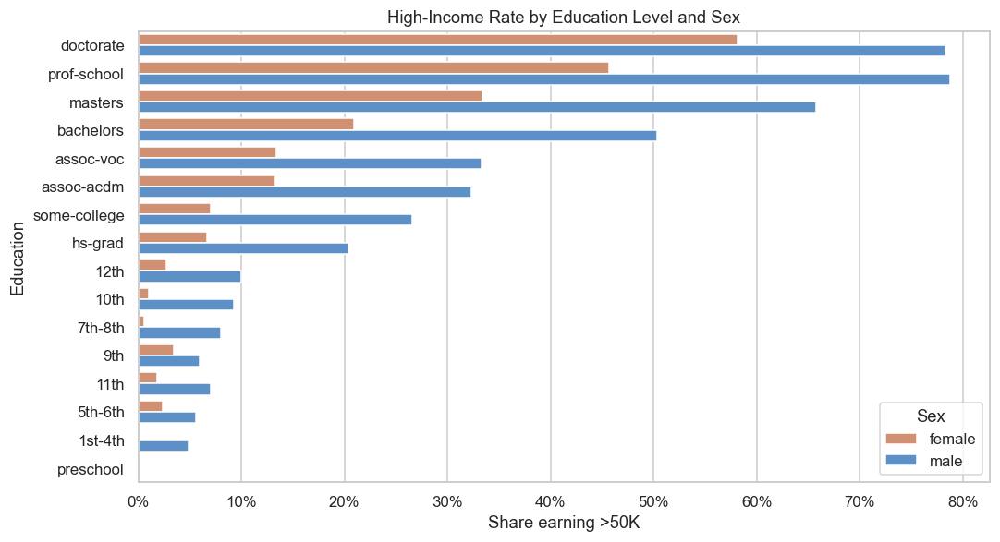

These findings demonstrate that income patterns are not explained by single variables alone. Instead, demographic, educational, occupational, and household-related features interact in complex ways. This supported the decision to use models capable of learning non-linear relationships and interactions, such as Random Forest and XGBoost.

## 5.6 EDA Summary

Overall, the EDA showed that the Adult Income dataset is suitable for binary classification. The most important patterns identified were:

- The target variable is imbalanced, with the `>50K` class representing about 24% of the data.
- Education, occupation, marital status, relationship, age, working hours, and capital-gain indicators are meaningfully associated with income.
- Several categorical variables contain rare groups, so subgroup patterns should be interpreted cautiously.
- Sensitive variables such as sex and race may reflect historical inequalities and require careful ethical consideration.
- Income-related patterns are associative, not causal.

These findings directly informed the feature engineering and modeling strategy. In particular, they supported keeping education, occupation, marital status, relationship, age, working hours, and capital indicators as predictive features, while also motivating evaluation metrics beyond accuracy.

# 6. Feature Engineering

Feature engineering transformed the cleaned dataset into a modeling-ready format. The goal was to preserve important information identified during EDA while preparing different variable types appropriately for machine learning models. Because the dataset contained both numerical and categorical variables, separate transformations were required for different feature groups.

## 6.1 Target Definition

The prediction target was whether an individual's annual income exceeded 50K. The original `income` variable contained two categories: `<=50k` and `>50k`. For modeling, this target was converted into a binary variable:

```text
0 = income <= 50K
1 = income > 50K
```

This binary encoding allowed the problem to be treated as a supervised binary classification task. The positive class was defined as `>50K`, which is the main group of interest for prediction.

## 6.2 Feature Selection

The final feature set was based on the cleaned dataset and EDA findings. The original dataset contained some variables that were not used directly in modeling. For example, `fnlwgt` was removed because it is a census sampling weight rather than a direct personal or employment attribute. The original `education_num` variable was also removed because it duplicates information already represented by the categorical `education` variable.

The final input features included:

```text
age
hours_per_week
capital_gain_flag
capital_loss_flag
workclass
education
marital_status
occupation
relationship
race
sex
native_country
```

These features were selected because they represent demographic, education-related, employment-related, household-related, and financial information. EDA showed that several of them were meaningfully associated with income, especially education, occupation, marital status, relationship, age, and working hours.

## 6.3 Capital Gain and Capital Loss Flags

The original `capital_gain` and `capital_loss` variables were highly skewed. Most observations had values of zero, while a small number of observations had large positive values. Instead of using the raw values directly, they were converted into binary indicators:

```text
capital_gain_flag = 1 if capital_gain > 0, otherwise 0
capital_loss_flag = 1 if capital_loss > 0, otherwise 0
```

This transformation reduced the influence of extreme values while preserving the important information that an individual reported some capital gain or loss. EDA showed that these indicators were sparse but still associated with income, especially `capital_gain_flag`.


## 6.4 Categorical Encoding

Most features in the dataset were categorical, including `workclass`, `education`, `marital_status`, `occupation`, `relationship`, `race`, `sex`, and `native_country`. These variables cannot be used directly by most machine learning models, so they were transformed using **OneHotEncoder**.

One-hot encoding creates a separate binary column for each category. This approach is suitable because most categorical variables in this dataset do not have a simple numerical scale. For example, occupation categories such as `exec-managerial`, `prof-specialty`, and `other-service` represent different job types rather than ordered numeric levels.

The encoder was configured with `handle_unknown='ignore'`. This is important for deployment because future user inputs or batch prediction files may contain categories that were not present in the training data. With this setting, the pipeline can still process new data without failing.

## 6.5 Numerical Scaling

The numerical features `age` and `hours_per_week` were standardized using **StandardScaler**. Standardization transforms each numerical feature to have a mean of approximately zero and a standard deviation of one within the training data.

Scaling is especially important for models such as Logistic Regression, because features measured on different scales can affect coefficient estimation and optimization. Although tree-based models such as Decision Tree, Random Forest, and XGBoost are less sensitive to feature scaling, applying a consistent preprocessing workflow made the comparison across models cleaner and more reproducible.

## 6.6 Preprocessing Pipeline

To prevent data leakage and ensure reproducibility, all feature transformations were implemented using a **ColumnTransformer** and a unified **Pipeline**.

The preprocessing workflow was organized as follows:

| Feature Type | Variables                                                    | Transformation                           |
| ------------ | ------------------------------------------------------------ | ---------------------------------------- |
| Numerical    | `age`, `hours_per_week`                                      | Median imputation + StandardScaler       |
| Binary       | `capital_gain_flag`, `capital_loss_flag`                     | Most-frequent imputation                 |
| Categorical  | `workclass`, `education`, `marital_status`, `occupation`, `relationship`, `race`, `sex`, `native_country` | Most-frequent imputation + OneHotEncoder |

Even though the cleaned dataset had no missing values, imputers were included in the pipeline for robustness. This makes the workflow safer for deployment, because future prediction inputs may contain missing values.

The `ColumnTransformer` applied the correct transformation to each feature type and combined the outputs into a single modeling matrix. After preprocessing, the training feature space expanded to **103 transformed features**, mainly because categorical variables were converted into one-hot encoded columns.

## 6.7 Leakage Prevention and Reproducibility

Using a pipeline was important because preprocessing steps were fitted only on the training data during cross-validation and model training. This prevents information from the test set from influencing imputation, scaling, or encoding. Without a pipeline, fitting preprocessing steps before splitting the data could introduce data leakage and produce overly optimistic model performance.

The pipeline also ensured that the same transformations were applied consistently during training, validation, testing, and deployment. This was especially important for the Streamlit web app, where new user inputs needed to be transformed in exactly the same way as the original training data.

## 6.8 Feature Engineering Summary

The feature engineering process converted the cleaned Adult Income dataset into a reliable modeling-ready dataset. The main steps were:

- defining the binary target variable for income classification;
- selecting relevant demographic, education, employment, household, and financial features;
- converting skewed capital gain and loss values into binary indicators;
- applying one-hot encoding to categorical variables;
- standardizing numerical variables;
- using `ColumnTransformer` and `Pipeline` to prevent data leakage and support deployment.

These engineered features provided the foundation for the model development stage. They allowed multiple algorithms, including Logistic Regression, Decision Tree, Random Forest, and XGBoost, to be trained and evaluated fairly using the same input representation.

# 7. Model Development

The modelling stage aimed to predict whether an individual's annual income exceeds `$50K` using demographic, education, employment, and financial indicators from the cleaned Adult Income dataset. The task was treated as a binary classification problem, where `income_binary = 1` represents `>50K` and `income_binary = 0` represents `<=50K`.

Before training, the data was split into training and test sets using a stratified 80/20 split. Stratification was important because the positive class was moderately imbalanced: only about 24% of observations belonged to the `>50K` group. The final split contained 26,027 training observations and 6,507 test observations.

All models used the same preprocessing pipeline to ensure fair comparison and prevent data leakage. Numerical features were imputed using the median and standardized, while categorical features were imputed using the most frequent category and one-hot encoded. These transformations were wrapped inside a `ColumnTransformer` and applied within a unified scikit-learn `Pipeline`, so preprocessing was learned only from the training folds during cross-validation.

Four classification models were trained and compared:

| Model | Role in the project |
|---|---|
| Logistic Regression | Interpretable baseline model |
| Decision Tree | Interpretable non-linear rule-based model |
| Random Forest | Ensemble tree model for stable non-linear prediction |
| XGBoost | Boosted tree model for strong ranking performance |

Logistic Regression was used as a simple baseline because it is efficient and interpretable. Decision Tree was included because it can capture non-linear rules and feature interactions, although it may overfit. Random Forest was used to reduce the instability of a single tree by averaging many trees trained on bootstrap samples. XGBoost was included because boosting methods often perform well on structured tabular data by sequentially correcting previous errors.

The model training code used five-fold stratified cross-validation and hyperparameter tuning. F1-score was selected as the main tuning metric because the target variable is imbalanced and the project needs to balance precision and recall for the `>50K` class. Accuracy, precision, recall, ROC-AUC, and PR-AUC were also reported to provide a more complete evaluation.

The tuned model settings were summarized as follows:

| Model | Main tuned settings |
|---|---|
| Logistic Regression | `C = 1`, `penalty = l2`, `solver = liblinear`, `class_weight = balanced` |
| Decision Tree | `criterion = entropy`, `min_samples_leaf = 20`, `class_weight = balanced` |
| Random Forest | `n_estimators = 300`, `max_features = sqrt`, `min_samples_split = 10`, `class_weight = balanced` |
| XGBoost | Tuned boosting model using the same feature set, split, and evaluation metrics |

# 8. Model Evaluation and Selection

After hyperparameter tuning, all models were evaluated on the independent test set using the same metrics. The comparison is shown below.

| Model | Accuracy | Precision | Recall | F1-score | ROC-AUC | PR-AUC |
|---|---:|---:|---:|---:|---:|---:|
| Random Forest | 0.8362 | 0.6329 | 0.7621 | 0.6916 | 0.8982 | 0.7359 |
| Logistic Regression | 0.8031 | 0.5603 | 0.8501 | 0.6754 | 0.9008 | 0.7453 |
| XGBoost | 0.8512 | 0.7168 | 0.6327 | 0.6721 | 0.9063 | 0.7592 |
| Decision Tree | 0.7830 | 0.5318 | 0.8310 | 0.6486 | 0.8797 | 0.7050 |

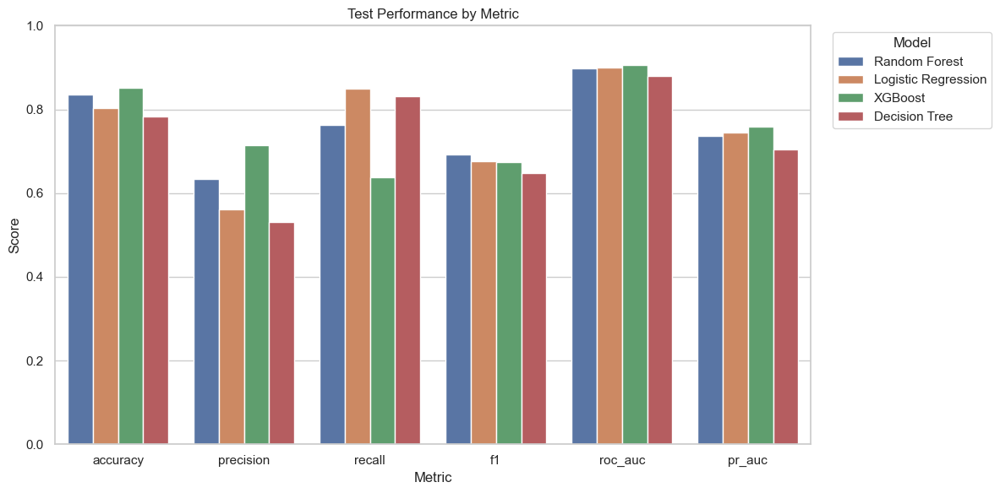

The results show that no model dominated across all metrics. Logistic Regression achieved the highest recall at 0.8501, meaning it identified the largest share of true high-income individuals. However, its precision was lower, so it produced more false positives. XGBoost achieved the highest accuracy, precision, ROC-AUC, and PR-AUC, showing strong overall ranking ability and reliable positive predictions. However, its recall was lower than Random Forest and Logistic Regression, meaning it missed more actual `>50K` cases.

Random Forest was selected as the final model because it achieved the highest F1-score, 0.6916. Since F1-score balances precision and recall, it was the most appropriate primary metric for this imbalanced classification problem. The selected Random Forest model provided a strong compromise: it captured a large share of high-income individuals while keeping false positives at a more acceptable level than the high-recall Logistic Regression model.

The final Random Forest model achieved an accuracy of 0.8362, meaning that about 83.6% of test observations were classified correctly. More importantly, its recall of 0.7621 indicates that it correctly identified about three-quarters of the actual `>50K` group. Its precision of 0.6329 shows that some predicted high-income cases were still false positives, so the model should be treated as a decision-support tool rather than a perfect classifier.

The ROC-AUC value of 0.8982 and PR-AUC value of 0.7359 also indicate strong probability ranking ability. These values are important because the app allows users to adjust the classification threshold. Lower thresholds can increase recall, while higher thresholds can increase precision. For the final report and Streamlit app, the default threshold of 0.50 was retained because it gave the best F1-score among the evaluated threshold settings.

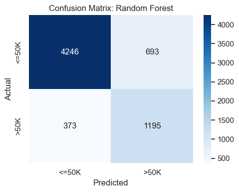

The confusion matrix supports the same conclusion. Random Forest successfully identified many `>50K` cases while maintaining reasonable precision, although false positives and false negatives remained. False negatives are important because they represent people who actually earned more than `$50K` but were predicted as `<=50K`. False positives are also important because they represent overestimated income predictions.

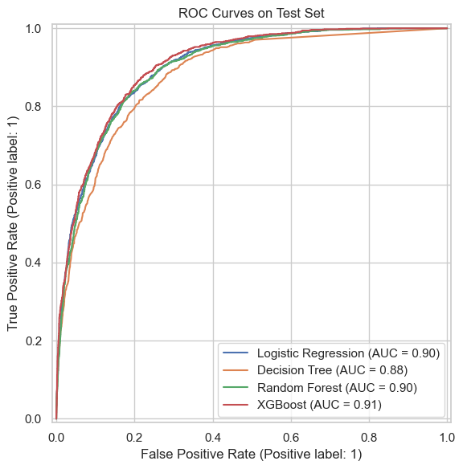
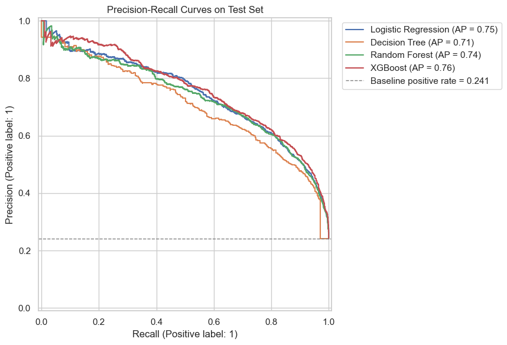

The ROC and precision-recall curves provide additional evidence about model ranking ability. XGBoost had the highest ROC-AUC and PR-AUC, but Random Forest remained the final selected model because the final deployment task uses a classification threshold and the primary selection metric was F1-score. In other words, XGBoost ranked cases very well, but Random Forest provided the best balance at the selected operating point.

# 9. Model Interpretation

Model interpretation was conducted after selecting Random Forest as the final model. The purpose was to understand which variables drove predictions and how the model used demographic, education, employment, and household-related information. This step is important because the project is not only about prediction, but also about workforce analytics and income-pattern interpretation.

## 9.1 Feature Importance

Two types of feature importance were used. First, model-based feature importance was extracted from the Random Forest model. This method measures how much each feature contributes to impurity reduction across the trees. Second, permutation importance was calculated on the test set using F1-score. This method randomly shuffles one original feature at a time and measures how much model performance decreases. Because permutation importance is evaluated on held-out data and is linked to the project metric, it was emphasized in the interpretation.

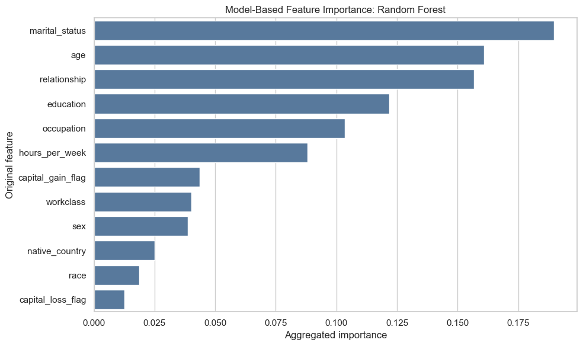

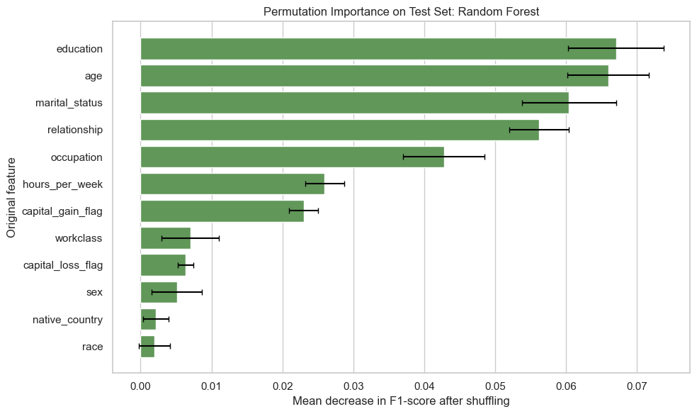

The feature-importance results showed that `education`, `age`, `marital_status`, `relationship`, and `occupation` were the strongest predictors. These variables are meaningful in the context of workforce analytics. Education reflects human capital and qualification level, age is related to career stage and work experience, occupation captures job type, and marital or relationship status may reflect household and life-stage patterns. In contrast, variables such as `race` and `native_country` had lower permutation importance in the fitted model.

## 9.2 SHAP Explanation

SHAP was used to provide both global and local explanations for the final Random Forest model. Unlike a single feature-importance ranking, SHAP values show whether a feature pushes a prediction toward `>50K` or toward `<=50K`. This makes SHAP useful for explaining not only which variables matter, but also how they influence model predictions.

In the code, SHAP was applied to a sample of 200 test-set observations to keep computation efficient. The final model pipeline was separated into the preprocessing component and the Random Forest estimator. The test sample was transformed using the fitted preprocessor, producing 103 encoded features after one-hot encoding. Then `shap.TreeExplainer` was used to calculate SHAP values for the Random Forest model.

An additivity check was also performed. For one sample, the model prediction was compared with the SHAP base value plus the sum of all SHAP contributions. The two values were nearly identical, which confirmed that the SHAP explanation reconstructed the model output correctly.
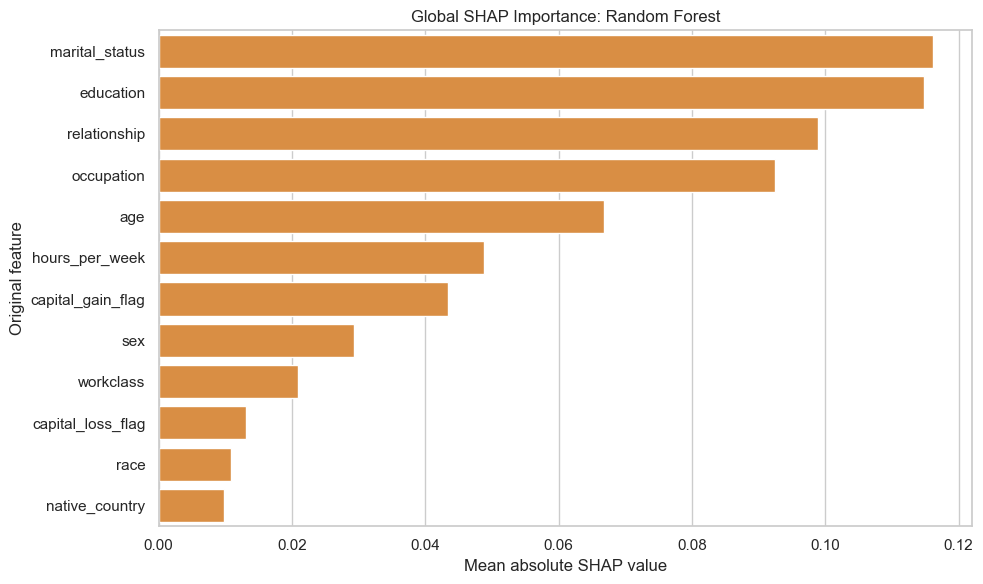

The global SHAP importance results were consistent with the feature-importance analysis. Variables such as `marital_status`, `education`, `relationship`, `occupation`, and `age` had the largest average SHAP contributions. This consistency increases confidence that these variables are genuinely important to the model's predictions rather than artifacts of one specific interpretation method.

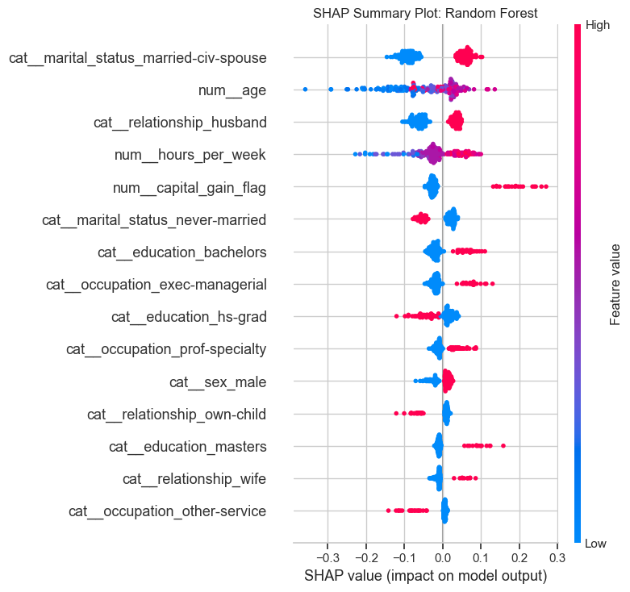

The SHAP summary plot provides more detail than a simple ranking. Each point represents one observation and one transformed feature. Positive SHAP values push the prediction toward the `>50K` class, while negative SHAP values push it toward the `<=50K` class. The plot shows that income prediction is influenced by a combination of education, marital status, relationship, occupation, age, and capital-related indicators rather than by one variable alone.

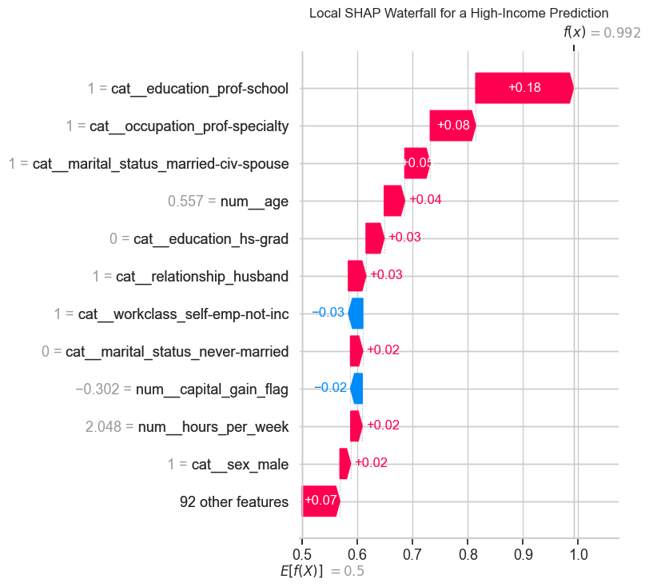

The local SHAP waterfall plot explains one individual prediction. In the M5 analysis, the selected observation had a predicted probability of about 0.9915 for the `>50K` class, and the actual class was also `>50K`. The waterfall plot starts from the baseline prediction and shows how individual feature values increase or decrease the final probability. This makes the model more transparent at the individual level.

## 9.3 PDP / ICE Analysis

Partial Dependence Plot (PDP) and Individual Conditional Expectation (ICE) analysis were used to examine how the Random Forest model responds to two numerical workforce variables: `age` and `hours_per_week`. PDP shows the average effect of a feature on predicted probability, while ICE shows individual-level curves. Using both methods helps reveal both general trends and variation across individuals.


For `age`, the average predicted probability of earning more than `$50K` generally increased from young adulthood to middle age and then slightly decreased among older working ages. This suggests that the model associates middle working age with a higher probability of high income, likely reflecting career development and accumulated experience.

For `hours_per_week`, the predicted probability increased from part-time levels toward full-time and longer working hours, then became more stable after around 50 hours per week. This suggests that working hours provide useful employment-related information, but very long hours do not continue to strongly increase the predicted probability.

The ICE curves showed that the effect of age and working hours was not identical for every individual. People with the same age or working hours may still have different predicted probabilities because of other factors such as education, occupation, marital status, and workclass. Therefore, the model's predictions depend on interactions among multiple features.

## 9.4 Stakeholder Visualisations

Stakeholder visualisations were created to translate technical model outputs into practical insights. These visualisations focus on the final Random Forest model and are easier for non-technical audiences to interpret than raw cross-validation results or one-hot encoded feature names.

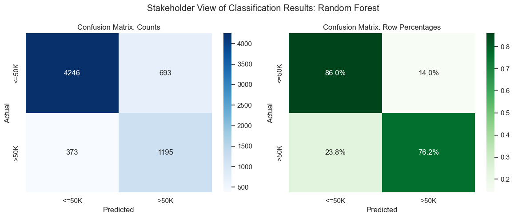

The stakeholder confusion matrix presents correct and incorrect predictions in a more accessible way. It shows that Random Forest achieves strong overall performance but still makes both false positive and false negative errors.

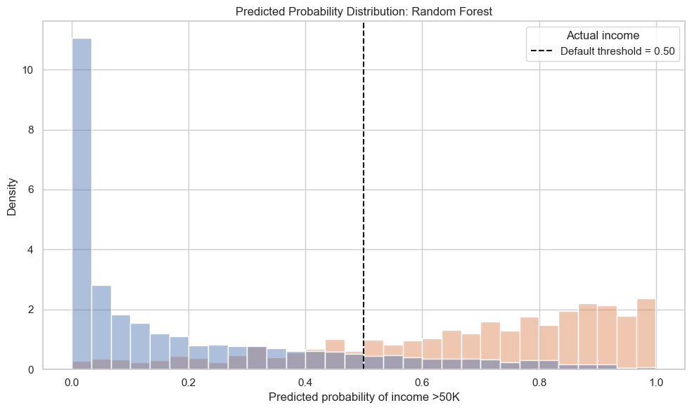

The probability distribution plot shows how well the model separates the two income classes. Many `<=50K` observations receive low predicted probabilities, while many `>50K` observations receive higher predicted probabilities. However, there is overlap around the 0.50 threshold, which explains why some borderline cases are misclassified.

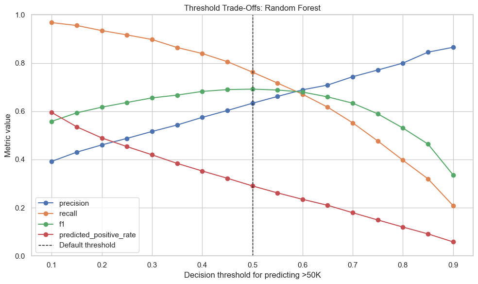

The threshold trade-off chart shows how precision, recall, F1-score, and predicted positive rate change as the classification threshold changes from 0.10 to 0.90. At lower thresholds, recall increases because more individuals are classified as `>50K`, but precision decreases. At higher thresholds, precision increases but recall decreases. The default threshold of 0.50 achieved the best F1-score among the evaluated thresholds, so it was retained as the recommended operating point.

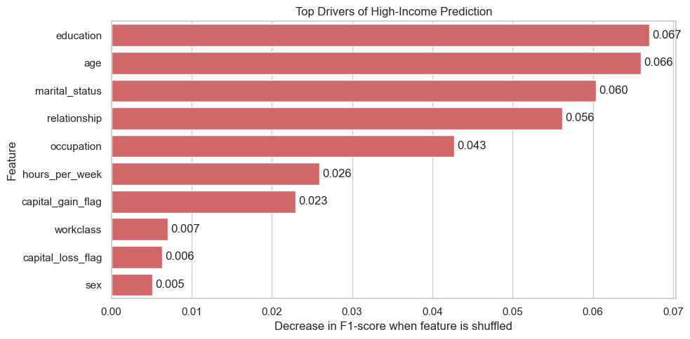

The stakeholder feature-driver chart summarizes the most important original features in a way that avoids technical one-hot encoded feature names. It shows that `education`, `age`, `marital_status`, `relationship`, and `occupation` are the main drivers of high-income prediction. This aligns with the EDA findings and provides a clear explanation for business or workforce analytics stakeholders.

# 10. Deployment: Streamlit Web App

The final stage of this project is the deployment of the Adult Income prediction model as an interactive Streamlit web application. The goal of the deployment is to transform the modelling workflow into a usable product-style demo where users can explore the dataset, run predictions, compare models, adjust thresholds, test what-if scenarios, and review model performance.

The application was tested locally at:

```text
http://localhost:8501/
```

The deployment package includes the following main files:

| File                 | Purpose                                                      |
| -------------------- | ------------------------------------------------------------ |
| `app.py`             | Main Streamlit app containing the interface, model pipeline, prediction logic, charts, and navigation. |
| `adult_cleaned.xlsx` | Cleaned Adult Income modelling dataset used by the application. |
| `requirements.txt`   | Required Python packages for running the app.                |
| `README.md`          | Local run instructions for the deployment.                   |

The app can be launched locally with:

```bash
pip install -r requirements.txt
streamlit run app.py
```

## 10.1 Home Page and Dataset Summary

The app opens with the title **Income Prediction and Workforce Analytics**. The top summary cards present the most important project information: **32,534 cleaned records**, **12 features**, a **24.1% >50K rate**, and **Random Forest** as the final model.

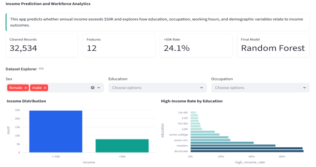

This design is effective because users can immediately understand the scale of the dataset, the number of input variables, the level of class imbalance, and the selected final model. The interface also makes the project more presentation-ready because the most important information appears before users interact with the app.

## 10.2 Dataset Explorer

The Dataset Explorer allows users to inspect the cleaned Adult Income dataset before running predictions. Users can filter the dataset by sex, education, and occupation, then review how income outcomes differ across selected groups.

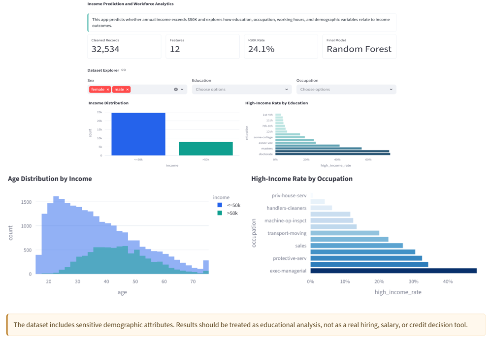

The page displays several important visualisations. The income distribution chart shows that `<=50K` is the majority class, while `>50K` is the minority class. The age distribution chart shows how income categories vary by age. The education and occupation charts show that high-income rates differ strongly across education levels and occupations.

The responsible-use note at the bottom is also important. It reminds users that the dataset includes sensitive demographic attributes and that the results should be treated as educational analysis rather than real hiring, salary, or credit decision evidence.

## 10.3 Prediction Center Input

The Prediction Center is the main prediction interface. It supports individual prediction and batch prediction. In individual mode, users select the prediction model, set the classification threshold, and enter a complete profile.

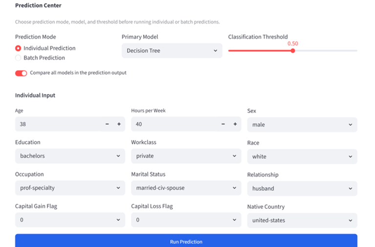

The input form includes the final 12 predictor features used by the model:

| Feature type | Variables                                                    |
| ------------ | ------------------------------------------------------------ |
| Numerical    | `age`, `hours_per_week`                                      |
| Categorical  | `sex`, `education`, `workclass`, `race`, `occupation`, `marital_status`, `relationship`, `native_country` |
| Binary flags | `capital_gain_flag`, `capital_loss_flag`                     |

In the example shown, the app uses a `Decision Tree` model with a classification threshold of `0.50`. The profile includes age `38`, `40` hours per week, sex `male`, education `bachelors`, workclass `private`, race `white`, occupation `prof-specialty`, marital status `married-civ-spouse`, relationship `husband`, native country `united-states`, and no capital gain or loss flag.

## 10.4 Prediction Output and Explanation

After the user runs prediction, the app displays the predicted class, probability, confidence level, and threshold. It also compares predictions across multiple models and provides a local explanation of the prediction.

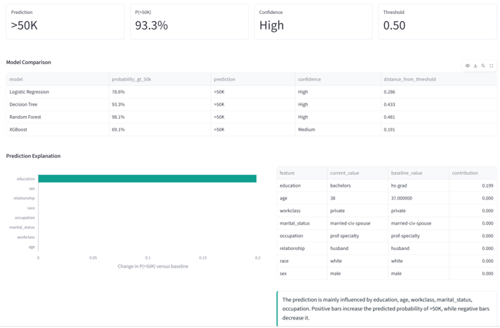

For the example profile, the app predicts `>50K` with a probability of **93.3%**, high confidence, and a threshold of `0.50`. The model comparison table shows that Logistic Regression, Decision Tree, Random Forest, and XGBoost all predict `>50K`, although their probabilities differ.

The explanation section shows which features most influence the prediction. In this case, education has the largest positive contribution compared with the baseline profile. This is useful because the app does not only return a label; it also gives users insight into why the prediction changed.

## 10.5 What-if Analysis Input

The What-if Analysis page allows users to start from a base profile and modify selected scenario variables. This turns the deployment into an interactive interpretation tool.

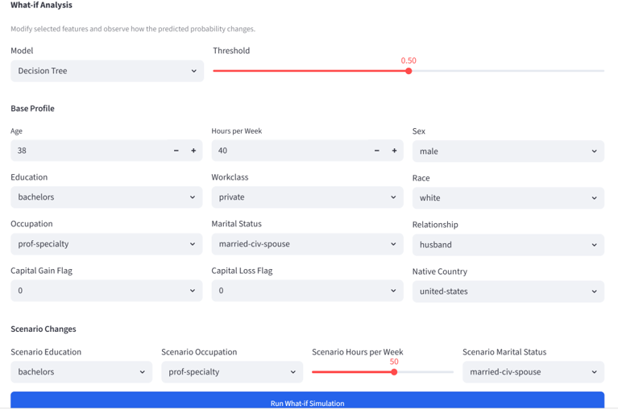

The page uses the same profile structure as the Prediction Center, but adds scenario controls for education, occupation, hours per week, and marital status. This allows users to ask practical questions such as how the predicted probability changes if weekly working hours increase or if selected categorical variables are changed.

## 10.6 What-if Analysis Output

After running the what-if simulation, the app compares the original profile with several scenario changes and reports the resulting probability, prediction class, and change from the original prediction.

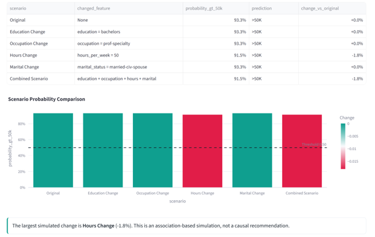

In the example shown, the original probability is **93.3%**. Education, occupation, and marital status changes do not meaningfully change the probability in this specific scenario, while changing hours per week from `40` to `50` reduces the probability to **91.5%**, a change of `-1.8%`. The combined scenario also results in **91.5%**.

The note below the chart correctly states that the largest simulated change is associated with hours change, but it also reminds users that this is an association-based simulation rather than a causal recommendation. This distinction is important for responsible interpretation.

## 10.7 Model Performance Dashboard

The Model Performance Dashboard summarizes the final model's evaluation results. The dashboard allows users to select a model and adjust the evaluation threshold. In the screenshot below, the selected model is **Random Forest**, which is the final selected model.

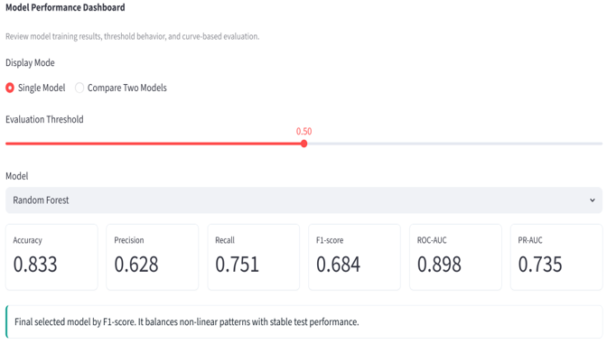

At threshold `0.50`, the Random Forest model achieves:

```text
Accuracy:  0.833
Precision: 0.628
Recall:    0.751
F1-score:  0.684
ROC-AUC:   0.898
PR-AUC:    0.735
```

These results show that the Random Forest model provides strong ranking ability and a reasonable balance between precision and recall. The app also identifies it as the final selected model by F1-score because it balances non-linear patterns with stable test performance.

## 10.8 Model Diagnostics

The performance dashboard also includes diagnostic plots such as the confusion matrix, threshold error types, ROC curve, and precision-recall curve.

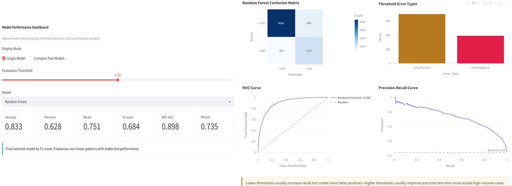

The confusion matrix shows that the model correctly predicts many `<=50K` and `>50K` cases, but it still produces both false positives and false negatives. The threshold error chart shows that false positives are more frequent than false negatives at the selected threshold. This reflects the trade-off created by threshold selection.

The ROC curve has an AUC of approximately **0.898**, indicating strong ability to rank high-income and lower-income observations across thresholds. The precision-recall curve is especially relevant because the `>50K` class is the minority class. Together, these diagnostics show that the model performs well overall but still requires careful threshold interpretation.

## 10.9 Deployment Summary

The Streamlit deployment improves the final project in three major ways.

First, it makes the model **usable**. Users can run predictions through an interface instead of executing notebook cells.

Second, it makes the model **transparent**. The app provides probabilities, thresholds, model comparisons, local explanations, what-if simulations, and performance diagnostics.

Third, it makes the project **presentation-ready**. The app gives a clear demo path: start with dataset exploration, run a prediction, interpret the result, test what-if scenarios, and evaluate the final model.

Overall, the deployment successfully turns the modelling work into a working analytical product. However, it should still be treated as an academic demo rather than a production decision system.

# 11. Ethical Considerations and Limitations

Income prediction is a sensitive task because the data includes demographic, socioeconomic, household, and employment-related variables. The deployed app correctly includes a responsible-use warning stating that the results should be treated as educational analysis, not as real hiring, salary, or credit decision evidence.

## 11.1 Sensitive Attributes and Fairness

The model uses variables such as `sex`, `race`, `education`, `occupation`, `relationship`, and `native_country`. Some of these variables are sensitive or closely connected to historical social inequality. A model trained on this dataset may learn patterns that reflect past inequality rather than fair individual assessment.

This creates fairness risk. Even if the overall model performance is strong, performance may differ across demographic or occupational subgroups. A high overall F1-score does not guarantee equal reliability for every group.

For this reason, the model should not be used as an automated decision-maker. It should only be used for educational analytics, model demonstration, and discussion of machine learning workflow design.

## 11.2 Class Imbalance

The app summary shows that the `>50K` class rate is **24.1%**, which means the positive class is the minority class. This imbalance affects both modelling and evaluation.

Accuracy alone is not enough for this task. A model could appear accurate by predicting the majority class too often. Therefore, the dashboard includes Precision, Recall, F1-score, ROC-AUC, and PR-AUC. These metrics provide a more complete view of performance.

The threshold slider is also important. Lower thresholds usually increase recall but create more false positives. Higher thresholds usually improve precision but miss more actual high-income cases. The app makes this trade-off visible through both metrics and diagnostic charts.

## 11.3 Prediction Is Not Causation

The What-if Analysis page is useful for interpretation, but it must be understood carefully. The scenario results show how the model prediction changes when inputs are modified, but this does not prove that those changes cause income to increase or decrease.

For example, the what-if output shows that changing hours per week has the largest simulated change in the captured scenario. However, the app correctly states that this is an association-based simulation, not a causal recommendation.

This same limitation applies to feature contribution charts and model explanations. They explain how the model behaves, not why income outcomes occur in the real world.

## 11.4 Generalizability

The Adult Income dataset is based on historical United States census data. Labour markets, wages, education systems, occupations, and social patterns have changed over time. Therefore, the model may not generalize well to modern income prediction tasks.

The dataset is also specific to the United States. Variables such as education, occupation, race, and native country may have different meanings in other countries or regions. The model should not be applied to current or international settings without updated data, retraining, and validation.

## 11.5 Technical Limitations

The Streamlit app is effective as a final project demo, but it is not production-ready. A production system would require saved model artifacts, stronger input validation, automated tests, security review, monitoring, logging, and model version control.

The model also still makes errors. The confusion matrix and threshold error chart show that false positives and false negatives remain. Therefore, predictions should be interpreted as uncertain estimates rather than absolute facts.

# 12. Conclusion

This project successfully delivers an end-to-end machine learning workflow for Adult Income prediction. The project begins with a cleaned modelling dataset, trains and evaluates multiple models, selects Random Forest as the final model, and deploys the workflow as an interactive Streamlit web app.

The deployed app clearly communicates the core dataset and model information: **32,534 cleaned records**, **12 features**, **24.1% >50K rate**, and **Random Forest** as the final model. These summary cards make the project understandable from the first screen.

The final app includes dataset exploration, individual prediction, model comparison, prediction explanation, what-if simulation, and model performance diagnostics. The screenshots in Section 10 demonstrate that the deployment is functional and suitable for a final class demo or recorded walkthrough.

The Random Forest model achieves strong overall performance. At the selected threshold of `0.50`, the app reports:

```text
Accuracy:  0.833
Precision: 0.628
Recall:    0.751
F1-score:  0.684
ROC-AUC:   0.898
PR-AUC:    0.735
```

These results show that the model has strong ranking ability and a reasonable balance between identifying high-income individuals and controlling false positives. Since the positive class is imbalanced, F1-score, Recall, ROC-AUC, and PR-AUC are more informative than Accuracy alone.

At the same time, the project has important limitations. Income prediction involves sensitive variables, the dataset is historically dated, the positive class is imbalanced, and model errors still occur. The app should therefore be presented as an educational analytics demo, not as a real-world decision-making tool.

Overall, the strongest contribution of this project is the complete workflow: cleaned data, feature engineering, model development, evaluation, interpretation, and deployment. The final Streamlit app makes the project accessible, transparent, and ready for presentation.

Future work could improve the project by using a more recent dataset, expanding fairness analysis, calibrating predicted probabilities, saving trained model artifacts, improving input validation, and deploying the app to a public cloud platform.
