# Data Acquisition & Preprocessing

# 1. Handling Missing Data

## Section 1 — Detecting and Visualising Missing Data


```python
import numpy as np
import pandas as pd
import matplotlib.pyplot as plt
import matplotlib.ticker as mticker
import seaborn as sns
from sklearn.experimental import enable_iterative_imputer  
from sklearn.impute import SimpleImputer, KNNImputer, IterativeImputer
from sklearn.ensemble import RandomForestClassifier
from sklearn.model_selection import cross_val_score
from sklearn.pipeline import Pipeline
from sklearn.preprocessing import LabelEncoder
import warnings

warnings.filterwarnings('ignore')
np.random.seed(42)
plt.rcParams['figure.dpi'] = 110
print('Setup complete.')
```

    Setup complete.
    


```python
data = pd.read_csv(
    'adult.data',
    header=None,
    na_values=' ?'
)

data.columns = [
    'age','workclass','fnlwgt',
    'education','education_num',
    'marital_status','occupation',
    'relationship','race','sex',
    'capital_gain','capital_loss',
    'hours_per_week',
    'native_country',
    'income'
]

print(f'Shape: {data.shape}')
data.head()
```

    Shape: (32561, 15)
    


<div>
<style scoped>
    .dataframe tbody tr th:only-of-type {
        vertical-align: middle;
    }

    .dataframe tbody tr th {
        vertical-align: top;
    }

    .dataframe thead th {
        text-align: right;
    }
</style>
<table border="1" class="dataframe">
  <thead>
    <tr style="text-align: right;">
      <th></th>
      <th>age</th>
      <th>workclass</th>
      <th>fnlwgt</th>
      <th>education</th>
      <th>education_num</th>
      <th>marital_status</th>
      <th>occupation</th>
      <th>relationship</th>
      <th>race</th>
      <th>sex</th>
      <th>capital_gain</th>
      <th>capital_loss</th>
      <th>hours_per_week</th>
      <th>native_country</th>
      <th>income</th>
    </tr>
  </thead>
  <tbody>
    <tr>
      <th>0</th>
      <td>39</td>
      <td>State-gov</td>
      <td>77516</td>
      <td>Bachelors</td>
      <td>13</td>
      <td>Never-married</td>
      <td>Adm-clerical</td>
      <td>Not-in-family</td>
      <td>White</td>
      <td>Male</td>
      <td>2174</td>
      <td>0</td>
      <td>40</td>
      <td>United-States</td>
      <td>&lt;=50K</td>
    </tr>
    <tr>
      <th>1</th>
      <td>50</td>
      <td>Self-emp-not-inc</td>
      <td>83311</td>
      <td>Bachelors</td>
      <td>13</td>
      <td>Married-civ-spouse</td>
      <td>Exec-managerial</td>
      <td>Husband</td>
      <td>White</td>
      <td>Male</td>
      <td>0</td>
      <td>0</td>
      <td>13</td>
      <td>United-States</td>
      <td>&lt;=50K</td>
    </tr>
    <tr>
      <th>2</th>
      <td>38</td>
      <td>Private</td>
      <td>215646</td>
      <td>HS-grad</td>
      <td>9</td>
      <td>Divorced</td>
      <td>Handlers-cleaners</td>
      <td>Not-in-family</td>
      <td>White</td>
      <td>Male</td>
      <td>0</td>
      <td>0</td>
      <td>40</td>
      <td>United-States</td>
      <td>&lt;=50K</td>
    </tr>
    <tr>
      <th>3</th>
      <td>53</td>
      <td>Private</td>
      <td>234721</td>
      <td>11th</td>
      <td>7</td>
      <td>Married-civ-spouse</td>
      <td>Handlers-cleaners</td>
      <td>Husband</td>
      <td>Black</td>
      <td>Male</td>
      <td>0</td>
      <td>0</td>
      <td>40</td>
      <td>United-States</td>
      <td>&lt;=50K</td>
    </tr>
    <tr>
      <th>4</th>
      <td>28</td>
      <td>Private</td>
      <td>338409</td>
      <td>Bachelors</td>
      <td>13</td>
      <td>Married-civ-spouse</td>
      <td>Prof-specialty</td>
      <td>Wife</td>
      <td>Black</td>
      <td>Female</td>
      <td>0</td>
      <td>0</td>
      <td>40</td>
      <td>Cuba</td>
      <td>&lt;=50K</td>
    </tr>
  </tbody>
</table>
</div>


```python
missing = (
    data.isnull()
        .sum()
        .rename('n_missing')
        .to_frame()
        .assign(
            pct_missing=lambda x:
            x['n_missing']/len(data)*100
        )
        .query('n_missing > 0')
        .sort_values(
            'pct_missing',
            ascending=False
        )
)
print(missing.to_string())
```

                    n_missing  pct_missing
    occupation           1843     5.660146
    workclass            1836     5.638647
    native_country        583     1.790486
    


```python
fig, axes = plt.subplots(
    1,
    2,
    figsize=(14,5)
)
missing['pct_missing'].plot(
    kind='barh',
    ax=axes[0],
    color='steelblue',
    edgecolor='white'
)
axes[0].set_xlabel('Missing (%)')
axes[0].set_title(
    'Missingness per column'
)
for bar,val in zip(
    axes[0].patches,
    missing['pct_missing']
):
    axes[0].text(
        bar.get_width()+0.2,
        bar.get_y()+bar.get_height()/2,
        f'{val:.1f}%',
        va='center',
        fontsize=9
    )
cols_with_missing = missing.index.tolist()
sample = (
    data[cols_with_missing]
        .isnull()
        .astype(int)
        .head(100)
)
sns.heatmap(
    sample,
    ax=axes[1],
    cbar=False,
    cmap=['#4a90d9','#f5f5f5'],
    linewidths=0.3
)
axes[1].set_title(
    'Missingness heatmap (first 100 rows)\nWhite = missing'
)
axes[1].set_xlabel('Column')
axes[1].set_ylabel('Row index')
plt.tight_layout()
plt.show()
```


    
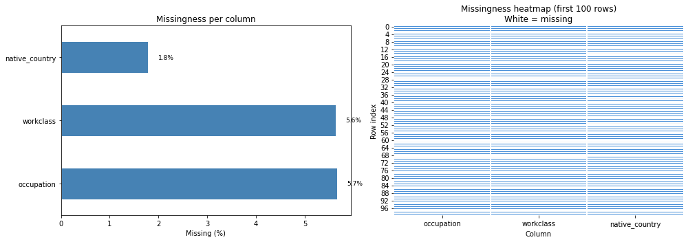
    


## Section 2 — Missingness Mechanisms


```python
data['occupation_missing'] = (
    data['occupation'].isnull().astype(int)
)

print('Income distribution by occupation missingness:')

print(
    data.groupby('occupation_missing')['income']
        .value_counts(normalize=True)
        .unstack()
        .rename(index={
            0: 'occupation present',
            1: 'occupation missing'
        })
)

print('\nEducation distribution by occupation missingness:')

print(
    data.groupby('occupation_missing')['education']
        .value_counts(normalize=True)
        .unstack()
        .rename(index={
            0: 'occupation present',
            1: 'occupation missing'
        })
)
```

    Income distribution by occupation missingness:
    income                 <=50K      >50K
    occupation_missing                    
    occupation present  0.750960  0.249040
    occupation missing  0.896365  0.103635
    
    Education distribution by occupation missingness:
    education               10th      11th      12th   1st-4th   5th-6th  \
    occupation_missing                                                     
    occupation present  0.027053  0.034377  0.012794  0.005078  0.009864   
    occupation missing  0.055345  0.064569  0.021704  0.006511  0.016278   
    
    education            7th-8th       9th  Assoc-acdm  Assoc-voc  Bachelors  \
    occupation_missing                                                         
    occupation present  0.018654  0.015073    0.033205   0.043004   0.168696   
    occupation missing  0.039609  0.027672    0.025502   0.033098   0.093869   
    
    education           Doctorate   HS-grad   Masters  Preschool  Prof-school  \
    occupation_missing                                                          
    occupation present   0.012957  0.324500  0.054528   0.001497     0.018165   
    occupation missing   0.008139  0.289202  0.026044   0.002713     0.009767   
    
    education           Some-college  
    occupation_missing                
    occupation present      0.220555  
    occupation missing      0.279978  
    

### Interpretation

Income and education distributions differ between
occupation-present and occupation-missing groups.

This suggests occupation missingness depends on
observed variables, indicating a likely MAR mechanism.

Therefore, advanced methods such as KNN and
Iterative (MICE) imputation may outperform
simple imputation.


```python
data.drop(
    columns=['occupation_missing'],
    inplace=True
)
```

## Section 3 — Drop Strategies


```python
# Drop rows with ANY missing value 

data_drop_any = data.dropna()

print(f'Original rows  : {len(data)}')

print(
    f'After dropna() : {len(data_drop_any)} '
    f'({len(data_drop_any)/len(data)*100:.1f}% retained)'
)
```

    Original rows  : 32561
    After dropna() : 30162 (92.6% retained)
    


```python
# Drop rows only if missing in occupation

data_drop_occ = data.dropna(
    subset=['occupation']
)
print(
    f'Original rows : {len(data)}'
)
print(
    f'After dropna(subset=[occupation]) : '
    f'{len(data_drop_occ)} '
    f'({len(data_drop_occ)/len(data)*100:.1f}% retained)'
)
```

    Original rows : 32561
    After dropna(subset=[occupation]) : 30718 (94.3% retained)
    


```python
# Drop columns exceeding missing threshold

threshold = 0.40
missing_frac = data.isnull().mean()
cols_to_drop = (
    missing_frac[
        missing_frac > threshold
    ]
    .index
    .tolist()
)
print(
    f'Columns with > {threshold*100:.0f}% missing: '
    f'{cols_to_drop}'
)
data_col_dropped = data.drop(
    columns=cols_to_drop
)
print(
    f'Columns before: {data.shape[1]} '
    f'→ after: {data_col_dropped.shape[1]}'
)
```

    Columns with > 40% missing: []
    Columns before: 15 → after: 15
    


```python
# Thresh parameter strategy, allow at most 2 missing values per row

n_required = data.shape[1]-2
data_thresh = data.dropna(
    thresh=n_required
)
print(
    f'After dropna(thresh={n_required}) : '
    f'{len(data_thresh)} rows'
)
```

    After dropna(thresh=13) : 32534 rows
    

### Interpretation
In this study, we compared several missing value handling strategies, including row deletion (dropna), targeted deletion based on specific features (subset deletion), column removal based on missing rate thresholds, and row filtering using a completeness threshold (thresh). However, all deletion-based approaches inevitably lead to information loss. The dropna method removes approximately 7.4% of the dataset, which reduces sample size and may introduce potential bias. The subset deletion strategy only addresses missingness in a single feature and does not resolve missing values in other variables. The column threshold method did not remove any features in this dataset, indicating that the overall data structure is relatively complete. Although the thresh method is more flexible, it still relies on discarding samples and may unnecessarily remove useful information. Considering that the dataset has a very low overall missing rate (less than 1%) and that missing values are primarily concentrated in categorical variables, deletion-based methods are not optimal. Therefore, we adopt mode imputation based on statistical frequency to fill missing values, preserving the full dataset while avoiding information loss and potential distribution bias caused by data removal.


## Section 4 — Simple Imputation


```python
cat_cols = ['workclass', 'occupation', 'native_country']

imputer = SimpleImputer(strategy='most_frequent')

data[cat_cols] = imputer.fit_transform(data[cat_cols])

# Check filling result
print("\nMissing after imputation:")
print(data.isnull().sum())

print("\nImputed values (mode):")
for col, val in zip(cat_cols, imputer.statistics_):
    print(f"{col}: {val}")
```

    
    Missing after imputation:
    age               0
    workclass         0
    fnlwgt            0
    education         0
    education_num     0
    marital_status    0
    occupation        0
    relationship      0
    race              0
    sex               0
    capital_gain      0
    capital_loss      0
    hours_per_week    0
    native_country    0
    income            0
    dtype: int64
    
    Imputed values (mode):
    workclass:  Private
    occupation:  Prof-specialty
    native_country:  United-States
    

### Interpretation

Unlike the Titanic dataset, the Adult dataset contains no native missing values in numeric variables such as age.

Consequently, median imputation was unnecessary for numeric features.

The primary missingness problem is concentrated in categorical variables such as **occupation**, **workclass**, and **native_country**.

## Section 5 — Advanced Imputation: KNN and Iterative (MICE)


```python
from sklearn.experimental import enable_iterative_imputer
from sklearn.impute import IterativeImputer
from sklearn.preprocessing import StandardScaler

# Numeric subset

numeric_cols = [
    'age',
    'fnlwgt',
    'education_num',
    'capital_gain',
    'capital_loss',
    'hours_per_week'
]

df_num = data[numeric_cols].copy()

print('Missing counts:')
print(df_num.isnull().sum())
```

    Missing counts:
    age               0
    fnlwgt            0
    education_num     0
    capital_gain      0
    capital_loss      0
    hours_per_week    0
    dtype: int64
    


```python
# KNN Imputation
scaler = StandardScaler()
df_scaled = scaler.fit_transform(df_num)

knn_imputer = KNNImputer(
    n_neighbors=5,
    weights='distance'
)

df_knn_scaled = knn_imputer.fit_transform(df_scaled)

df_knn = pd.DataFrame(
    scaler.inverse_transform(df_knn_scaled),
    columns=numeric_cols
)

print('KNN — missing after imputation:', df_knn.isnull().sum().sum())

print(
    f'KNN — mean age: '
    f'{df_knn["age"].mean():.2f} '
    f'(original: {df_num["age"].mean():.2f})'
)
```

    KNN — missing after imputation: 0
    KNN — mean age: 38.58 (original: 38.58)
    


```python
# Iterative Imputation (MICE) 
mice_imputer = IterativeImputer(
    max_iter=10,
    random_state=42,
    initial_strategy='median',
    imputation_order='roman'
)

df_mice_arr = mice_imputer.fit_transform(df_num)

df_mice = pd.DataFrame(
    df_mice_arr,
    columns=numeric_cols
)

print('MICE — missing after imputation:', df_mice.isnull().sum().sum())

print(
    f'MICE — mean age: '
    f'{df_mice["age"].mean():.2f} '
    f'(original: {df_num["age"].mean():.2f})'
)
```

    MICE — missing after imputation: 0
    MICE — mean age: 38.58 (original: 38.58)
    


```python
# Compare age distributions across strategies
fig, axes = plt.subplots(1, 3, figsize=(15, 4), sharey=True)

original_known = df_num['age'].dropna()

strats = [
    (df_knn['age'], 'KNN (k=5)', '#4a90d9'),
    (df_mice['age'], 'MICE (Iterative)', '#5cb85c')
]

bins = np.linspace(15, 90, 30)

axes[0].hist(
    original_known,
    bins=bins,
    color='#aaaaaa',
    edgecolor='white',
    alpha=0.85
)
axes[0].set_title('Original (non-missing only)')
axes[0].set_xlabel('Age')

for ax, (series, label, color) in zip(axes[1:], strats):

    ax.hist(
        original_known,
        bins=bins,
        color='#aaaaaa',
        edgecolor='white',
        alpha=0.4,
        label='Original'
    )

    ax.hist(
        series,
        bins=bins,
        color=color,
        edgecolor='white',
        alpha=0.6,
        label=label
    )

    ax.set_title(label)
    ax.set_xlabel('Age')
    ax.legend(fontsize=8)

plt.suptitle(
    'Age distribution comparison: KNN vs MICE',
    fontweight='bold'
)

plt.tight_layout()
plt.show()
```


    
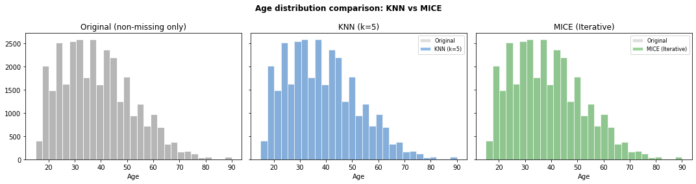
    


### Interpretation
Given that missing values are only present in categorical features and the overall missing rate is low, we adopt mode imputation as the primary strategy. More complex methods such as KNN and MICE are unnecessary due to the absence of missing values in numerical features.

## Section 6 — Comparing Strategies on Model Performance

### Interpretation
In this study, several imputation methods, including mean imputation, median imputation, K-nearest neighbors (KNN) imputation, and Multiple Imputation by Chained Equations (MICE), were evaluated but not selected as the primary strategy for handling missing values.

First, mean and median imputation are primarily designed for numerical variables. However, in this dataset, missing values are mainly concentrated in categorical features such as *occupation*, *workclass*, and *native_country*. Therefore, these methods are not appropriate for addressing the main type of missingness present in the data.

Second, KNN imputation leverages similarity between observations to estimate missing values. While this approach can be effective in certain numerical settings, it relies on distance calculations and is sensitive to feature scaling and categorical dominance. Given the relatively low missing rate and the categorical nature of most missing values, the additional computational complexity does not provide significant practical benefit.

Finally, MICE is a model-based iterative imputation method that is generally more suitable for continuous variables with strong inter-feature relationships. In this dataset, numerical features contain no missing values, making MICE unnecessary and unlikely to improve performance meaningfully.

Overall, since missingness is limited, low in proportion, and primarily categorical, simpler and more stable approaches such as mode imputation are more appropriate. This strategy preserves data integrity while avoiding unnecessary model complexity.

# 2. Outliers and Duplicates


```python
print(
    f'Dataset shape: {data.shape}'
)

data.describe().round(2)
```

    Dataset shape: (32561, 15)
    


<div>
<style scoped>
    .dataframe tbody tr th:only-of-type {
        vertical-align: middle;
    }

    .dataframe tbody tr th {
        vertical-align: top;
    }

    .dataframe thead th {
        text-align: right;
    }
</style>
<table border="1" class="dataframe">
  <thead>
    <tr style="text-align: right;">
      <th></th>
      <th>age</th>
      <th>fnlwgt</th>
      <th>education_num</th>
      <th>capital_gain</th>
      <th>capital_loss</th>
      <th>hours_per_week</th>
    </tr>
  </thead>
  <tbody>
    <tr>
      <th>count</th>
      <td>32561.00</td>
      <td>32561.00</td>
      <td>32561.00</td>
      <td>32561.00</td>
      <td>32561.00</td>
      <td>32561.00</td>
    </tr>
    <tr>
      <th>mean</th>
      <td>38.58</td>
      <td>189778.37</td>
      <td>10.08</td>
      <td>1077.65</td>
      <td>87.30</td>
      <td>40.44</td>
    </tr>
    <tr>
      <th>std</th>
      <td>13.64</td>
      <td>105549.98</td>
      <td>2.57</td>
      <td>7385.29</td>
      <td>402.96</td>
      <td>12.35</td>
    </tr>
    <tr>
      <th>min</th>
      <td>17.00</td>
      <td>12285.00</td>
      <td>1.00</td>
      <td>0.00</td>
      <td>0.00</td>
      <td>1.00</td>
    </tr>
    <tr>
      <th>25%</th>
      <td>28.00</td>
      <td>117827.00</td>
      <td>9.00</td>
      <td>0.00</td>
      <td>0.00</td>
      <td>40.00</td>
    </tr>
    <tr>
      <th>50%</th>
      <td>37.00</td>
      <td>178356.00</td>
      <td>10.00</td>
      <td>0.00</td>
      <td>0.00</td>
      <td>40.00</td>
    </tr>
    <tr>
      <th>75%</th>
      <td>48.00</td>
      <td>237051.00</td>
      <td>12.00</td>
      <td>0.00</td>
      <td>0.00</td>
      <td>45.00</td>
    </tr>
    <tr>
      <th>max</th>
      <td>90.00</td>
      <td>1484705.00</td>
      <td>16.00</td>
      <td>99999.00</td>
      <td>4356.00</td>
      <td>99.00</td>
    </tr>
  </tbody>
</table>
</div>


## Section 1 — Visualising Outliers


```python
fig, axes = plt.subplots(2, 3, figsize=(15, 8))

numeric_cols = [
    'age',
    'fnlwgt',
    'education_num',
    'capital_gain',
    'capital_loss',
    'hours_per_week'
]

for ax, col in zip(axes.flatten(), numeric_cols):
    ax.boxplot(
        df_num[col].dropna(),
        vert=True,
        patch_artist=True,
        boxprops=dict(facecolor='#4a90d9', alpha=0.7),
        medianprops=dict(color='black', linewidth=2),
        flierprops=dict(marker='o', color='#e07b54', markersize=6, alpha=0.8)
    )
    ax.set_title(f'Boxplot — {col}')
    ax.set_ylabel(col)

plt.suptitle('Univariate outlier detection via boxplots', fontweight='bold')
plt.tight_layout()
plt.show()
```


    
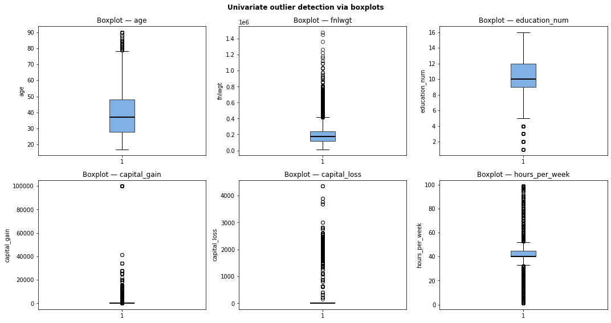
    


```python
fig, ax = plt.subplots(figsize=(8, 5))

ax.scatter(
    df_num['age'],
    df_num['capital_gain'],
    alpha=0.5,
    s=30,
    color='#4a90d9',
    label='Normal'
)

# multivariate outliers
mv_mask = (df_num['capital_gain'] > 20000) & (df_num['age'] < 25)

ax.scatter(
    df_num.loc[mv_mask, 'age'],
    df_num.loc[mv_mask, 'capital_gain'],
    color='#e07b54',
    s=80,
    zorder=5,
    label='Multivariate outlier'
)

ax.set_xlabel('Age')
ax.set_ylabel('Capital Gain')
ax.set_title('Multivariate Outliers: Age vs Capital Gain')
ax.legend()

plt.tight_layout()
plt.show()
```


    
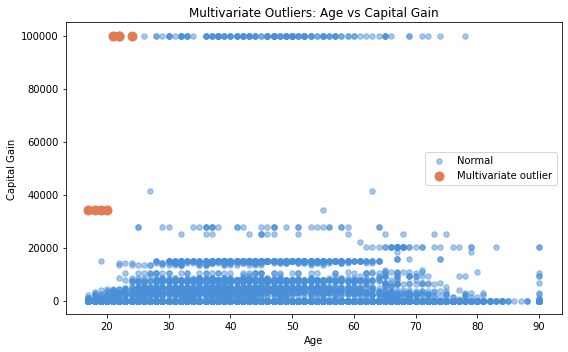
    


## Section 2 — IQR Method


```python
def iqr_outlier_mask(series: pd.Series, multiplier: float = 1.5) -> pd.Series:
    """Return boolean mask where values are IQR outliers."""
    q1 = series.quantile(0.25)
    q3 = series.quantile(0.75)
    iqr = q3 - q1
    return (series < q1 - multiplier * iqr) | (series > q3 + multiplier * iqr)

cols = [
    'age',
    'fnlwgt',
    'education_num',
    'capital_gain',
    'capital_loss',
    'hours_per_week'
]

for col in cols:
    mask = iqr_outlier_mask(df_num[col])

    print(f'{col:15s} outliers={mask.sum():5d} ({mask.mean()*100:.2f}%)')

    if mask.any():
        print(f'              sample values: {sorted(df_num.loc[mask, col].unique())[:8]}')
```

    age             outliers=  143 (0.44%)
                  sample values: [np.int64(79), np.int64(80), np.int64(81), np.int64(82), np.int64(83), np.int64(84), np.int64(85), np.int64(86)]
    fnlwgt          outliers=  992 (3.05%)
                  sample values: [np.int64(415913), np.int64(416059), np.int64(416103), np.int64(416129), np.int64(416164), np.int64(416165), np.int64(416338), np.int64(416356)]
    education_num   outliers= 1198 (3.68%)
                  sample values: [np.int64(1), np.int64(2), np.int64(3), np.int64(4)]
    capital_gain    outliers= 2712 (8.33%)
                  sample values: [np.int64(114), np.int64(401), np.int64(594), np.int64(914), np.int64(991), np.int64(1055), np.int64(1086), np.int64(1111)]
    capital_loss    outliers= 1519 (4.67%)
                  sample values: [np.int64(155), np.int64(213), np.int64(323), np.int64(419), np.int64(625), np.int64(653), np.int64(810), np.int64(880)]
    hours_per_week  outliers= 9008 (27.66%)
                  sample values: [np.int64(1), np.int64(2), np.int64(3), np.int64(4), np.int64(5), np.int64(6), np.int64(7), np.int64(8)]
    

## Section 3 — Z-score Method


```python
from scipy import stats

# Z-score 
def zscore_outlier_mask(series: pd.Series, threshold: float = 3.0) -> pd.Series:
    z = np.abs(stats.zscore(series.dropna()))
    mask = pd.Series(False, index=series.index)
    mask.loc[series.dropna().index] = z > threshold
    return mask


# Modified Z-score (robust) 
def modified_zscore_mask(series: pd.Series, threshold: float = 3.5) -> pd.Series:
    median = series.median()
    mad = np.abs(series - median).median()
    m_z = 0.6745 * np.abs(series - median) / (mad + 1e-9)
    return m_z > threshold


# Features 
cols = [
    'age',
    'fnlwgt',
    'education_num',
    'capital_gain',
    'capital_loss',
    'hours_per_week'
]

# Standard Z-score 
print('--- Standard Z-score (threshold=3) ---')
for col in cols:
    mask = zscore_outlier_mask(df_num[col])
    print(f'{col:15s} outliers={mask.sum():5d}')

# Modified Z-score 
print('\n--- Modified Z-score (MAD, threshold=3.5) ---')
for col in cols:
    mask = modified_zscore_mask(df_num[col])
    print(f'{col:15s} outliers={mask.sum():5d}')
```

    --- Standard Z-score (threshold=3) ---
    age             outliers=  121
    fnlwgt          outliers=  347
    education_num   outliers=  219
    capital_gain    outliers=  215
    capital_loss    outliers= 1470
    hours_per_week  outliers=  440
    
    --- Modified Z-score (MAD, threshold=3.5) ---
    age             outliers=   43
    fnlwgt          outliers=  414
    education_num   outliers= 1611
    capital_gain    outliers= 2712
    capital_loss    outliers= 1519
    hours_per_week  outliers= 6001
    

## Section 4 — Isolation Forest (Multivariate)


```python
from sklearn.ensemble import IsolationForest
from sklearn.preprocessing import StandardScaler

# Features 
numeric_cols = [
    'age',
    'fnlwgt',
    'education_num',
    'capital_gain',
    'capital_loss',
    'hours_per_week'
]

X = df_num[numeric_cols].copy()

# Scaling 
scaler = StandardScaler()
X_scaled = scaler.fit_transform(X)

# Isolation Forest
iso = IsolationForest(
    contamination=0.05,
    random_state=42,
    n_estimators=200
)

df_num['iso_label'] = iso.fit_predict(X_scaled)   # -1 = outlier, 1 = normal
df_num['iso_score'] = iso.score_samples(X_scaled) 

# Results 
n_outliers = (df_num['iso_label'] == -1).sum()

print(f'Isolation Forest flagged {n_outliers} outliers '
      f'({n_outliers / len(df_num) * 100:.2f}%)')

print('\nTop anomalous samples:')
print(
    df_num[df_num['iso_label'] == -1]
    [numeric_cols + ['iso_score']]
    .sort_values('iso_score')
    .head(10)
)
```

    Isolation Forest flagged 1628 outliers (5.00%)
    
    Top anomalous samples:
           age  fnlwgt  education_num  capital_gain  capital_loss  hours_per_week  \
    16740   41  495061             16         99999             0              70   
    20283   49  423222             14         99999             0              80   
    6524    49  362795             14         99999             0              80   
    15279   52  334273             16         99999             0              65   
    16422   50  158294             15         99999             0              80   
    10964   56  205601             16         99999             0              70   
    6035    78  316261             13         99999             0              20   
    26825   49   43348             16         99999             0              70   
    23467   42  269733             14         99999             0              80   
    18882   43  462180             15         99999             0              60   
    
           iso_score  
    16740  -0.721369  
    20283  -0.718133  
    6524   -0.713362  
    15279  -0.712113  
    16422  -0.704148  
    10964  -0.702287  
    6035   -0.698902  
    26825  -0.698335  
    23467  -0.694370  
    18882  -0.693166  
    


```python
# Visualise Isolation Forest results

fig, ax = plt.subplots(figsize=(8, 5))

plot_cols = ['age', 'capital_gain']

for label, color, marker, name in [
    (1,  '#4a90d9', 'o', 'Inlier'),
    (-1, '#e07b54', 'X', 'Outlier (Isolation Forest)'),
]:
    mask = df_num['iso_label'] == label

    ax.scatter(
        df_num.loc[mask, plot_cols[0]],
        df_num.loc[mask, plot_cols[1]],
        alpha=0.6,
        s=50,
        color=color,
        marker=marker,
        label=name
    )

ax.set_xlabel('Age')
ax.set_ylabel('Capital Gain')
ax.set_title('Isolation Forest — Multivariate Outlier Detection')
ax.legend()

plt.tight_layout()
plt.show()

# Clean up
df_num = df_num.drop(columns=['iso_label', 'iso_score'])
```


    
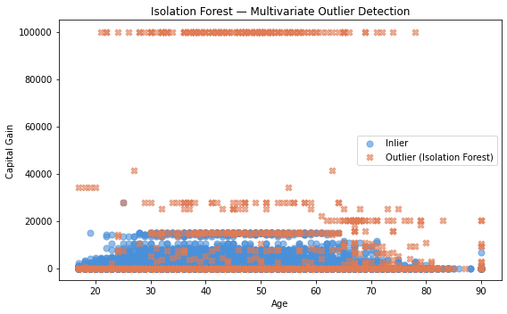
    


## Section 5 — Treatment: Capping / Winsorizing


```python
import pandas as pd
import numpy as np
import matplotlib.pyplot as plt

# All columns (full dataset retained)
cols = [
    'age','workclass','fnlwgt',
    'education','education_num',
    'marital_status','occupation',
    'relationship','race','sex',
    'capital_gain','capital_loss',
    'hours_per_week',
    'native_country',
    'income'
]

# ONLY numeric columns for Winsorization
numeric_cols = [
    'age',
    'fnlwgt',
    'education_num',
    'capital_gain',
    'capital_loss',
    'hours_per_week'
]

# Keep full dataset
data_clean = data[cols].copy()

# Winsorization function
def winsorize(series: pd.Series,
               lower_pct: float = 0.01,
               upper_pct: float = 0.99) -> pd.Series:

    lo = series.quantile(lower_pct)
    hi = series.quantile(upper_pct)

    return series.clip(lower=lo, upper=hi)

# Create cleaned dataset
data_winsorized = data_clean.copy()

# Apply ONLY to numeric columns
for col in numeric_cols:
    data_winsorized[col] = winsorize(
        data_winsorized[col]
    )

print("Original vs Winsorized summary:\n")

# Compare only numeric columns
for col in numeric_cols:

    print(
        f"{col}: "
        f"orig_max={data_clean[col].max()} | "
        f"winsorized_max={data_winsorized[col].max()}"
    )

print("\nNew dataset created: data_winsorized")
print(data_winsorized.shape)

# Visualisation (numeric columns only)
fig, axes = plt.subplots(
    len(numeric_cols),
    2,
    figsize=(12, len(numeric_cols) * 3)
)

for row, col in enumerate(numeric_cols):

    original = data_clean[col]
    capped = data_winsorized[col]

    # Histogram
    axes[row][0].hist(
        original,
        bins=40,
        color='#e07b54',
        alpha=0.7,
        edgecolor='white',
        label='Original'
    )

    axes[row][0].hist(
        capped,
        bins=40,
        color='#4a90d9',
        alpha=0.6,
        edgecolor='white',
        label='Winsorized'
    )

    axes[row][0].set_title(f'{col} — distribution')
    axes[row][0].legend()

    # Boxplot
    axes[row][1].boxplot(
        [original, capped],
        labels=['Original', 'Winsorized'],
        patch_artist=True,
        boxprops=dict(
            facecolor='#4a90d9',
            alpha=0.6
        )
    )

    axes[row][1].set_title(f'{col} — boxplot')

plt.suptitle(
    'Winsorizing: before vs after (Cleaned Data)',
    fontweight='bold'
)

plt.tight_layout()
plt.show()
```

    Original vs Winsorized summary:
    
    age: orig_max=90 | winsorized_max=74
    fnlwgt: orig_max=1484705 | winsorized_max=510072.0
    education_num: orig_max=16 | winsorized_max=16
    capital_gain: orig_max=99999 | winsorized_max=15024
    capital_loss: orig_max=4356 | winsorized_max=1980
    hours_per_week: orig_max=99 | winsorized_max=80
    
    New dataset created: data_winsorized
    (32561, 15)
    


    
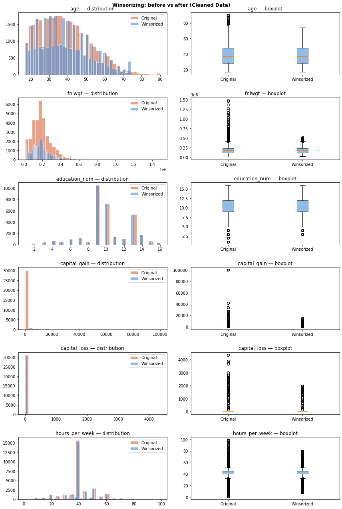
    


## Section 6 — Treatment: When to Remove vs. Transform


```python
# Rule-based data cleaning
error_mask = (
    (df_num['age'] < 17) | (df_num['age'] > 90) |
    (df_num['hours_per_week'] < 1) | (df_num['hours_per_week'] > 100) |
    (df_num['capital_gain'] < 0) |
    (df_num['capital_loss'] < 0)
)

print(f'Rows with rule-based errors: {error_mask.sum()}')

print(df_num.loc[error_mask, [
    'age',
    'fnlwgt',
    'education_num',
    'capital_gain',
    'capital_loss',
    'hours_per_week'
]].head(10))

df_clean = df_num[~error_mask].copy()

print(f'\nShape after cleaning: {df_num.shape} → {df_clean.shape}')
```

    Rows with rule-based errors: 0
    Empty DataFrame
    Columns: [age, fnlwgt, education_num, capital_gain, capital_loss, hours_per_week]
    Index: []
    
    Shape after cleaning: (32561, 6) → (32561, 6)
    

## Section 7 — Detecting and Handling Duplicates


```python
# Exact duplicates (on winsorized dataset)

n_dup = data_winsorized.duplicated().sum()
print(f'Exact duplicate rows: {n_dup} ({n_dup / len(data_winsorized) * 100:.2f}%)')

# view duplicated rows
duplicated_rows = data_winsorized[data_winsorized.duplicated(keep=False)].sort_values(
    ['age', 'fnlwgt']
)

print(f'\nAll duplicated rows ({len(duplicated_rows)} total):')
print(duplicated_rows.head(10))
```

    Exact duplicate rows: 27 (0.08%)
    
    All duplicated rows (53 total):
           age workclass    fnlwgt      education  education_num  marital_status  \
    17673   19   Private   97261.0        HS-grad              9   Never-married   
    18698   19   Private   97261.0        HS-grad              9   Never-married   
    6990    19   Private  138153.0   Some-college             10   Never-married   
    21318   19   Private  138153.0   Some-college             10   Never-married   
    15189   19   Private  146679.0   Some-college             10   Never-married   
    21490   19   Private  146679.0   Some-college             10   Never-married   
    3917    19   Private  251579.0   Some-college             10   Never-married   
    31993   19   Private  251579.0   Some-college             10   Never-married   
    5805    20   Private  107658.0   Some-college             10   Never-married   
    11631   20   Private  107658.0   Some-college             10   Never-married   
    
                 occupation    relationship    race      sex  capital_gain  \
    17673   Farming-fishing   Not-in-family   White     Male             0   
    18698   Farming-fishing   Not-in-family   White     Male             0   
    6990       Adm-clerical       Own-child   White   Female             0   
    21318      Adm-clerical       Own-child   White   Female             0   
    15189   Exec-managerial       Own-child   Black     Male             0   
    21490   Exec-managerial       Own-child   Black     Male             0   
    3917      Other-service       Own-child   White     Male             0   
    31993     Other-service       Own-child   White     Male             0   
    5805       Tech-support   Not-in-family   White   Female             0   
    11631      Tech-support   Not-in-family   White   Female             0   
    
           capital_loss  hours_per_week  native_country  income  
    17673             0              40   United-States   <=50K  
    18698             0              40   United-States   <=50K  
    6990              0              10   United-States   <=50K  
    21318             0              10   United-States   <=50K  
    15189             0              30   United-States   <=50K  
    21490             0              30   United-States   <=50K  
    3917              0              14   United-States   <=50K  
    31993             0              14   United-States   <=50K  
    5805              0              10   United-States   <=50K  
    11631             0              10   United-States   <=50K  
    


```python
# Remove duplicates (on winsorized dataset)
df_deduped = data_winsorized.drop_duplicates(keep='first')

print(f'Shape before dedup: {data_winsorized.shape}')
print(f'Shape after dedup : {df_deduped.shape}')
print(f'Rows removed       : {len(data_winsorized) - len(df_deduped)}')
```

    Shape before dedup: (32561, 15)
    Shape after dedup : (32534, 15)
    Rows removed       : 27
    

# 3. Data Types and Formatting


```python
import numpy as np
import pandas as pd
import warnings

warnings.filterwarnings('ignore')
np.random.seed(42)

print('Setup complete.')

# Use final cleaned Adult dataset
df = df_deduped.copy()

print('Cleaned DataFrame:')
print(df.head(10).to_string())

print('\nShape:')
print(df.shape)

print('\nDtypes:')
print(df.dtypes)

print('\nMissing values:')
print(df.isnull().sum())

print('\nDuplicate rows:')
print(df.duplicated().sum())
```

    Setup complete.
    Cleaned DataFrame:
       age          workclass    fnlwgt   education  education_num          marital_status          occupation    relationship    race      sex  capital_gain  capital_loss  hours_per_week  native_country  income
    0   39          State-gov   77516.0   Bachelors             13           Never-married        Adm-clerical   Not-in-family   White     Male          2174             0              40   United-States   <=50K
    1   50   Self-emp-not-inc   83311.0   Bachelors             13      Married-civ-spouse     Exec-managerial         Husband   White     Male             0             0              13   United-States   <=50K
    2   38            Private  215646.0     HS-grad              9                Divorced   Handlers-cleaners   Not-in-family   White     Male             0             0              40   United-States   <=50K
    3   53            Private  234721.0        11th              7      Married-civ-spouse   Handlers-cleaners         Husband   Black     Male             0             0              40   United-States   <=50K
    4   28            Private  338409.0   Bachelors             13      Married-civ-spouse      Prof-specialty            Wife   Black   Female             0             0              40            Cuba   <=50K
    5   37            Private  284582.0     Masters             14      Married-civ-spouse     Exec-managerial            Wife   White   Female             0             0              40   United-States   <=50K
    6   49            Private  160187.0         9th              5   Married-spouse-absent       Other-service   Not-in-family   Black   Female             0             0              16         Jamaica   <=50K
    7   52   Self-emp-not-inc  209642.0     HS-grad              9      Married-civ-spouse     Exec-managerial         Husband   White     Male             0             0              45   United-States    >50K
    8   31            Private   45781.0     Masters             14           Never-married      Prof-specialty   Not-in-family   White   Female         14084             0              50   United-States    >50K
    9   42            Private  159449.0   Bachelors             13      Married-civ-spouse     Exec-managerial         Husband   White     Male          5178             0              40   United-States    >50K
    
    Shape:
    (32534, 15)
    
    Dtypes:
    age                 int64
    workclass          object
    fnlwgt            float64
    education          object
    education_num       int64
    marital_status     object
    occupation         object
    relationship       object
    race               object
    sex                object
    capital_gain        int64
    capital_loss        int64
    hours_per_week      int64
    native_country     object
    income             object
    dtype: object
    
    Missing values:
    age               0
    workclass         0
    fnlwgt            0
    education         0
    education_num     0
    marital_status    0
    occupation        0
    relationship      0
    race              0
    sex               0
    capital_gain      0
    capital_loss      0
    hours_per_week    0
    native_country    0
    income            0
    dtype: int64
    
    Duplicate rows:
    0
    

## Section 1 — Inspecting and Auditing Column Types


```python
def audit_dataframe(df: pd.DataFrame) -> pd.DataFrame:
    """Return audit summary for Adult dataset."""

    rows=[]

    for col in df.columns:

        s=df[col]

        rows.append({
            'column':col,
            'dtype':str(s.dtype),

            # missing values
            'n_missing':s.isnull().sum(),
            'pct_missing':f'{s.isnull().mean()*100:.1f}%',

            # remaining ? values
            'n_question':(s.astype(str).str.strip()=='?').sum(),

            # duplicate count in column
            'n_unique':s.nunique(),

            # sample values
            'sample_values':(
                s.dropna()
                .unique()[:5]
                .tolist()
            )
        })

    return pd.DataFrame(rows).set_index('column')


# Run audit
audit = audit_dataframe(df)

print(audit)
```

                      dtype  n_missing pct_missing  n_question  n_unique  \
    column                                                                 
    age               int64          0        0.0%           0        58   
    workclass        object          0        0.0%           0         8   
    fnlwgt          float64          0        0.0%           0     21134   
    education        object          0        0.0%           0        16   
    education_num     int64          0        0.0%           0        14   
    marital_status   object          0        0.0%           0         7   
    occupation       object          0        0.0%           0        14   
    relationship     object          0        0.0%           0         6   
    race             object          0        0.0%           0         5   
    sex              object          0        0.0%           0         2   
    capital_gain      int64          0        0.0%           0       109   
    capital_loss      int64          0        0.0%           0        52   
    hours_per_week    int64          0        0.0%           0        70   
    native_country   object          0        0.0%           0        41   
    income           object          0        0.0%           0         2   
    
                                                        sample_values  
    column                                                             
    age                                          [39, 50, 38, 53, 28]  
    workclass       [ State-gov,  Self-emp-not-inc,  Private,  Fed...  
    fnlwgt           [77516.0, 83311.0, 215646.0, 234721.0, 338409.0]  
    education           [ Bachelors,  HS-grad,  11th,  Masters,  9th]  
    education_num                                   [13, 9, 7, 14, 5]  
    marital_status  [ Never-married,  Married-civ-spouse,  Divorce...  
    occupation      [ Adm-clerical,  Exec-managerial,  Handlers-cl...  
    relationship    [ Not-in-family,  Husband,  Wife,  Own-child, ...  
    race            [ White,  Black,  Asian-Pac-Islander,  Amer-In...  
    sex                                              [ Male,  Female]  
    capital_gain                         [2174, 0, 14084, 5178, 5013]  
    capital_loss                          [0, 1980, 1408, 1902, 1573]  
    hours_per_week                               [40, 13, 16, 45, 50]  
    native_country  [ United-States,  Cuba,  Jamaica,  India,  Mex...  
    income                                            [ <=50K,  >50K]  
    

### Interpretation

The audit results provide an overview of the structure and quality of the Adult dataset. The dataset contains both numerical variables (e.g., age, capital_gain, and hours_per_week) and categorical variables (e.g., workclass, education, and occupation). No missing values (n_missing = 0) or remaining invalid symbols (n_question = 0) were detected at this stage, indicating that the previous missing-value handling process was successful.

However, the audit also revealed some formatting issues. Several categorical variables still contained leading spaces in category labels, such as " State-gov" and " Bachelors", which could lead to inconsistencies during feature encoding. In addition, fnlwgt was stored as float64 instead of int64, suggesting that data type conversion may have occurred during preprocessing. Therefore, additional formatting cleanup and data type correction were required before proceeding to further analysis and feature engineering.

## Section 2 — Coercing Mixed-Type Numeric Columns


```python
# Step 1: clean remaining formatting issues

def clean_strings(series: pd.Series) -> pd.Series:
    
    return (
        series.astype(str)
        .str.strip()      # remove leading/trailing spaces
    )


# Apply to all categorical columns
categorical_cols = df.select_dtypes(
    include='object'
).columns

for col in categorical_cols:
    
    df[col] = clean_strings(df[col])


# Convert fnlwgt back to integer if needed
df['fnlwgt'] = df['fnlwgt'].astype(int)


# Compare before vs after
print('Workclass sample:')
print(df['workclass'].head())

print('\nEducation sample:')
print(df['education'].head())

print('\nIncome sample:')
print(df['income'].head())

print('\nDtypes after cleaning:')
print(df.dtypes)
```

    Workclass sample:
    0           State-gov
    1    Self-emp-not-inc
    2             Private
    3             Private
    4             Private
    Name: workclass, dtype: object
    
    Education sample:
    0    Bachelors
    1    Bachelors
    2      HS-grad
    3         11th
    4    Bachelors
    Name: education, dtype: object
    
    Income sample:
    0    <=50K
    1    <=50K
    2    <=50K
    3    <=50K
    4    <=50K
    Name: income, dtype: object
    
    Dtypes after cleaning:
    age                int64
    workclass         object
    fnlwgt             int64
    education         object
    education_num      int64
    marital_status    object
    occupation        object
    relationship      object
    race              object
    sex               object
    capital_gain       int64
    capital_loss       int64
    hours_per_week     int64
    native_country    object
    income            object
    dtype: object
    

### Interpretation

The formatting cleanup process successfully standardized categorical variables and corrected data type inconsistencies in the Adult dataset. Leading and trailing spaces were removed from categorical labels such as workclass, education, and income, ensuring that identical categories are represented consistently. For example, labels such as " State-gov" and "State-gov" are now treated as the same category.

In addition, the fnlwgt attribute was converted back to int64 to restore its appropriate numerical representation after preprocessing. The output confirms that all variables now have consistent formats and suitable data types for subsequent feature engineering, encoding, and machine learning tasks.

## Section 3 — Parsing and Normalising Categorical Variables


```python
# Check categorical feature values after cleaning

print("Sample values in categorical columns:\n")

categorical_cols = df.select_dtypes(
    include='object'
).columns

for col in categorical_cols:

    print(f"{col}:")

    unique_values = df[col].unique()[:10]

    print(unique_values)

    print("-"*50)
```

    Sample values in categorical columns:
    
    workclass:
    ['State-gov' 'Self-emp-not-inc' 'Private' 'Federal-gov' 'Local-gov'
     'Self-emp-inc' 'Without-pay' 'Never-worked']
    --------------------------------------------------
    education:
    ['Bachelors' 'HS-grad' '11th' 'Masters' '9th' 'Some-college' 'Assoc-acdm'
     'Assoc-voc' '7th-8th' 'Doctorate']
    --------------------------------------------------
    marital_status:
    ['Never-married' 'Married-civ-spouse' 'Divorced' 'Married-spouse-absent'
     'Separated' 'Married-AF-spouse' 'Widowed']
    --------------------------------------------------
    occupation:
    ['Adm-clerical' 'Exec-managerial' 'Handlers-cleaners' 'Prof-specialty'
     'Other-service' 'Sales' 'Craft-repair' 'Transport-moving'
     'Farming-fishing' 'Machine-op-inspct']
    --------------------------------------------------
    relationship:
    ['Not-in-family' 'Husband' 'Wife' 'Own-child' 'Unmarried' 'Other-relative']
    --------------------------------------------------
    race:
    ['White' 'Black' 'Asian-Pac-Islander' 'Amer-Indian-Eskimo' 'Other']
    --------------------------------------------------
    sex:
    ['Male' 'Female']
    --------------------------------------------------
    native_country:
    ['United-States' 'Cuba' 'Jamaica' 'India' 'Mexico' 'South' 'Puerto-Rico'
     'Honduras' 'England' 'Canada']
    --------------------------------------------------
    income:
    ['<=50K' '>50K']
    --------------------------------------------------
    


```python
# Working intensity category
df['work_hours_group'] = pd.cut(
    df['hours_per_week'],
    bins=[0,30,40,60,100],
    labels=['Part-time','Full-time','Overtime','Heavy-work']
)

# Age group
df['age_group'] = pd.cut(
    df['age'],
    bins=[0, 25, 45, 65, 100],
    labels=['Young', 'Adult', 'Middle_Aged', 'Senior']
)

# Whether there is capital income/loss
df['has_capital_gain'] = (
    df['capital_gain'] > 0
).astype(int)

df['has_capital_loss'] = (
    df['capital_loss'] > 0
).astype(int)


print(
    df[
        [
            'age',
            'age_group',
            'hours_per_week',
            'work_hours_group',
            'capital_gain',
            'has_capital_gain'
        ]
    ].head(10)
)
```

       age    age_group  hours_per_week work_hours_group  capital_gain  \
    0   39        Adult              40        Full-time          2174   
    1   50  Middle_Aged              13        Part-time             0   
    2   38        Adult              40        Full-time             0   
    3   53  Middle_Aged              40        Full-time             0   
    4   28        Adult              40        Full-time             0   
    5   37        Adult              40        Full-time             0   
    6   49  Middle_Aged              16        Part-time             0   
    7   52  Middle_Aged              45         Overtime             0   
    8   31        Adult              50         Overtime         14084   
    9   42        Adult              40        Full-time          5178   
    
       has_capital_gain  
    0                 1  
    1                 0  
    2                 0  
    3                 0  
    4                 0  
    5                 0  
    6                 0  
    7                 0  
    8                 1  
    9                 1  
    


```python
from sklearn.preprocessing import StandardScaler

# Numerical columns for scaling
numeric_cols = [
    'age',
    'fnlwgt',
    'education_num',
    'capital_gain',
    'capital_loss',
    'hours_per_week'
]

# Create copy
df_scaled = df.copy()

# Standardization
scaler = StandardScaler()

df_scaled[numeric_cols] = scaler.fit_transform(
    df_scaled[numeric_cols]
)

print("Scaled numerical features:\n")

print(
    df_scaled[
        numeric_cols
    ].head(10)
)
```

    Scaled numerical features:
    
            age    fnlwgt  education_num  capital_gain  capital_loss  \
    0  0.034618 -1.113563       1.142627      0.610482     -0.218923   
    1  0.850637 -1.055451       1.142627     -0.251517     -0.218923   
    2 -0.039566  0.271579      -0.427960     -0.251517     -0.218923   
    3  1.073188  0.462860      -1.213253     -0.251517     -0.218923   
    4 -0.781401  1.502623       1.142627     -0.251517     -0.218923   
    5 -0.113749  0.962856       1.535273     -0.251517     -0.218923   
    6  0.776453 -0.284553      -1.998547     -0.251517     -0.218923   
    7  0.999004  0.211372      -0.427960     -0.251517     -0.218923   
    8 -0.558851 -1.431795       1.535273      5.332839     -0.218923   
    9  0.257168 -0.291954       1.142627      1.801578     -0.218923   
    
       hours_per_week  
    0       -0.033028  
    1       -2.294829  
    2       -0.033028  
    3       -0.033028  
    4       -0.033028  
    5       -0.033028  
    6       -2.043518  
    7        0.385824  
    8        0.804676  
    9       -0.033028  
    

### Interpretation for Feature Engineering

The feature engineering process created several new variables from the original Adult dataset in order to improve data representation and support later analysis and predictive modeling. Continuous variables such as age and hours_per_week were transformed into categorical groups (age_group and work_hours_group). This transformation makes the dataset easier to interpret and may help identify patterns that are not immediately visible from raw numerical values alone.

In addition, two binary indicator variables, has_capital_gain and has_capital_loss, were generated based on whether an individual reported any capital gain or capital loss. These features simplify the original numerical variables into meaningful indicators that capture the presence of investment-related income or losses.

The results show that the engineered features were successfully created and assigned to appropriate categories. For example, individuals were grouped into different age ranges and work-hour categories such as Regular or Overtime based on their weekly working hours. Overall, the feature engineering process enriched the dataset with more interpretable and informative variables that may improve the effectiveness of subsequent machine learning models.

### Interpretation for Feature Engineering

The feature engineering process generated new variables from existing attributes in the Adult dataset to improve interpretability and potentially enhance model performance. Continuous variables such as age and hours_per_week were transformed into grouped categories (age_group and work_hours_group), making the data easier to interpret and helping capture possible nonlinear relationships. In addition, binary indicators (has_capital_gain and has_capital_loss) were created to identify whether an individual had capital-related income or loss.

The output demonstrates that the newly created features successfully categorized observations into meaningful groups. For example, individuals aged 39 were assigned to the 36–50 age group, while individuals working 45–50 hours per week were categorized as Overtime. These engineered features may provide more useful information for later predictive modeling tasks.

## Section 4 — String Normalisation


```python
# Inspect categorical values before normalization

categorical_cols = [
    'workclass',
    'education',
    'marital_status',
    'occupation',
    'relationship',
    'race',
    'sex',
    'native_country',
    'income'
]

print("Before normalization:\n")

for col in categorical_cols[:3]:

    print(f"{col}:")

    print(df[col].unique()[:10])

    print()
```

    Before normalization:
    
    workclass:
    ['State-gov' 'Self-emp-not-inc' 'Private' 'Federal-gov' 'Local-gov'
     'Self-emp-inc' 'Without-pay' 'Never-worked']
    
    education:
    ['Bachelors' 'HS-grad' '11th' 'Masters' '9th' 'Some-college' 'Assoc-acdm'
     'Assoc-voc' '7th-8th' 'Doctorate']
    
    marital_status:
    ['Never-married' 'Married-civ-spouse' 'Divorced' 'Married-spouse-absent'
     'Separated' 'Married-AF-spouse' 'Widowed']
    
    


```python
# Normalize categorical strings

for col in categorical_cols:

    df[col] = (
        df[col]
        .astype(str)
        .str.strip()
        .str.lower()
        .str.replace(r'\s+', ' ', regex=True)
    )

print("After normalization:\n")

for col in categorical_cols[:3]:

    print(f"{col}:")

    print(df[col].unique()[:10])

    print()
```

    After normalization:
    
    workclass:
    ['state-gov' 'self-emp-not-inc' 'private' 'federal-gov' 'local-gov'
     'self-emp-inc' 'without-pay' 'never-worked']
    
    education:
    ['bachelors' 'hs-grad' '11th' 'masters' '9th' 'some-college' 'assoc-acdm'
     'assoc-voc' '7th-8th' 'doctorate']
    
    marital_status:
    ['never-married' 'married-civ-spouse' 'divorced' 'married-spouse-absent'
     'separated' 'married-af-spouse' 'widowed']
    
    


```python
# Binary conversion for target variable

df['income_binary'] = (
    df['income'] == '>50k'
).astype(int)

print("Income before → after:\n")

print(
    df[
        ['income', 'income_binary']
    ].head(10)
)
```

    Income before → after:
    
      income  income_binary
    0  <=50k              0
    1  <=50k              0
    2  <=50k              0
    3  <=50k              0
    4  <=50k              0
    5  <=50k              0
    6  <=50k              0
    7   >50k              1
    8   >50k              1
    9   >50k              1
    


```python
# Regex extraction example

country_region = df['native_country'].str.extract(
    r'([a-zA-Z-]+)',
    expand=False
)

result = pd.DataFrame({

    'native_country': df['native_country'].head(10),

    'country_extracted': country_region.head(10)
})

print("\nRegex extraction result:\n")

print(result)
```

    
    Regex extraction result:
    
      native_country country_extracted
    0  united-states     united-states
    1  united-states     united-states
    2  united-states     united-states
    3  united-states     united-states
    4           cuba              cuba
    5  united-states     united-states
    6        jamaica           jamaica
    7  united-states     united-states
    8  united-states     united-states
    9  united-states     united-states
    

### Interpretation

String normalization was applied to categorical variables in order to ensure consistent formatting across the dataset. All categorical labels were converted to lowercase, leading and trailing spaces were removed, and internal spacing was standardized. This process reduces inconsistencies that could negatively affect categorical encoding and downstream machine learning tasks.

In addition, the target variable income was transformed into a binary numerical feature (income_binary), where individuals earning more than 50K were encoded as 1 and others as 0. This conversion prepares the dataset for classification modeling.

A regular expression (regex) extraction example was also demonstrated using the native_country attribute to illustrate how textual patterns can be extracted from string-based data fields.

## Section 5 — Categorical Dtype


```python
# Select categorical columns
cat_cols = [
    'workclass',
    'education',
    'marital_status',
    'occupation',
    'relationship',
    'race',
    'sex',
    'native_country'
]

# Memory usage before conversion
object_mem = (
    df[cat_cols]
    .memory_usage(deep=True)
    .sum()
    / 1e6
)

print(f"Memory as object dtype  : {object_mem:.2f} MB")


# Convert to category dtype
df_category = df.copy()

for col in cat_cols:

    df_category[col] = (
        df_category[col]
        .astype('category')
    )


# Memory usage after conversion
category_mem = (
    df_category[cat_cols]
    .memory_usage(deep=True)
    .sum()
    / 1e6
)

print(f"Memory as category dtype: {category_mem:.2f} MB")

print(
    f"Reduction               : "
    f"{(1 - category_mem/object_mem)*100:.1f}%"
)
```

    Memory as object dtype  : 17.56 MB
    Memory as category dtype: 0.53 MB
    Reduction               : 97.0%
    


```python
# Ordered categorical example

education_order = pd.CategoricalDtype(

    categories=[
        'preschool',
        '1st-4th',
        '5th-6th',
        '7th-8th',
        '9th',
        '10th',
        '11th',
        '12th',
        'hs-grad',
        'some-college',
        'assoc-voc',
        'assoc-acdm',
        'bachelors',
        'masters',
        'prof-school',
        'doctorate'
    ],

    ordered=True
)

df_category['education'] = (
    df_category['education']
    .astype(education_order)
)

print("Education category order:\n")

print(
    df_category['education']
    .cat.categories
)
```

    Education category order:
    
    Index(['preschool', '1st-4th', '5th-6th', '7th-8th', '9th', '10th', '11th',
           '12th', 'hs-grad', 'some-college', 'assoc-voc', 'assoc-acdm',
           'bachelors', 'masters', 'prof-school', 'doctorate'],
          dtype='object')
    


```python
# Filter higher education levels
high_edu = df_category[
    df_category['education'] >= 'bachelors'
]

print(
    f"\nRows with education >= 'bachelors': "
    f"{len(high_edu):,}"
)

print(
    high_edu['education']
    .value_counts()
)
```

    
    Rows with education >= 'bachelors': 8,063
    education
    bachelors       5352
    masters         1722
    prof-school      576
    doctorate        413
    preschool          0
    1st-4th            0
    5th-6th            0
    7th-8th            0
    12th               0
    11th               0
    10th               0
    9th                0
    assoc-acdm         0
    assoc-voc          0
    some-college       0
    hs-grad            0
    Name: count, dtype: int64
    

### Interpretation

Categorical variables in the Adult dataset were converted from the default object type to the category dtype in order to improve memory efficiency. Because many categorical features contain repeated values, the categorical representation significantly reduces memory usage compared with storing full string values repeatedly.

An ordered categorical type was also created for the education variable to represent the natural hierarchy of educational attainment, ranging from preschool to doctorate. This ordering enables meaningful comparisons, sorting, and filtering operations. For example, observations with education levels greater than or equal to bachelors were successfully filtered using categorical ordering logic.

## Section 6 — Memory Optimisation with Narrow Types


```python
def downcast_dataframe(df: pd.DataFrame) -> pd.DataFrame:
    """Downcast numeric columns to the smallest fitting type."""

    df = df.copy()

    # Downcast integer columns
    for col in df.select_dtypes(include=['int', 'int64']).columns:
        df[col] = pd.to_numeric(df[col], downcast='integer')

    # Downcast float columns
    for col in df.select_dtypes(include=['float', 'float64']).columns:
        df[col] = pd.to_numeric(df[col], downcast='float')

    return df


# Select numeric columns
numeric_cols = df.select_dtypes(include=['int64', 'float64']).columns

print('Before downcast:')
print(df[numeric_cols].dtypes)

print(f'\nMemory usage before: '
      f'{df[numeric_cols].memory_usage(deep=True).sum() / 1e6:.3f} MB')


# Apply downcasting and write back into df
df[numeric_cols] = downcast_dataframe(df[numeric_cols])


print('\nAfter downcast:')
print(df[numeric_cols].dtypes)

print(f'\nMemory usage after: '
      f'{df[numeric_cols].memory_usage(deep=True).sum() / 1e6:.3f} MB')
```

    Before downcast:
    age                 int64
    fnlwgt              int64
    education_num       int64
    capital_gain        int64
    capital_loss        int64
    hours_per_week      int64
    has_capital_gain    int64
    has_capital_loss    int64
    income_binary       int64
    dtype: object
    
    Memory usage before: 2.603 MB
    
    After downcast:
    age                  int8
    fnlwgt              int32
    education_num        int8
    capital_gain        int16
    capital_loss        int16
    hours_per_week       int8
    has_capital_gain     int8
    has_capital_loss     int8
    income_binary        int8
    dtype: object
    
    Memory usage after: 0.716 MB
    

### Interpretation
This section demonstrates the effectiveness of memory optimization through data type downcasting. Before optimization, all numeric features in the dataset were stored using int64, which consumes a relatively large amount of memory.

After applying the downcast_dataframe function, each numeric column was converted to the smallest appropriate data type (e.g., int8, int16, or int32) based on the range of values.

As a result, the total memory usage was reduced significantly from 2.603 MB to 0.716 MB, representing a reduction of approximately 72.5%.

This improvement is achieved without losing any information, since downcasting only changes the storage format rather than the actual values. Columns with smaller value ranges (such as binary indicators like income_binary, has_capital_gain, and has_capital_loss) benefit the most, as they can be safely stored using int8.

Overall, this experiment highlights the importance of selecting appropriate data types in large-scale data processing to improve memory efficiency and computational performance.

## Section 7 — Cleaned DataFrame Summary


```python
df_clean = pd.DataFrame({

    'age'              : df['age'],
    'workclass'        : df['workclass'].astype('category'),
    'education'        : df['education'],
    'marital_status'   : df['marital_status'].astype('category'),
    'occupation'       : df['occupation'].astype('category'),
    'relationship'     : df['relationship'].astype('category'),
    'race'             : df['race'].astype('category'),
    'sex'              : df['sex'].astype('category'),
    'hours_per_week'   : df['hours_per_week'],
    'native_country'   : df['native_country'].astype('category'),

    # engineered features
    'capital_gain_flag': (df['capital_gain'] > 0).astype('int8'),
    'capital_loss_flag': (df['capital_loss'] > 0).astype('int8'),

    # target
    'income'           : df['income'].astype('category')
})

print('Cleaned DataFrame:')
print(df_clean.head(10).to_string())

print('\nDtypes after cleaning:')
print(df_clean.dtypes)
```

    Cleaned DataFrame:
       age         workclass  education         marital_status         occupation   relationship   race     sex  hours_per_week native_country  capital_gain_flag  capital_loss_flag income
    0   39         state-gov  bachelors          never-married       adm-clerical  not-in-family  white    male              40  united-states                  1                  0  <=50k
    1   50  self-emp-not-inc  bachelors     married-civ-spouse    exec-managerial        husband  white    male              13  united-states                  0                  0  <=50k
    2   38           private    hs-grad               divorced  handlers-cleaners  not-in-family  white    male              40  united-states                  0                  0  <=50k
    3   53           private       11th     married-civ-spouse  handlers-cleaners        husband  black    male              40  united-states                  0                  0  <=50k
    4   28           private  bachelors     married-civ-spouse     prof-specialty           wife  black  female              40           cuba                  0                  0  <=50k
    5   37           private    masters     married-civ-spouse    exec-managerial           wife  white  female              40  united-states                  0                  0  <=50k
    6   49           private        9th  married-spouse-absent      other-service  not-in-family  black  female              16        jamaica                  0                  0  <=50k
    7   52  self-emp-not-inc    hs-grad     married-civ-spouse    exec-managerial        husband  white    male              45  united-states                  0                  0   >50k
    8   31           private    masters          never-married     prof-specialty  not-in-family  white  female              50  united-states                  1                  0   >50k
    9   42           private  bachelors     married-civ-spouse    exec-managerial        husband  white    male              40  united-states                  1                  0   >50k
    
    Dtypes after cleaning:
    age                      int8
    workclass            category
    education              object
    marital_status       category
    occupation           category
    relationship         category
    race                 category
    sex                  category
    hours_per_week           int8
    native_country       category
    capital_gain_flag        int8
    capital_loss_flag        int8
    income               category
    dtype: object
    

# 4. Encoding Categorical Features


```python
import numpy as np
import pandas as pd
import matplotlib.pyplot as plt
import seaborn as sns

from sklearn.preprocessing import OrdinalEncoder, OneHotEncoder
from sklearn.model_selection import train_test_split, cross_val_score, KFold
from sklearn.ensemble import RandomForestClassifier
from sklearn.pipeline import Pipeline
from sklearn.compose import ColumnTransformer
import warnings

warnings.filterwarnings('ignore')
np.random.seed(42)
plt.rcParams['figure.dpi'] = 110

print('Setup complete.')
```

    Setup complete.
    


```python
# Target
y = df_clean['income']

# Features
X = df_clean.drop('income', axis=1)

# Identify column types
cat_cols = X.select_dtypes(include=['object', 'category']).columns
num_cols = X.select_dtypes(include=['int', 'float']).columns

print('Categorical columns and their cardinality:')
for col in cat_cols:
    print(f'  {col:15s}  {X[col].nunique():3d} unique values')
```

    Categorical columns and their cardinality:
      workclass          8 unique values
      education         16 unique values
      marital_status     7 unique values
      occupation        14 unique values
      relationship       6 unique values
      race               5 unique values
      sex                2 unique values
      native_country    41 unique values
    

## Section 1 — Ordinal Encoding


```python
print(df_clean['education'].apply(repr).value_counts().head(20))
```

    education
    'hs-grad'         10493
    'some-college'     7281
    'bachelors'        5352
    'masters'          1722
    'assoc-voc'        1382
    '11th'             1175
    'assoc-acdm'       1067
    '10th'              933
    '7th-8th'           645
    'prof-school'       576
    '9th'               514
    '12th'              433
    'doctorate'         413
    '5th-6th'           332
    '1st-4th'           166
    'preschool'          50
    Name: count, dtype: int64
    


```python
import pandas as pd


edu = df_clean['education'].copy()

edu = edu.astype(str).str.strip().str.lower()


education_order = [
    'preschool',
    '1st-4th',
    '5th-6th',
    '7th-8th',
    '9th',
    '10th',
    '11th',
    '12th',
    'hs-grad',
    'some-college',
    'assoc-voc',
    'assoc-acdm',
    'bachelors',
    'masters',
    'prof-school',
    'doctorate'
]

mapping = {k: i for i, k in enumerate(education_order)}


df_ordinal = edu.map(mapping).to_frame('education_ord')


print("NaN count:", df_ordinal.isna().sum().values[0])

print(df_ordinal.head(10))
```

    NaN count: 0
       education_ord
    0             12
    1             12
    2              8
    3              6
    4             12
    5             13
    6              4
    7              8
    8             13
    9             12
    


```python
df_plot = df_clean[['income']].copy()
df_plot['education_ord'] = df_ordinal

fig, axes = plt.subplots(1, 2, figsize=(13, 4))


df_plot.boxplot(column='education_ord', by='income', ax=axes[0])
axes[0].set_title('Education level by income group')
axes[0].set_xlabel('Income')
axes[0].set_ylabel('Education (ordinal)')


mean_edu = df_plot.groupby('income')['education_ord'].mean()

axes[1].bar(mean_edu.index.astype(str), mean_edu.values)
axes[1].set_title('Mean education level by income')
axes[1].set_xlabel('Income')
axes[1].set_ylabel('Mean education level')

plt.tight_layout()
plt.show()
```


    
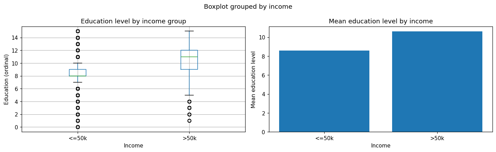
    


```python
print(df_clean['education'].unique())
```

    ['bachelors' 'hs-grad' '11th' 'masters' '9th' 'some-college' 'assoc-acdm'
     'assoc-voc' '7th-8th' 'doctorate' 'prof-school' '5th-6th' '10th'
     '1st-4th' 'preschool' '12th']
    

### Interpretation
The boxplot and mean comparison both show a clear positive relationship between education and income in the Adult dataset. Individuals earning >50K generally have higher education levels, with a higher median (around 11 vs. 8) and an overall upward shift in distribution, although some overlap exists between groups. This is further supported by the mean values, where the >50K group has an average education level of about 10.5 compared to 8.5 for the ≤50K group, indicating a difference of roughly 2 education levels.

## Section 2 — One-Hot Encoding


```python
from sklearn.preprocessing import OneHotEncoder
import pandas as pd

# check categorical columns
cat_cols = [
    'workclass',
    'marital_status',
    'occupation',
    'relationship',
    'race',
    'sex',
    'native_country'
]

print("Categorical column unique counts:")
for col in cat_cols:
    print(f"{col:15s}: {df_clean[col].nunique()} unique values")
```

    Categorical column unique counts:
    workclass      : 8 unique values
    marital_status : 7 unique values
    occupation     : 14 unique values
    relationship   : 6 unique values
    race           : 5 unique values
    sex            : 2 unique values
    native_country : 41 unique values
    


```python
ohe = OneHotEncoder(
    drop='first',     
    sparse_output=False,
    handle_unknown='ignore'
)

cat_data = (
    df_clean[cat_cols]
    .astype(str)
    .replace('nan', 'Unknown')
)

ohe_encoded = ohe.fit_transform(cat_data)

df_ohe = pd.DataFrame(
    ohe_encoded,
    columns=ohe.get_feature_names_out(cat_cols)
)

print("One-hot encoded shape:", df_ohe.shape)

print(pd.concat([cat_data.reset_index(drop=True), df_ohe], axis=1).head(8))
```

    One-hot encoded shape: (32534, 76)
              workclass         marital_status         occupation   relationship  \
    0         state-gov          never-married       adm-clerical  not-in-family   
    1  self-emp-not-inc     married-civ-spouse    exec-managerial        husband   
    2           private               divorced  handlers-cleaners  not-in-family   
    3           private     married-civ-spouse  handlers-cleaners        husband   
    4           private     married-civ-spouse     prof-specialty           wife   
    5           private     married-civ-spouse    exec-managerial           wife   
    6           private  married-spouse-absent      other-service  not-in-family   
    7  self-emp-not-inc     married-civ-spouse    exec-managerial        husband   
    
        race     sex native_country  workclass_local-gov  workclass_never-worked  \
    0  white    male  united-states                  0.0                     0.0   
    1  white    male  united-states                  0.0                     0.0   
    2  white    male  united-states                  0.0                     0.0   
    3  black    male  united-states                  0.0                     0.0   
    4  black  female           cuba                  0.0                     0.0   
    5  white  female  united-states                  0.0                     0.0   
    6  black  female        jamaica                  0.0                     0.0   
    7  white    male  united-states                  0.0                     0.0   
    
       workclass_private  ...  native_country_portugal  \
    0                0.0  ...                      0.0   
    1                0.0  ...                      0.0   
    2                1.0  ...                      0.0   
    3                1.0  ...                      0.0   
    4                1.0  ...                      0.0   
    5                1.0  ...                      0.0   
    6                1.0  ...                      0.0   
    7                0.0  ...                      0.0   
    
       native_country_puerto-rico  native_country_scotland  native_country_south  \
    0                         0.0                      0.0                   0.0   
    1                         0.0                      0.0                   0.0   
    2                         0.0                      0.0                   0.0   
    3                         0.0                      0.0                   0.0   
    4                         0.0                      0.0                   0.0   
    5                         0.0                      0.0                   0.0   
    6                         0.0                      0.0                   0.0   
    7                         0.0                      0.0                   0.0   
    
       native_country_taiwan  native_country_thailand  \
    0                    0.0                      0.0   
    1                    0.0                      0.0   
    2                    0.0                      0.0   
    3                    0.0                      0.0   
    4                    0.0                      0.0   
    5                    0.0                      0.0   
    6                    0.0                      0.0   
    7                    0.0                      0.0   
    
       native_country_trinadad&tobago  native_country_united-states  \
    0                             0.0                           1.0   
    1                             0.0                           1.0   
    2                             0.0                           1.0   
    3                             0.0                           1.0   
    4                             0.0                           0.0   
    5                             0.0                           1.0   
    6                             0.0                           0.0   
    7                             0.0                           1.0   
    
       native_country_vietnam  native_country_yugoslavia  
    0                     0.0                        0.0  
    1                     0.0                        0.0  
    2                     0.0                        0.0  
    3                     0.0                        0.0  
    4                     0.0                        0.0  
    5                     0.0                        0.0  
    6                     0.0                        0.0  
    7                     0.0                        0.0  
    
    [8 rows x 83 columns]
    


```python
df_dummies = pd.get_dummies(
    df_clean[cat_cols],
    drop_first=True,
    dtype=int
)

print(df_dummies.head(5))
print("\nTotal dummy columns:", len(df_dummies.columns))
```

       workclass_local-gov  workclass_never-worked  workclass_private  \
    0                    0                       0                  0   
    1                    0                       0                  0   
    2                    0                       0                  1   
    3                    0                       0                  1   
    4                    0                       0                  1   
    
       workclass_self-emp-inc  workclass_self-emp-not-inc  workclass_state-gov  \
    0                       0                           0                    1   
    1                       0                           1                    0   
    2                       0                           0                    0   
    3                       0                           0                    0   
    4                       0                           0                    0   
    
       workclass_without-pay  marital_status_married-af-spouse  \
    0                      0                                 0   
    1                      0                                 0   
    2                      0                                 0   
    3                      0                                 0   
    4                      0                                 0   
    
       marital_status_married-civ-spouse  marital_status_married-spouse-absent  \
    0                                  0                                     0   
    1                                  1                                     0   
    2                                  0                                     0   
    3                                  1                                     0   
    4                                  1                                     0   
    
       ...  native_country_portugal  native_country_puerto-rico  \
    0  ...                        0                           0   
    1  ...                        0                           0   
    2  ...                        0                           0   
    3  ...                        0                           0   
    4  ...                        0                           0   
    
       native_country_scotland  native_country_south  native_country_taiwan  \
    0                        0                     0                      0   
    1                        0                     0                      0   
    2                        0                     0                      0   
    3                        0                     0                      0   
    4                        0                     0                      0   
    
       native_country_thailand  native_country_trinadad&tobago  \
    0                        0                               0   
    1                        0                               0   
    2                        0                               0   
    3                        0                               0   
    4                        0                               0   
    
       native_country_united-states  native_country_vietnam  \
    0                             1                       0   
    1                             1                       0   
    2                             1                       0   
    3                             1                       0   
    4                             0                       0   
    
       native_country_yugoslavia  
    0                          0  
    1                          0  
    2                          0  
    3                          0  
    4                          0  
    
    [5 rows x 76 columns]
    
    Total dummy columns: 76
    


```python
print("native_country unique values:", df_clean['native_country'].nunique())


country_data = df_clean[['native_country']].astype(str).replace('nan', 'Unknown')

# One-hot encoding
ohe_country = OneHotEncoder(
    sparse_output=False,
    handle_unknown='ignore'
)

country_encoded = ohe_country.fit_transform(country_data)

print("One-hot columns created:", country_encoded.shape[1])
```

    native_country unique values: 41
    One-hot columns created: 41
    

### Interpretation

One-hot encoding was applied to the categorical feature native_country, which contains 41 unique values. This transformation converts each country into a separate binary feature, resulting in 41 new columns in the dataset.

This ensures that no ordinal relationship is introduced between categories, while preserving all categorical information for modeling. However, it also increases the dimensionality of the dataset, which may lead to sparsity and higher computational cost, especially for high-cardinality features.

## Section 3 — Target Encoding


```python
import numpy as np
import pandas as pd
from sklearn.model_selection import KFold

def target_encode_cv(
    train: pd.DataFrame,
    col: str,
    target: str,
    n_splits: int = 5,
    smoothing: float = 10.0,
    random_state: int = 42,
):

    train = train.copy()

    train[col] = train[col].astype(str)

    global_mean = train[target].mean()
    encoded = pd.Series(np.nan, index=train.index)

    kf = KFold(n_splits=n_splits, shuffle=True, random_state=random_state)

    for train_idx, val_idx in kf.split(train):

        fold_train = train.iloc[train_idx]
        fold_val = train.iloc[val_idx]

        stats = fold_train.groupby(col)[target].agg(['mean', 'count'])

        stats['smoothed'] = (
            (stats['count'] * stats['mean'] + smoothing * global_mean)
            / (stats['count'] + smoothing)
        )

        encoded.iloc[val_idx] = (
            fold_val[col]
            .astype(str)
            .map(stats['smoothed'])
            .fillna(global_mean)
        )

    return encoded
```


```python
df_te = df_clean[['occupation', 'income']].copy()

# convert target to binary
df_te['income'] = df_te['income'].astype(str)
df_te['income_binary'] = df_te['income'].apply(lambda x: 1 if '>50' in x else 0)

df_te = df_te[['occupation', 'income_binary']].dropna().reset_index(drop=True)
```


```python
df_te['occupation_te'] = target_encode_cv(
    df_te,
    col='occupation',
    target='income_binary'
)

print(df_te[['occupation', 'occupation_te']].drop_duplicates()
      .sort_values('occupation_te')
      .to_string())
```

                  occupation  occupation_te
    622      priv-house-serv       0.018251
    2065     priv-house-serv       0.025827
    929      priv-house-serv       0.026634
    536      priv-house-serv       0.026844
    3622     priv-house-serv       0.028649
    82         other-service       0.041252
    21         other-service       0.041883
    6          other-service       0.041962
    51         other-service       0.042963
    57         other-service       0.043869
    3      handlers-cleaners       0.059936
    2      handlers-cleaners       0.061170
    404    handlers-cleaners       0.065333
    563    handlers-cleaners       0.067645
    107    handlers-cleaners       0.068040
    16       farming-fishing       0.107251
    227      farming-fishing       0.113775
    343      farming-fishing       0.117348
    35     machine-op-inspct       0.120055
    272      farming-fishing       0.123184
    40     machine-op-inspct       0.124394
    17     machine-op-inspct       0.124943
    36     machine-op-inspct       0.125570
    22       farming-fishing       0.126328
    137         adm-clerical       0.130484
    56     machine-op-inspct       0.131137
    33          adm-clerical       0.134464
    67          adm-clerical       0.134617
    0           adm-clerical       0.134789
    12          adm-clerical       0.140202
    442         armed-forces       0.150573
    18027       armed-forces       0.189398
    329     transport-moving       0.193490
    210     transport-moving       0.200163
    14608       armed-forces       0.200540
    145     transport-moving       0.200919
    23      transport-moving       0.204259
    15      transport-moving       0.204687
    173         craft-repair       0.225678
    48          craft-repair       0.226356
    105         craft-repair       0.227063
    14          craft-repair       0.227651
    29          craft-repair       0.228342
    38                 sales       0.260920
    31                 sales       0.266693
    13                 sales       0.269004
    83                 sales       0.272928
    18                 sales       0.275462
    64          tech-support       0.297338
    144         tech-support       0.297994
    24          tech-support       0.300145
    42          tech-support       0.305289
    86       protective-serv       0.311169
    402      protective-serv       0.312093
    403         tech-support       0.321120
    242      protective-serv       0.329050
    94       protective-serv       0.330920
    30       protective-serv       0.334734
    4         prof-specialty       0.337858
    8         prof-specialty       0.342733
    45        prof-specialty       0.342996
    20        prof-specialty       0.344062
    11        prof-specialty       0.345087
    5        exec-managerial       0.478387
    7        exec-managerial       0.483346
    1        exec-managerial       0.483679
    100      exec-managerial       0.484656
    9        exec-managerial       0.486807
    


```python
import matplotlib.pyplot as plt

occupation_mean = df_te.groupby('occupation')['occupation_te'].mean()
occupation_true = df_te.groupby('occupation')['income_binary'].mean()

fig, ax = plt.subplots(figsize=(8, 5))

ax.scatter(occupation_mean, occupation_true, s=60, alpha=0.8)

for occ in occupation_mean.index:
    ax.annotate(occ, (occupation_mean[occ], occupation_true[occ]),
                fontsize=7, alpha=0.7)

ax.set_xlabel('Target Encoding (CV smoothed mean)')
ax.set_ylabel('Actual Positive Rate (income >50K)')
ax.set_title('Target Encoding vs True Income Rate (Occupation)')

plt.tight_layout()
plt.show()
```


    
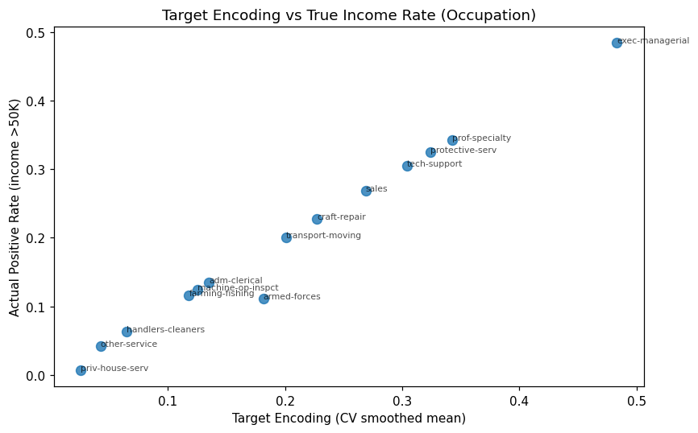
    


### Interpretation

The scatter plot shows a strong alignment between the target encoding values of occupation and the actual proportion of individuals earning >50K across different occupations. Each point lies close to the diagonal, indicating that the cross-validated smoothed target encoding effectively captures the relationship between occupation and income. High-income occupations such as exec-managerial have both high encoded values (~0.48) and high actual income rates, while low-income occupations such as priv-house-serv have values close to zero in both cases. This demonstrates that target encoding successfully preserves predictive information while reducing dimensionality compared to one-hot encoding.

## Section 4 — Frequency Encoding


```python
# choose categorical feature
col = 'occupation'

# compute frequency of each category
freq_map = df_clean[col].value_counts(normalize=True)

# map frequency back to dataset
df_clean['occupation_freq'] = df_clean[col].map(freq_map)

print('Frequency encoding — occupation (top 10):')
print(freq_map.head(10).to_string())

print('\nSample encoded data:')
print(df_clean[[col, 'occupation_freq']].head(10))
```

    Frequency encoding — occupation (top 10):
    occupation
    prof-specialty       0.183746
    craft-repair         0.125807
    exec-managerial      0.124946
    adm-clerical         0.115817
    sales                0.112160
    other-service        0.101156
    machine-op-inspct    0.061474
    transport-moving     0.049087
    handlers-cleaners    0.042079
    farming-fishing      0.030491
    
    Sample encoded data:
              occupation occupation_freq
    0       adm-clerical        0.115817
    1    exec-managerial        0.124946
    2  handlers-cleaners        0.042079
    3  handlers-cleaners        0.042079
    4     prof-specialty        0.183746
    5    exec-managerial        0.124946
    6      other-service        0.101156
    7    exec-managerial        0.124946
    8     prof-specialty        0.183746
    9    exec-managerial        0.124946
    

### Interpretation
Frequency encoding replaces each category with its relative frequency in the dataset. In this case, occupations such as prof-specialty appear more frequently (18%), while farming-fishing is relatively rare (3%). This provides a compact numerical representation of categorical features without introducing additional dimensions.

## Section 5 — Comparison and Leakage Prevention


```python
from sklearn.model_selection import cross_val_score
from sklearn.compose import ColumnTransformer
from sklearn.pipeline import Pipeline
from sklearn.preprocessing import OneHotEncoder, OrdinalEncoder
from sklearn.ensemble import RandomForestClassifier
import numpy as np
X_train = df_clean.drop('income', axis=1).copy()
y_train = df_clean['income'].astype(str).apply(lambda x: 1 if '>50' in x else 0)
```


```python
cat_cols = ['workclass', 'education', 'marital_status',
            'occupation', 'relationship', 'race',
            'sex', 'native_country']

num_cols = ['age', 'hours_per_week']

pipe_ohe = Pipeline([
    ('pre', ColumnTransformer([
        ('num', 'passthrough', num_cols),

        ('cat', OneHotEncoder(handle_unknown='ignore'),
         cat_cols),
    ])),
    ('model', RandomForestClassifier(n_estimators=100, random_state=42)),
])

scores_ohe = cross_val_score(pipe_ohe, X_train, y_train, cv=5, scoring='accuracy')

print(f'OHE pipeline — CV Accuracy: {scores_ohe.mean():.4f} ± {scores_ohe.std():.4f}')
```

    OHE pipeline — CV Accuracy: 0.8161 ± 0.0052
    


```python
from sklearn.base import BaseEstimator, TransformerMixin
import pandas as pd

class FreqEncoder(BaseEstimator, TransformerMixin):

    def fit(self, X, y=None):
        s = pd.Series(np.array(X).ravel())

        self.map_ = s.value_counts(normalize=True).to_dict()
        self.default_ = 1 / max(s.nunique(), 1)
        return self

    def transform(self, X):
        s = pd.Series(np.array(X).ravel())
        return s.map(self.map_).fillna(self.default_).values.reshape(-1, 1)

pipe_freq = Pipeline([
    ('pre', ColumnTransformer([
        ('num', 'passthrough', num_cols),

        ('cat', OrdinalEncoder(handle_unknown='use_encoded_value', unknown_value=-1),
         cat_cols[:-1]),

        ('freq', FreqEncoder(), ['native_country']),
    ])),
    ('model', RandomForestClassifier(n_estimators=100, random_state=42)),
])

scores_freq = cross_val_score(pipe_freq, X_train, y_train, cv=5, scoring='accuracy')

print(f'Freq pipeline — CV Accuracy: {scores_freq.mean():.4f} ± {scores_freq.std():.4f}')
```

    Freq pipeline — CV Accuracy: 0.8184 ± 0.0043
    


```python
# Summary comparison
fig, ax = plt.subplots(figsize=(7, 4))

names = ['One-Hot Encoding', 'Frequency Encoding']
means = [scores_ohe.mean(), scores_freq.mean()]
stds  = [scores_ohe.std(), scores_freq.std()]

bars = ax.bar(
    names,
    means,
    yerr=stds,
    capsize=6,
    color=['#4a90d9', '#5cb85c'],
    edgecolor='white',
    alpha=0.85
)

ax.set_ylabel('Cross-validated Accuracy')
ax.set_title('Encoding Strategy Comparison (5-fold CV)')
ax.set_ylim(0.5, 1.0)

for bar, m in zip(bars, means):
    ax.text(
        bar.get_x() + bar.get_width()/2,
        bar.get_height() + 0.005,
        f'{m:.3f}',
        ha='center',
        fontsize=10
    )

plt.tight_layout()
plt.show()
```


    
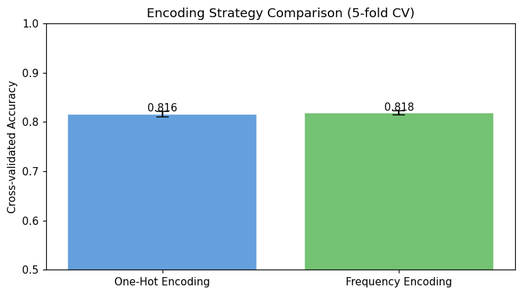
    


### Interpretation

Both encoding strategies achieve similar performance, with frequency encoding slightly outperforming one-hot encoding in both mean accuracy and stability. This suggests that for the Adult dataset, categorical frequency information captures most of the predictive signal, while high-dimensional one-hot representations do not provide additional benefit.

# 5. Features Scaling


```python
# Feature Scaling
import numpy as np
import pandas as pd
import matplotlib.pyplot as plt
import seaborn as sns
import warnings

from sklearn.preprocessing import (
    StandardScaler,
    MinMaxScaler,
    RobustScaler,
    MaxAbsScaler
)
from sklearn.model_selection import train_test_split
from sklearn.model_selection import cross_val_score
from sklearn.linear_model import LogisticRegression
from sklearn.neighbors import KNeighborsClassifier
from sklearn.ensemble import RandomForestClassifier
from sklearn.metrics import accuracy_score, f1_score
from sklearn.pipeline import Pipeline

warnings.filterwarnings('ignore')
np.random.seed(42)
plt.rcParams['figure.dpi'] = 110

print('Setup complete.')
```

    Setup complete.
    


```python
# Use the cleaned dataset from previous sections
df_scaling = df_clean.copy()

y = df_scaling['income'].astype(str).apply(lambda x: 1 if '>50' in x else 0)

scale_cols = [
    'age',
    'hours_per_week'
]

X = df_scaling[scale_cols].copy()

print('Numeric feature ranges before scaling:')
display(X.describe().loc[['min', 'max', 'mean', 'std']].round(2))
```

    Numeric feature ranges before scaling:
    


<div>
<style scoped>
    .dataframe tbody tr th:only-of-type {
        vertical-align: middle;
    }

    .dataframe tbody tr th {
        vertical-align: top;
    }

    .dataframe thead th {
        text-align: right;
    }
</style>
<table border="1" class="dataframe">
  <thead>
    <tr style="text-align: right;">
      <th></th>
      <th>age</th>
      <th>hours_per_week</th>
    </tr>
  </thead>
  <tbody>
    <tr>
      <th>min</th>
      <td>17.00</td>
      <td>8.00</td>
    </tr>
    <tr>
      <th>max</th>
      <td>74.00</td>
      <td>80.00</td>
    </tr>
    <tr>
      <th>mean</th>
      <td>38.53</td>
      <td>40.39</td>
    </tr>
    <tr>
      <th>std</th>
      <td>13.48</td>
      <td>11.94</td>
    </tr>
  </tbody>
</table>
</div>


```python
# Split first to avoid data leakage
X_train, X_test, y_train, y_test = train_test_split(
    X,
    y,
    test_size=0.2,
    random_state=42,
    stratify=y
)

print(f'Train: {X_train.shape}  Test: {X_test.shape}')
```

    Train: (26027, 2)  Test: (6507, 2)
    


```python
# Helper function: plot original vs one scaled version

def plot_original_vs_scaled(original_df, scaled_df, scaler_name, color_scaled):
    fig, axes = plt.subplots(len(scale_cols), 2, figsize=(12, 3.5 * len(scale_cols)))

    if len(scale_cols) == 1:
        axes = np.array([axes])

    for i, col in enumerate(scale_cols):
        sns.histplot(
            original_df[col],
            bins=40,
            ax=axes[i, 0],
            color='#4a90d9',
            edgecolor='white',
            alpha=0.85
        )
        axes[i, 0].set_title(f'Original {col}')
        axes[i, 0].set_xlabel(col)

        sns.histplot(
            scaled_df[col],
            bins=40,
            ax=axes[i, 1],
            color=color_scaled,
            edgecolor='white',
            alpha=0.85
        )
        axes[i, 1].set_title(f'{scaler_name} {col}')
        axes[i, 1].set_xlabel('Scaled value')

    plt.suptitle(
        f'Original vs {scaler_name} Numeric Features',
        fontweight='bold'
    )
    plt.tight_layout()
    plt.show()
```

## Section 1 — StandardScaler (Z-score normalization)


```python
scaler_std = StandardScaler()

# Fit on TRAIN only
X_train_std = pd.DataFrame(
    scaler_std.fit_transform(X_train),
    columns=scale_cols,
    index=X_train.index
)

# Transform TEST using train statistics
X_test_std = pd.DataFrame(
    scaler_std.transform(X_test),
    columns=scale_cols,
    index=X_test.index
)

print('StandardScaler — train set stats after scaling:')
display(X_train_std.describe().loc[['mean', 'std']].round(4))

print('First 5 rows after StandardScaler:')
display(X_train_std.head())

plot_original_vs_scaled(
    original_df=X_train,
    scaled_df=X_train_std,
    scaler_name='StandardScaler',
    color_scaled='#5cb85c'
)
```

    StandardScaler — train set stats after scaling:
    


<div>
<style scoped>
    .dataframe tbody tr th:only-of-type {
        vertical-align: middle;
    }

    .dataframe tbody tr th {
        vertical-align: top;
    }

    .dataframe thead th {
        text-align: right;
    }
</style>
<table border="1" class="dataframe">
  <thead>
    <tr style="text-align: right;">
      <th></th>
      <th>age</th>
      <th>hours_per_week</th>
    </tr>
  </thead>
  <tbody>
    <tr>
      <th>mean</th>
      <td>-0.0</td>
      <td>-0.0</td>
    </tr>
    <tr>
      <th>std</th>
      <td>1.0</td>
      <td>1.0</td>
    </tr>
  </tbody>
</table>
</div>


    First 5 rows after StandardScaler:
    


<div>
<style scoped>
    .dataframe tbody tr th:only-of-type {
        vertical-align: middle;
    }

    .dataframe tbody tr th {
        vertical-align: top;
    }

    .dataframe thead th {
        text-align: right;
    }
</style>
<table border="1" class="dataframe">
  <thead>
    <tr style="text-align: right;">
      <th></th>
      <th>age</th>
      <th>hours_per_week</th>
    </tr>
  </thead>
  <tbody>
    <tr>
      <th>22094</th>
      <td>-1.445945</td>
      <td>-0.033095</td>
    </tr>
    <tr>
      <th>4953</th>
      <td>0.780075</td>
      <td>0.799292</td>
    </tr>
    <tr>
      <th>2673</th>
      <td>-1.520146</td>
      <td>-0.366049</td>
    </tr>
    <tr>
      <th>1569</th>
      <td>-1.371745</td>
      <td>-2.030823</td>
    </tr>
    <tr>
      <th>22422</th>
      <td>2.412490</td>
      <td>0.383099</td>
    </tr>
  </tbody>
</table>
</div>


    
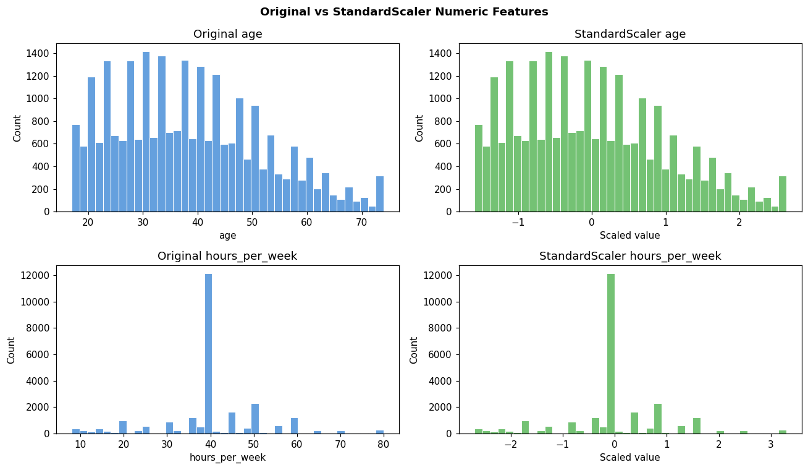
    


## Section 2 — MinMaxScaler ([0,1] Normalisation)


```python
scaler_mm = MinMaxScaler(feature_range=(0, 1))

# Fit on TRAIN only
X_train_mm = pd.DataFrame(
    scaler_mm.fit_transform(X_train),
    columns=scale_cols,
    index=X_train.index
)

# Transform TEST using train min/max
X_test_mm = pd.DataFrame(
    scaler_mm.transform(X_test),
    columns=scale_cols,
    index=X_test.index
)

print('MinMaxScaler — train set range after scaling:')
display(X_train_mm.describe().loc[['min', 'max']].round(6))

print('First 5 rows after MinMaxScaler:')
display(X_train_mm.head())

plot_original_vs_scaled(
    original_df=X_train,
    scaled_df=X_train_mm,
    scaler_name='MinMaxScaler',
    color_scaled='#e07b54'
)
```

    MinMaxScaler — train set range after scaling:
    


<div>
<style scoped>
    .dataframe tbody tr th:only-of-type {
        vertical-align: middle;
    }

    .dataframe tbody tr th {
        vertical-align: top;
    }

    .dataframe thead th {
        text-align: right;
    }
</style>
<table border="1" class="dataframe">
  <thead>
    <tr style="text-align: right;">
      <th></th>
      <th>age</th>
      <th>hours_per_week</th>
    </tr>
  </thead>
  <tbody>
    <tr>
      <th>min</th>
      <td>0.0</td>
      <td>0.0</td>
    </tr>
    <tr>
      <th>max</th>
      <td>1.0</td>
      <td>1.0</td>
    </tr>
  </tbody>
</table>
</div>


    First 5 rows after MinMaxScaler:
    


<div>
<style scoped>
    .dataframe tbody tr th:only-of-type {
        vertical-align: middle;
    }

    .dataframe tbody tr th {
        vertical-align: top;
    }

    .dataframe thead th {
        text-align: right;
    }
</style>
<table border="1" class="dataframe">
  <thead>
    <tr style="text-align: right;">
      <th></th>
      <th>age</th>
      <th>hours_per_week</th>
    </tr>
  </thead>
  <tbody>
    <tr>
      <th>22094</th>
      <td>0.035088</td>
      <td>0.444444</td>
    </tr>
    <tr>
      <th>4953</th>
      <td>0.561404</td>
      <td>0.583333</td>
    </tr>
    <tr>
      <th>2673</th>
      <td>0.017544</td>
      <td>0.388889</td>
    </tr>
    <tr>
      <th>1569</th>
      <td>0.052632</td>
      <td>0.111111</td>
    </tr>
    <tr>
      <th>22422</th>
      <td>0.947368</td>
      <td>0.513889</td>
    </tr>
  </tbody>
</table>
</div>


    
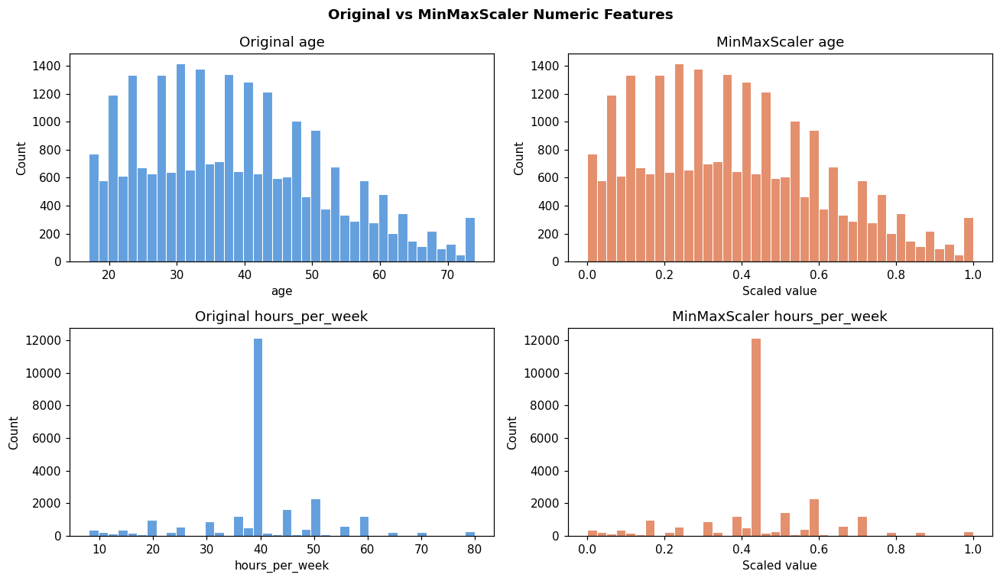
    


## Section 3 — RobustScaler (Outlier-Resistant Scaling)


```python
scaler_rob = RobustScaler(quantile_range=(25, 75))

# Fit on TRAIN only
X_train_rob = pd.DataFrame(
    scaler_rob.fit_transform(X_train),
    columns=scale_cols,
    index=X_train.index
)

# Transform TEST using train median and IQR
X_test_rob = pd.DataFrame(
    scaler_rob.transform(X_test),
    columns=scale_cols,
    index=X_test.index
)

print('RobustScaler — train set statistics after scaling:')
display(X_train_rob.describe().loc[['25%', '50%', '75%']].round(4))

print('First 5 rows after RobustScaler:')
display(X_train_rob.head())

plot_original_vs_scaled(
    original_df=X_train,
    scaled_df=X_train_rob,
    scaler_name='RobustScaler',
    color_scaled='#5cb85c'
)

print('RobustScaler uses median and IQR, so it is less affected by extreme values.')
```

    RobustScaler — train set statistics after scaling:
    


<div>
<style scoped>
    .dataframe tbody tr th:only-of-type {
        vertical-align: middle;
    }

    .dataframe tbody tr th {
        vertical-align: top;
    }

    .dataframe thead th {
        text-align: right;
    }
</style>
<table border="1" class="dataframe">
  <thead>
    <tr style="text-align: right;">
      <th></th>
      <th>age</th>
      <th>hours_per_week</th>
    </tr>
  </thead>
  <tbody>
    <tr>
      <th>25%</th>
      <td>-0.4737</td>
      <td>0.0</td>
    </tr>
    <tr>
      <th>50%</th>
      <td>0.0000</td>
      <td>0.0</td>
    </tr>
    <tr>
      <th>75%</th>
      <td>0.5263</td>
      <td>1.0</td>
    </tr>
  </tbody>
</table>
</div>


    First 5 rows after RobustScaler:
    


<div>
<style scoped>
    .dataframe tbody tr th:only-of-type {
        vertical-align: middle;
    }

    .dataframe tbody tr th {
        vertical-align: top;
    }

    .dataframe thead th {
        text-align: right;
    }
</style>
<table border="1" class="dataframe">
  <thead>
    <tr style="text-align: right;">
      <th></th>
      <th>age</th>
      <th>hours_per_week</th>
    </tr>
  </thead>
  <tbody>
    <tr>
      <th>22094</th>
      <td>-0.947368</td>
      <td>0.0</td>
    </tr>
    <tr>
      <th>4953</th>
      <td>0.631579</td>
      <td>2.0</td>
    </tr>
    <tr>
      <th>2673</th>
      <td>-1.000000</td>
      <td>-0.8</td>
    </tr>
    <tr>
      <th>1569</th>
      <td>-0.894737</td>
      <td>-4.8</td>
    </tr>
    <tr>
      <th>22422</th>
      <td>1.789474</td>
      <td>1.0</td>
    </tr>
  </tbody>
</table>
</div>


    
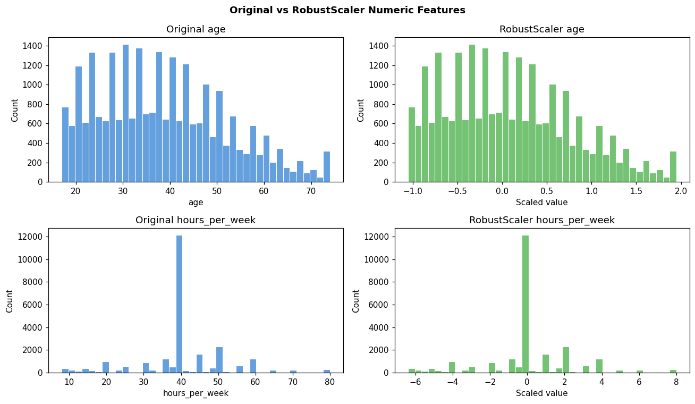
    


    RobustScaler uses median and IQR, so it is less affected by extreme values.
    

## Section 4 — MaxAbsScaler (Sparse-Data Safe)


```python
scaler_ma = MaxAbsScaler()

# Fit on TRAIN only
X_train_ma = pd.DataFrame(
    scaler_ma.fit_transform(X_train),
    columns=scale_cols,
    index=X_train.index
)

# Transform TEST using train maximum absolute values
X_test_ma = pd.DataFrame(
    scaler_ma.transform(X_test),
    columns=scale_cols,
    index=X_test.index
)

print('MaxAbsScaler — train set range after scaling:')
display(X_train_ma.agg(['min', 'max']).round(4))

print('First 5 rows after MaxAbsScaler:')
display(X_train_ma.head())

plot_original_vs_scaled(
    original_df=X_train,
    scaled_df=X_train_ma,
    scaler_name='MaxAbsScaler',
    color_scaled='#9467bd'
)
```

    MaxAbsScaler — train set range after scaling:
    


<div>
<style scoped>
    .dataframe tbody tr th:only-of-type {
        vertical-align: middle;
    }

    .dataframe tbody tr th {
        vertical-align: top;
    }

    .dataframe thead th {
        text-align: right;
    }
</style>
<table border="1" class="dataframe">
  <thead>
    <tr style="text-align: right;">
      <th></th>
      <th>age</th>
      <th>hours_per_week</th>
    </tr>
  </thead>
  <tbody>
    <tr>
      <th>min</th>
      <td>0.2297</td>
      <td>0.1</td>
    </tr>
    <tr>
      <th>max</th>
      <td>1.0000</td>
      <td>1.0</td>
    </tr>
  </tbody>
</table>
</div>


    First 5 rows after MaxAbsScaler:
    


<div>
<style scoped>
    .dataframe tbody tr th:only-of-type {
        vertical-align: middle;
    }

    .dataframe tbody tr th {
        vertical-align: top;
    }

    .dataframe thead th {
        text-align: right;
    }
</style>
<table border="1" class="dataframe">
  <thead>
    <tr style="text-align: right;">
      <th></th>
      <th>age</th>
      <th>hours_per_week</th>
    </tr>
  </thead>
  <tbody>
    <tr>
      <th>22094</th>
      <td>0.256757</td>
      <td>0.5000</td>
    </tr>
    <tr>
      <th>4953</th>
      <td>0.662162</td>
      <td>0.6250</td>
    </tr>
    <tr>
      <th>2673</th>
      <td>0.243243</td>
      <td>0.4500</td>
    </tr>
    <tr>
      <th>1569</th>
      <td>0.270270</td>
      <td>0.2000</td>
    </tr>
    <tr>
      <th>22422</th>
      <td>0.959459</td>
      <td>0.5625</td>
    </tr>
  </tbody>
</table>
</div>


    
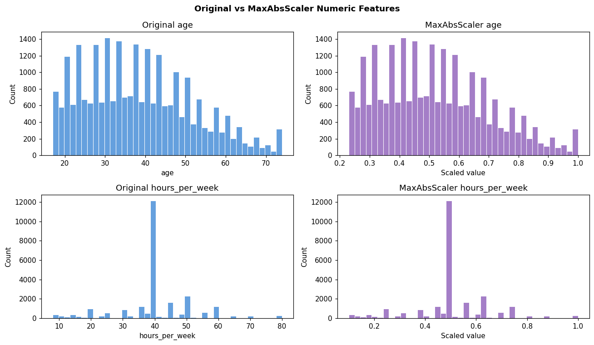
    


## Section 5 — When Scaling Matters (and When It Doesn't)


```python
models = {
    'LogisticRegression': LogisticRegression(
        max_iter=2000,
        class_weight='balanced',
        random_state=42
    ),
    'KNN': KNeighborsClassifier(
        n_neighbors=15
    ),
    'RandomForest': RandomForestClassifier(
        n_estimators=100,
        random_state=42,
        n_jobs=-1
    ),
}

results = {}

for model_name, model in models.items():
    for scaled, X_tr, label in [
        (False, X_train,     'unscaled'),
        (True,  X_train_std, 'StandardScaler'),
    ]:
        scores = cross_val_score(
            model,
            X_tr,
            y_train,
            cv=5,
            scoring='f1'
        )

        results[f'{model_name} ({label})'] = scores.mean()

results_df = pd.Series(results).round(4).to_frame('CV F1')
print(results_df.to_string())
```

                                          CV F1
    LogisticRegression (unscaled)        0.4931
    LogisticRegression (StandardScaler)  0.4931
    KNN (unscaled)                       0.3163
    KNN (StandardScaler)                 0.3134
    RandomForest (unscaled)              0.3022
    RandomForest (StandardScaler)        0.3027
    


```python
# Visualise scaling impact by algorithm

fig, ax = plt.subplots(figsize=(10, 5))

colors = [
    '#4a90d9', '#aad4f5',  # Logistic Regression
    '#e07b54', '#f5bfaa',  # KNN
    '#5cb85c', '#a8dfa8',  # Random Forest
]

bars = ax.barh(
    list(results.keys()),
    list(results.values()),
    color=colors,
    edgecolor='white',
    alpha=0.85
)

ax.axvline(0, color='black', linewidth=0.8)
ax.set_xlabel('Cross-validated F1 Score')
ax.set_title('Scaling Impact by Algorithm — Adult Income Classification')

for bar, val in zip(bars, results.values()):
    ax.text(
        bar.get_width() + 0.005,
        bar.get_y() + bar.get_height() / 2,
        f'{val:.3f}',
        va='center',
        fontsize=9
    )

plt.tight_layout()
plt.show()
```


    
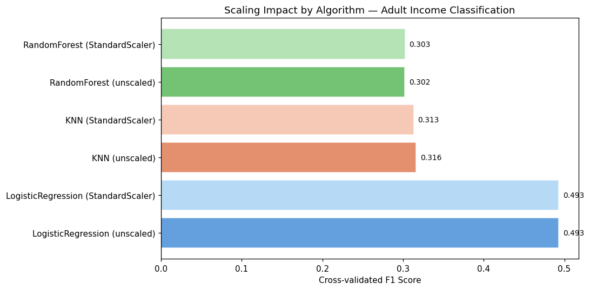
    


### Interpretation
Scaling is theoretically important for Logistic Regression and KNN because they
depend on regularization or distance calculations. In this experiment, the F1
difference is small because only age and hours_per_week are used, and their
ranges are not extremely different after cleaning. Random Forest is almost
unchanged, which matches the expectation for tree-based models.

Since this is a classification task, F1 score is used instead of R². F1 is more
appropriate than R² because the target variable is binary income class
(<=50K or >50K), not a continuous numeric value.

## Scaler Comparison Summary


```python
for feature in scale_cols:
    fig, axes = plt.subplots(2, 2, figsize=(13, 8))

    scalers_data = [
        (X_train[feature],     'Original',       '#aaaaaa'),
        (X_train_std[feature], 'StandardScaler', '#4a90d9'),
        (X_train_mm[feature],  'MinMaxScaler',   '#e07b54'),
        (X_train_rob[feature], 'RobustScaler',   '#5cb85c'),
    ]

    for ax, (data, label, color) in zip(axes.ravel(), scalers_data):
        ax.hist(
            data,
            bins=50,
            color=color,
            edgecolor='white',
            alpha=0.85
        )

        ax.axvline(
            data.mean(),
            color='black',
            linestyle='--',
            linewidth=1,
            label='Mean'
        )

        ax.axvline(
            data.median(),
            color='red',
            linestyle=':',
            linewidth=1,
            label='Median'
        )

        ax.set_title(label)
        ax.legend(fontsize=8)

    plt.suptitle(
        f'{feature} distribution after each scaler',
        fontweight='bold'
    )

    plt.tight_layout()
    plt.show()

# summary
print("""
Key observations:

- StandardScaler centers features at mean 0 with standard deviation 1, making
  age and hours_per_week comparable for scale-sensitive models.
- MinMaxScaler maps values to [0, 1], but it is sensitive to minimum and maximum
  values.
- RobustScaler is more resistant to outliers, but the selected features have
  already been cleaned and do not contain severe untreated outliers.
- MaxAbsScaler is useful for sparse data, but age and hours_per_week are regular
  numeric features.
""")
```


    
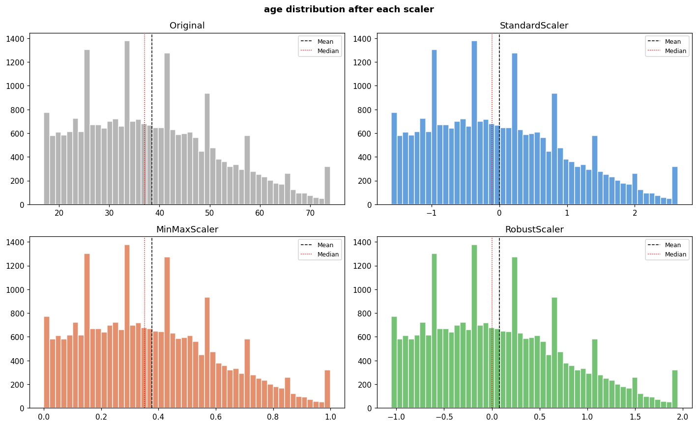
    


    
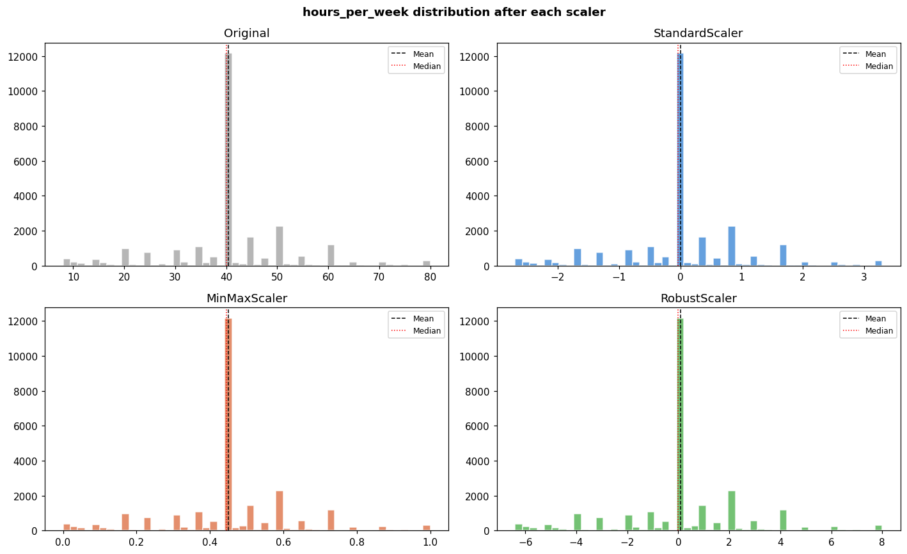
    


    
    Key observations:
    
    - StandardScaler centers features at mean 0 with standard deviation 1, making
      age and hours_per_week comparable for scale-sensitive models.
    - MinMaxScaler maps values to [0, 1], but it is sensitive to minimum and maximum
      values.
    - RobustScaler is more resistant to outliers, but the selected features have
      already been cleaned and do not contain severe untreated outliers.
    - MaxAbsScaler is useful for sparse data, but age and hours_per_week are regular
      numeric features.
    
    

### Interpretation
Final selected scaling method: StandardScaler

StandardScaler is selected as the final scaling method because it gives numeric
features a common scale and is suitable for scale-sensitive models such as
Logistic Regression and KNN. In this experiment, scaling does not greatly change
F1 score because only age and hours_per_week are used, but StandardScaler is
still a safe and standard preprocessing choice for later modeling with more
features.

MinMaxScaler is more sensitive to minimum and maximum values, RobustScaler is
mainly needed when strong outliers remain, and MaxAbsScaler is more suitable for
sparse data. Therefore, StandardScaler is the most appropriate choice here.

# 6. Distribution Transformations


```python
import scipy.stats as stats
from sklearn.preprocessing import PowerTransformer, QuantileTransformer

np.random.seed(42)
plt.rcParams['figure.dpi'] = 110

print('Setup complete.')
```

    Setup complete.
    


```python
# Use cleaned dataset from previous sections

df_transform = df_clean.copy()

y = df_transform['income'].astype(str).apply(lambda x: 1 if '>50' in x else 0)

transform_cols = [
    'age',
    'hours_per_week'
]

X = df_transform[transform_cols].copy()

X_train, X_test, y_train, y_test = train_test_split(
    X,
    y,
    test_size=0.2,
    random_state=42,
    stratify=y
)

print(f'Train: {X_train.shape}  Test: {X_test.shape}')
```

    Train: (26027, 2)  Test: (6507, 2)
    

## Diagnosing Skewness


```python
skew_summary = pd.DataFrame({
    'skewness': X_train.skew(),
    'min': X_train.min(),
    'max': X_train.max(),
    'mean': X_train.mean(),
    'median': X_train.median()
}).round(4)

def skew_interpretation(skew):
    if abs(skew) <= 0.5:
        return 'approximately symmetric'
    elif abs(skew) <= 1:
        return 'moderately skewed'
    else:
        return 'strongly skewed'

skew_summary['interpretation'] = skew_summary['skewness'].apply(skew_interpretation)

print('Skewness diagnosis:')
display(skew_summary)
```

    Skewness diagnosis:
    


<div>
<style scoped>
    .dataframe tbody tr th:only-of-type {
        vertical-align: middle;
    }

    .dataframe tbody tr th {
        vertical-align: top;
    }

    .dataframe thead th {
        text-align: right;
    }
</style>
<table border="1" class="dataframe">
  <thead>
    <tr style="text-align: right;">
      <th></th>
      <th>skewness</th>
      <th>min</th>
      <th>max</th>
      <th>mean</th>
      <th>median</th>
      <th>interpretation</th>
    </tr>
  </thead>
  <tbody>
    <tr>
      <th>age</th>
      <td>0.4807</td>
      <td>17</td>
      <td>74</td>
      <td>38.4870</td>
      <td>37.0</td>
      <td>approximately symmetric</td>
    </tr>
    <tr>
      <th>hours_per_week</th>
      <td>0.0212</td>
      <td>8</td>
      <td>80</td>
      <td>40.3976</td>
      <td>40.0</td>
      <td>approximately symmetric</td>
    </tr>
  </tbody>
</table>
</div>


```python
# Histogram and Q-Q plot for each numeric feature

fig, axes = plt.subplots(len(transform_cols), 2, figsize=(12, 4 * len(transform_cols)))

for i, col in enumerate(transform_cols):
    sns.histplot(X_train[col], bins=40, kde=True, ax=axes[i, 0], color='#4a90d9')
    axes[i, 0].set_title(f'Histogram of {col}')

    stats.probplot(X_train[col], dist='norm', plot=axes[i, 1])
    axes[i, 1].set_title(f'Q-Q Plot of {col}')

plt.suptitle('Diagnosing Skewness Before Transformation', fontweight='bold')
plt.tight_layout()
plt.show()
```


    
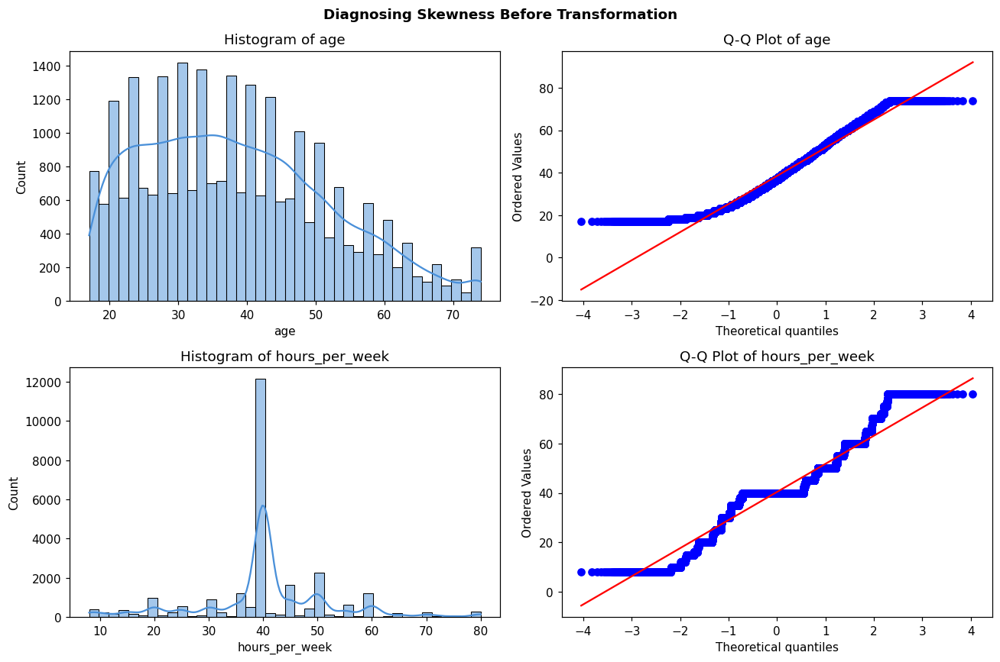
    


```python
# Decide whether transformation is needed

skewed_cols = skew_summary[
    skew_summary['skewness'].abs() > 0.5
].index.tolist()

print('Columns that may need transformation:')
print(skewed_cols)

if len(skewed_cols) == 0:
    print("""
No distribution transformation is necessary because all selected numeric
features are approximately symmetric.
""")
else:
    print("""
At least one numeric feature shows moderate or strong skewness, so distribution
transformation will be tested.
""")
```

    Columns that may need transformation:
    []
    
    No distribution transformation is necessary because all selected numeric
    features are approximately symmetric.
    
    

# 7. sklearn Pipelines - End-to-End Preprocessing

This section follows the structure of `02_sklearn_pipeline.ipynb`, but adapts it to the Adult income dataset prepared in the previous sections. The goal is to combine imputation, encoding, scaling, model training, cross-validation, tuning, and prediction into one reproducible workflow.

## Section 1 - Prepare Modeling Data

This section uses the cleaned dataframe `df_clean` created in the previous notebook sections. Therefore, the pipeline continues from the existing cleaning workflow instead of reloading `adult.data`.


```python
import numpy as np
import pandas as pd
import matplotlib.pyplot as plt
import seaborn as sns
import joblib

from pathlib import Path

from sklearn.base import BaseEstimator, TransformerMixin
from sklearn.compose import ColumnTransformer
from sklearn.ensemble import RandomForestClassifier
from sklearn.impute import SimpleImputer
from sklearn.linear_model import LogisticRegression
from sklearn.metrics import (
    accuracy_score,
    classification_report,
    confusion_matrix,
    ConfusionMatrixDisplay,
    f1_score,
)
from sklearn.model_selection import GridSearchCV, cross_val_score, train_test_split
from sklearn.pipeline import Pipeline
from sklearn.preprocessing import OneHotEncoder, StandardScaler

np.random.seed(42)
plt.rcParams['figure.dpi'] = 110

print('Pipeline setup complete.')

```

    Pipeline setup complete.
    


```python
df_pipeline = df_clean.copy()

print('Using cleaned dataset from previous sections: df_clean')
print('Pipeline dataframe shape:', df_pipeline.shape)
display(df_pipeline.head())
print('\nMissing values after preparation:')
print(df_pipeline.isna().sum())

```

    Using cleaned dataset from previous sections: df_clean
    Pipeline dataframe shape: (32534, 14)
    


<div>
<style scoped>
    .dataframe tbody tr th:only-of-type {
        vertical-align: middle;
    }

    .dataframe tbody tr th {
        vertical-align: top;
    }

    .dataframe thead th {
        text-align: right;
    }
</style>
<table border="1" class="dataframe">
  <thead>
    <tr style="text-align: right;">
      <th></th>
      <th>age</th>
      <th>workclass</th>
      <th>education</th>
      <th>marital_status</th>
      <th>occupation</th>
      <th>relationship</th>
      <th>race</th>
      <th>sex</th>
      <th>hours_per_week</th>
      <th>native_country</th>
      <th>capital_gain_flag</th>
      <th>capital_loss_flag</th>
      <th>income</th>
      <th>occupation_freq</th>
    </tr>
  </thead>
  <tbody>
    <tr>
      <th>0</th>
      <td>39</td>
      <td>state-gov</td>
      <td>bachelors</td>
      <td>never-married</td>
      <td>adm-clerical</td>
      <td>not-in-family</td>
      <td>white</td>
      <td>male</td>
      <td>40</td>
      <td>united-states</td>
      <td>1</td>
      <td>0</td>
      <td>&lt;=50k</td>
      <td>0.115817</td>
    </tr>
    <tr>
      <th>1</th>
      <td>50</td>
      <td>self-emp-not-inc</td>
      <td>bachelors</td>
      <td>married-civ-spouse</td>
      <td>exec-managerial</td>
      <td>husband</td>
      <td>white</td>
      <td>male</td>
      <td>13</td>
      <td>united-states</td>
      <td>0</td>
      <td>0</td>
      <td>&lt;=50k</td>
      <td>0.124946</td>
    </tr>
    <tr>
      <th>2</th>
      <td>38</td>
      <td>private</td>
      <td>hs-grad</td>
      <td>divorced</td>
      <td>handlers-cleaners</td>
      <td>not-in-family</td>
      <td>white</td>
      <td>male</td>
      <td>40</td>
      <td>united-states</td>
      <td>0</td>
      <td>0</td>
      <td>&lt;=50k</td>
      <td>0.042079</td>
    </tr>
    <tr>
      <th>3</th>
      <td>53</td>
      <td>private</td>
      <td>11th</td>
      <td>married-civ-spouse</td>
      <td>handlers-cleaners</td>
      <td>husband</td>
      <td>black</td>
      <td>male</td>
      <td>40</td>
      <td>united-states</td>
      <td>0</td>
      <td>0</td>
      <td>&lt;=50k</td>
      <td>0.042079</td>
    </tr>
    <tr>
      <th>4</th>
      <td>28</td>
      <td>private</td>
      <td>bachelors</td>
      <td>married-civ-spouse</td>
      <td>prof-specialty</td>
      <td>wife</td>
      <td>black</td>
      <td>female</td>
      <td>40</td>
      <td>cuba</td>
      <td>0</td>
      <td>0</td>
      <td>&lt;=50k</td>
      <td>0.183746</td>
    </tr>
  </tbody>
</table>
</div>


    
    Missing values after preparation:
    age                  0
    workclass            0
    education            0
    marital_status       0
    occupation           0
    relationship         0
    race                 0
    sex                  0
    hours_per_week       0
    native_country       0
    capital_gain_flag    0
    capital_loss_flag    0
    income               0
    occupation_freq      0
    dtype: int64
    


```python
target = 'income'

categorical_features = [
    'workclass', 'education', 'marital_status', 'occupation',
    'relationship', 'race', 'sex', 'native_country'
]

numeric_features = [
    'age', 'hours_per_week'
]

binary_features = [
    'capital_gain_flag', 'capital_loss_flag'
]

feature_cols = categorical_features + numeric_features + binary_features

X = df_pipeline[feature_cols].copy()
y = df_pipeline[target].astype(str).str.strip().str.lower().map({
    '<=50k': 0,
    '>50k': 1,
})

X_train, X_test, y_train, y_test = train_test_split(
    X,
    y,
    test_size=0.2,
    stratify=y,
    random_state=42
)

print(f'Train: {X_train.shape}  Test: {X_test.shape}')
print('\nTarget balance in training set:')
print(y_train.value_counts(normalize=True).rename({0: '<=50k', 1: '>50k'}).round(4))
```

    Train: (26027, 12)  Test: (6507, 12)
    
    Target balance in training set:
    income
    <=50k    0.7591
    >50k     0.2409
    Name: proportion, dtype: float64
    

## Section 2 - ColumnTransformer

Different feature types need different preprocessing:

- numeric features: median imputation + StandardScaler
- binary indicator features: most-frequent imputation
- categorical features: most-frequent imputation + one-hot encoding

Putting these steps inside `ColumnTransformer` ensures that all transformations are fitted only on the training data.


```python
numeric_pipe = Pipeline([
    ('impute', SimpleImputer(strategy='median')),
    ('scale', StandardScaler()),
])

binary_pipe = Pipeline([
    ('impute', SimpleImputer(strategy='most_frequent')),
])

categorical_pipe = Pipeline([
    ('impute', SimpleImputer(strategy='most_frequent')),
    ('ohe', OneHotEncoder(handle_unknown='ignore', sparse_output=False)),
])

preprocessor = ColumnTransformer(
    transformers=[
        ('num', numeric_pipe, numeric_features),
        ('bin', binary_pipe, binary_features),
        ('cat', categorical_pipe, categorical_features),
    ],
    remainder='drop',
    verbose_feature_names_out=True,
)

X_train_prepared = preprocessor.fit_transform(X_train)

print(f'Output shape after preprocessing: {X_train_prepared.shape}')
print('\nFirst 20 transformed feature names:')
print(preprocessor.get_feature_names_out()[:20])

```

    Output shape after preprocessing: (26027, 103)
    
    First 20 transformed feature names:
    ['num__age' 'num__hours_per_week' 'bin__capital_gain_flag'
     'bin__capital_loss_flag' 'cat__workclass_federal-gov'
     'cat__workclass_local-gov' 'cat__workclass_never-worked'
     'cat__workclass_private' 'cat__workclass_self-emp-inc'
     'cat__workclass_self-emp-not-inc' 'cat__workclass_state-gov'
     'cat__workclass_without-pay' 'cat__education_10th' 'cat__education_11th'
     'cat__education_12th' 'cat__education_1st-4th' 'cat__education_5th-6th'
     'cat__education_7th-8th' 'cat__education_9th' 'cat__education_assoc-acdm']
    

## Section 3 - Full Preprocessing + Model Pipeline

The full pipeline chains preprocessing and classification. This prevents train/test leakage because the imputer, scaler, and encoder are fitted inside the pipeline using only the training split.


```python
full_pipe = Pipeline([
    ('pre', preprocessor),
    ('model', RandomForestClassifier(
        n_estimators=200,
        max_depth=12,
        min_samples_leaf=2,
        class_weight='balanced',
        random_state=42,
        n_jobs=-1,
    )),
])

full_pipe.fit(X_train, y_train)

y_pred = full_pipe.predict(X_test)

print('Test set performance:')
print(f'Accuracy: {accuracy_score(y_test, y_pred):.4f}')
print(f'F1-score: {f1_score(y_test, y_pred):.4f}')
print()
print(classification_report(
    y_test,
    y_pred,
    target_names=['<=50k', '>50k']
))
```

    Test set performance:
    Accuracy: 0.7746
    F1-score: 0.6523
    
                  precision    recall  f1-score   support
    
           <=50k       0.95      0.74      0.83      4939
            >50k       0.52      0.88      0.65      1568
    
        accuracy                           0.77      6507
       macro avg       0.73      0.81      0.74      6507
    weighted avg       0.85      0.77      0.79      6507
    
    


```python
cm = confusion_matrix(y_test, y_pred)

fig, ax = plt.subplots(figsize=(5, 4))
disp = ConfusionMatrixDisplay(
    confusion_matrix=cm,
    display_labels=['<=50k', '>50k']
)
disp.plot(ax=ax, cmap='Blues', values_format='d', colorbar=False)
ax.set_title('Random Forest Pipeline - Confusion Matrix')
plt.tight_layout()
plt.show()

```


    
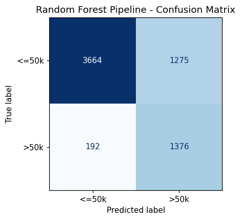
    


### Interpretation

The pipeline keeps the full preprocessing workflow together with the model. This is safer than manually transforming the data before training because the same fitted preprocessing steps will be reused consistently for validation, testing, saving, loading, and future prediction.


## Section 4 - Cross-Validation Without Leakage

When `cross_val_score` receives the full pipeline, every fold fits its own imputer, scaler, encoder, and classifier using only that fold's training portion.


```python
cv_accuracy = cross_val_score(
    full_pipe,
    X_train,
    y_train,
    cv=5,
    scoring='accuracy',
    n_jobs=-1
)

cv_f1 = cross_val_score(
    full_pipe,
    X_train,
    y_train,
    cv=5,
    scoring='f1',
    n_jobs=-1
)

print('5-fold cross-validation results:')
for i, (acc, f1) in enumerate(zip(cv_accuracy, cv_f1), 1):
    print(f'  Fold {i}: accuracy={acc:.4f}, f1={f1:.4f}')

print(f'\nMean accuracy: {cv_accuracy.mean():.4f} ± {cv_accuracy.std():.4f}')
print(f'Mean F1-score: {cv_f1.mean():.4f} ± {cv_f1.std():.4f}')

```

    5-fold cross-validation results:
      Fold 1: accuracy=0.7818, f1=0.6597
      Fold 2: accuracy=0.7660, f1=0.6401
      Fold 3: accuracy=0.7743, f1=0.6502
      Fold 4: accuracy=0.7746, f1=0.6491
      Fold 5: accuracy=0.7835, f1=0.6584
    
    Mean accuracy: 0.7760 ± 0.0062
    Mean F1-score: 0.6515 ± 0.0071
    

## Section 5 - Hyperparameter Search

Pipeline parameters are tuned with the format `stepname__parameter`. Here, model parameters are searched while the preprocessing steps remain inside the same leakage-safe workflow.


```python
param_grid = {
    'model__n_estimators': [100, 200],
    'model__max_depth': [8, 12, None],
    'model__min_samples_leaf': [1, 2],
}

grid_search = GridSearchCV(
    estimator=full_pipe,
    param_grid=param_grid,
    cv=3,
    scoring='f1',
    n_jobs=-1,
    verbose=0
)

grid_search.fit(X_train, y_train)

print('Best parameters:')
print(grid_search.best_params_)
print(f'Best CV F1-score: {grid_search.best_score_:.4f}')
print(f'Test F1-score   : {grid_search.score(X_test, y_test):.4f}')

best_pipe = grid_search.best_estimator_

```

    Best parameters:
    {'model__max_depth': None, 'model__min_samples_leaf': 2, 'model__n_estimators': 200}
    Best CV F1-score: 0.6767
    Test F1-score   : 0.6866
    

## Section 6 - Inspecting the Fitted Pipeline

After fitting, each named pipeline step can be accessed. The transformed feature names are especially useful for interpreting tree-based feature importance.


```python
print('Pipeline steps:')
for name, step in best_pipe.steps:
    print(f'  [{name}] {type(step).__name__}')

print('\nPreprocessor transformers:')
for name, transformer, cols in best_pipe.named_steps['pre'].transformers_:
    print(f'  [{name}] {type(transformer).__name__} -> columns: {cols}')

scaler = best_pipe.named_steps['pre'].named_transformers_['num'].named_steps['scale']
print('\nStandardScaler learned means:')
print(pd.Series(scaler.mean_, index=numeric_features).round(3))
```

    Pipeline steps:
      [pre] ColumnTransformer
      [model] RandomForestClassifier
    
    Preprocessor transformers:
      [num] Pipeline -> columns: ['age', 'hours_per_week']
      [bin] Pipeline -> columns: ['capital_gain_flag', 'capital_loss_flag']
      [cat] Pipeline -> columns: ['workclass', 'education', 'marital_status', 'occupation', 'relationship', 'race', 'sex', 'native_country']
    
    StandardScaler learned means:
    age               38.487
    hours_per_week    40.398
    dtype: float64
    


```python
feature_names = best_pipe.named_steps['pre'].get_feature_names_out()
rf_model = best_pipe.named_steps['model']

feature_importance = (
    pd.Series(rf_model.feature_importances_, index=feature_names)
    .sort_values(ascending=False)
)

display(feature_importance.head(15).to_frame('importance'))

fig, ax = plt.subplots(figsize=(9, 6))
feature_importance.head(15).sort_values().plot(kind='barh', ax=ax, color='#4a90d9')
ax.set_title('Top 15 Feature Importances from Pipeline Model')
ax.set_xlabel('Importance')
plt.tight_layout()
plt.show()
```


<div>
<style scoped>
    .dataframe tbody tr th:only-of-type {
        vertical-align: middle;
    }

    .dataframe tbody tr th {
        vertical-align: top;
    }

    .dataframe thead th {
        text-align: right;
    }
</style>
<table border="1" class="dataframe">
  <thead>
    <tr style="text-align: right;">
      <th></th>
      <th>importance</th>
    </tr>
  </thead>
  <tbody>
    <tr>
      <th>cat__marital_status_married-civ-spouse</th>
      <td>0.147540</td>
    </tr>
    <tr>
      <th>num__age</th>
      <td>0.130307</td>
    </tr>
    <tr>
      <th>cat__relationship_husband</th>
      <td>0.081031</td>
    </tr>
    <tr>
      <th>num__hours_per_week</th>
      <td>0.077109</td>
    </tr>
    <tr>
      <th>cat__marital_status_never-married</th>
      <td>0.055422</td>
    </tr>
    <tr>
      <th>bin__capital_gain_flag</th>
      <td>0.047254</td>
    </tr>
    <tr>
      <th>cat__relationship_own-child</th>
      <td>0.036513</td>
    </tr>
    <tr>
      <th>cat__education_bachelors</th>
      <td>0.026605</td>
    </tr>
    <tr>
      <th>cat__relationship_not-in-family</th>
      <td>0.025783</td>
    </tr>
    <tr>
      <th>cat__relationship_wife</th>
      <td>0.024401</td>
    </tr>
    <tr>
      <th>cat__sex_male</th>
      <td>0.023922</td>
    </tr>
    <tr>
      <th>cat__occupation_exec-managerial</th>
      <td>0.023593</td>
    </tr>
    <tr>
      <th>cat__sex_female</th>
      <td>0.020767</td>
    </tr>
    <tr>
      <th>cat__education_hs-grad</th>
      <td>0.018994</td>
    </tr>
    <tr>
      <th>cat__education_masters</th>
      <td>0.017864</td>
    </tr>
  </tbody>
</table>
</div>


    
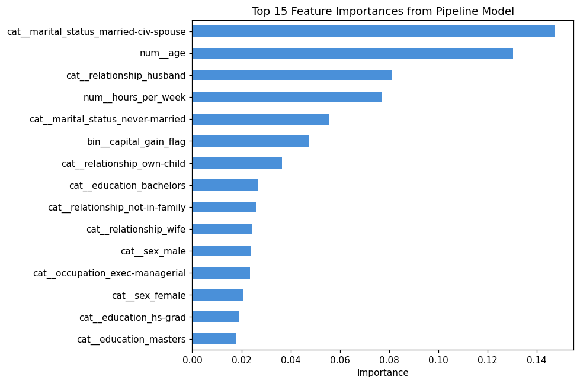
    


## Section 7 - Save, Load, and Predict New Data

Saving the fitted pipeline stores both preprocessing and the model. Future data can be passed in raw dataframe form, and the pipeline will automatically apply the same transformations before prediction.


```python
model_path = Path('adult_income_pipeline.joblib')
joblib.dump(best_pipe, model_path)

loaded_pipe = joblib.load(model_path)

print(f'Pipeline saved to: {model_path}')
print(f'File size: {model_path.stat().st_size / 1e6:.2f} MB')
print(f'Loaded pipeline test F1-score: {loaded_pipe.score(X_test, y_test):.4f}')
```

    Pipeline saved to: adult_income_pipeline.joblib
    File size: 47.17 MB
    Loaded pipeline test F1-score: 0.8191
    


```python
new_person = pd.DataFrame([{
    'workclass': 'private',
    'education': 'bachelors',
    'marital_status': 'married-civ-spouse',
    'occupation': 'exec-managerial',
    'relationship': 'husband',
    'race': 'white',
    'sex': 'male',
    'native_country': 'united-states',
    'age': 42,
    'hours_per_week': 45,
    'capital_gain_flag': 0,
    'capital_loss_flag': 0,
}])

pred_class = loaded_pipe.predict(new_person)[0]
pred_proba = loaded_pipe.predict_proba(new_person)[0, 1]

print('New sample prediction:')
print('Predicted income class:', '>50k' if pred_class == 1 else '<=50k')
print(f'Predicted probability of >50k: {pred_proba:.3f}')

```

    New sample prediction:
    Predicted income class: >50k
    Predicted probability of >50k: 0.921
    

## Section 8 - Optional Custom Transformer

The previous sections already performed winsorizing before building `df_clean`. In production, the same logic can also be wrapped as a transformer and placed directly inside the pipeline.


```python
class WinsorizeTransformer(BaseEstimator, TransformerMixin):
    """Cap numeric feature values at percentile bounds learned from training data."""

    def __init__(self, lower_pct=0.01, upper_pct=0.99):
        self.lower_pct = lower_pct
        self.upper_pct = upper_pct

    def fit(self, X, y=None):
        X_df = pd.DataFrame(X)
        self.lower_bounds_ = X_df.quantile(self.lower_pct)
        self.upper_bounds_ = X_df.quantile(self.upper_pct)
        return self

    def transform(self, X):
        X_df = pd.DataFrame(X).copy()
        X_df = X_df.clip(self.lower_bounds_, self.upper_bounds_, axis=1)
        return X_df.to_numpy()


numeric_pipe_with_winsor = Pipeline([
    ('impute', SimpleImputer(strategy='median')),
    ('winsor', WinsorizeTransformer(lower_pct=0.01, upper_pct=0.99)),
    ('scale', StandardScaler()),
])

preprocessor_with_winsor = ColumnTransformer(
    transformers=[
        ('num', numeric_pipe_with_winsor, numeric_features),
        ('bin', binary_pipe, binary_features),
        ('cat', categorical_pipe, categorical_features),
    ],
    remainder='drop',
    verbose_feature_names_out=True,
)

pipe_with_winsor = Pipeline([
    ('pre', preprocessor_with_winsor),
    ('model', LogisticRegression(
        max_iter=2000,
        class_weight='balanced',
        random_state=42,
    )),
])

scores_winsor = cross_val_score(
    pipe_with_winsor,
    X_train,
    y_train,
    cv=5,
    scoring='f1',
    n_jobs=-1
)

print('Logistic Regression pipeline with in-pipeline winsorizing:')
print(f'Mean CV F1-score: {scores_winsor.mean():.4f} ± {scores_winsor.std():.4f}')

```

    Logistic Regression pipeline with in-pipeline winsorizing:
    Mean CV F1-score: 0.6686 ± 0.0058
    

### Final Interpretation

This pipeline section turns the Adult income workflow into a reproducible end-to-end machine learning process. The most important improvement is that all preprocessing steps are fitted inside the training workflow, which prevents data leakage and ensures that future samples receive exactly the same transformations as the training data.
